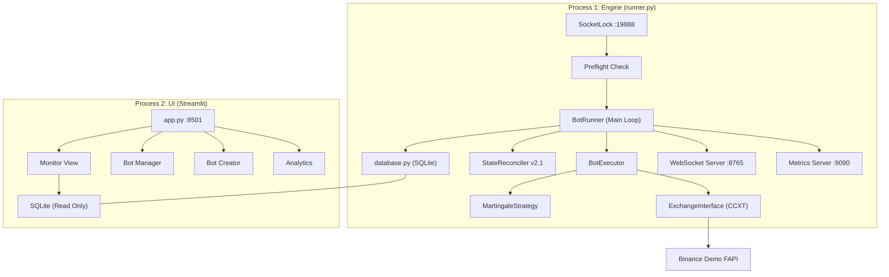

# Crypto Quant Bot — System Architecture

## Overview

A professional **Martingale Grid Trading System** on Binance USDC Futures. Multi-bot, single-runner, with Streamlit UI and SQLite persistence.



---

## Startup Sequence (Professional Flow)

```mermaid
sequenceDiagram
    participant OS
    participant Runner as runner.py
    participant Lock as SocketLock
    participant PF as preflight.py
    participant DB as database.py
    participant EX as ExchangeInterface
    participant Loop as Main Loop

    Runner->>Lock: bind(:19888)
    alt Port free
        Lock-->>Runner: ✅ Acquired
    else Port in use
        Lock-->>Runner: 🛑 FATAL
        Runner->>OS: sys.exit(1)
    end

    Runner->>DB: init_db()
    Runner->>PF: preflight_check()

    PF->>EX: fetch_positions()
    PF->>DB: SELECT net positions
    PF->>PF: Compare (Check 1: Position Match)

    PF->>EX: fetch_open_orders()
    PF->>DB: SELECT in-trade bots
    PF->>PF: Verify orders exist (Check 2: Order Integrity)

    PF->>DB: SELECT steps + invested
    PF->>PF: Sanity check (Check 3: Step Consistency)

    PF-->>Runner: {passed: true, summary: "3/3"}

    Runner->>Loop: BotRunner.run()
    loop Every ~15s
        Loop->>EX: Fetch snapshot
        Loop->>BE: process_bot() for each bot
        Loop->>DB: update_full_snapshot()
        Loop->>WS: broadcast(state)
        Loop->>Loop: [_WS-HEALTH-CHECK] Auto-restart dead streams
    end
```

---

## Component Map

### Engine Layer (`engine/`)

| Module | Lines | Purpose |
|---|---|---|
| [runner.py](file:///c:/Users/Gionie/Documents/GitHub/Crypto_Quant_Bot/engine/runner.py) | 1325 | **Orchestrator.** Main loop, exchange snapshot, bot dispatch, lifecycle |
| [preflight.py](file:///c:/Users/Gionie/Documents/GitHub/Crypto_Quant_Bot/engine/preflight.py) | 260 | **Startup Gate.** 3 checks: position match, order integrity, step sanity |
| [bot_executor.py](file:///c:/Users/Gionie/Documents/GitHub/Crypto_Quant_Bot/engine/bot_executor.py) | 744 | **Per-bot logic.** Entry, exit (TP/SL), order maintenance, grid placement |
| [database.py](file:///c:/Users/Gionie/Documents/GitHub/Crypto_Quant_Bot/engine/database.py) | 1501 | **Persistence.** 56 functions: CRUD bots, trades, orders, snapshots |
| [exchange_interface.py](file:///c:/Users/Gionie/Documents/GitHub/Crypto_Quant_Bot/engine/exchange_interface.py) | 557 | **CCXT wrapper.** Positions, orders, balance, raw API signing. Includes Hybrid Raw Mode overrides for Demo FAPI. |
| [reconciler.py](file:///c:/Users/Gionie/Documents/GitHub/Crypto_Quant_Bot/engine/reconciler.py) | 875 | **State healer.** `StateReconciler v2.1` — Includes API success gates to prevent accidental resets during network blinks and 'Smart Adoption' logic for ghost recovery. |
| [state_manager.py](file:///c:/Users/Gionie/Documents/GitHub/Crypto_Quant_Bot/engine/state_manager.py) | 598 | **Unified state.** Singleton, cross-source consistency (partially used) |
| [strategies/martingale_strategy.py](file:///c:/Users/Gionie/Documents/GitHub/Crypto_Quant_Bot/engine/strategies/martingale_strategy.py) | 607 | **Strategy.** 13-trigger confluence entry, cumulative grid pricing, TP calc, projections |
| [ws_event_handlers.py](file:///c:/Users/Gionie/Documents/GitHub/Crypto_Quant_Bot/engine/ws_event_handlers.py) | 256 | **WebSocket fills.** Atomic step/invested updates on ENTRY/GRID/TP fills |
| [websocket_server.py](file:///c:/Users/Gionie/Documents/GitHub/Crypto_Quant_Bot/engine/websocket_server.py) | 91 | **Real-time push.** Broadcasts state to connected clients |
| [metrics.py](file:///c:/Users/Gionie/Documents/GitHub/Crypto_Quant_Bot/engine/metrics.py) | 71 | **Prometheus.** Cycle time, active bots, equity gauges |

### UI Layer (`ui/`)

| Module | Size | Purpose |
|---|---|---|
| [app.py](file:///c:/Users/Gionie/Documents/GitHub/Crypto_Quant_Bot/ui/app.py) | 18KB | Streamlit entry, sidebar nav, theme |
| [monitor.py](file:///c:/Users/Gionie/Documents/GitHub/Crypto_Quant_Bot/ui/views/monitor.py) | 34KB | Dashboard: positions, orders, system health |
| [bot_manager.py](file:///c:/Users/Gionie/Documents/GitHub/Crypto_Quant_Bot/ui/views/bot_manager.py) | 48KB | Bot config, status, control panel |
| [bot_creator.py](file:///c:/Users/Gionie/Documents/GitHub/Crypto_Quant_Bot/ui/views/bot_creator.py) | 36KB | New bot wizard |
| [analytics.py](file:///c:/Users/Gionie/Documents/GitHub/Crypto_Quant_Bot/ui/views/analytics.py) | 3.6KB | Trade history, PnL charts |

### Config Layer (`config/`)

| Module | Purpose |
|---|---|
| [settings.py](file:///c:/Users/Gionie/Documents/GitHub/Crypto_Quant_Bot/config/settings.py) | Global config: API keys, paths, market type, trading flags |
| [constants.py](file:///c:/Users/Gionie/Documents/GitHub/Crypto_Quant_Bot/config/constants.py) | Enums, thresholds, limits |
| [default_config.json](file:///c:/Users/Gionie/Documents/GitHub/Crypto_Quant_Bot/config/default_config.json) | Bot template defaults |

---

## Data Flow — One Cycle

```mermaid
flowchart LR
    A["Exchange<br/>(Binance)"] -->|fetch_positions<br/>fetch_orders| B["Snapshot"]
    B --> C["BotExecutor.process_bot()"]
    C -->|decide_action()| D["Strategy"]
    D -->|ENTER / HOLD / GRID| C
    C -->|create_order()| A
    C -->|update_martingale_step()| E["SQLite DB"]
    B -->|update_full_snapshot()| E
    E -->|read_sql()| F["UI (Streamlit)"]
```

---

## Key Design Decisions

| Decision | Rationale |
|---|---|
| **SQLite DELETE mode** (not WAL) | Windows cross-process reads break with WAL |
| **SocketLock** (not PID file) | OS-enforced, zero race conditions, auto-releases |
| **Preflight gate** (not hope) | Validate before starting, not patch after |
| **Single runner process** | SQLite doesn't support true concurrent writes |
| **CCXT + raw API** | Hybrid: CCXT for standard ops, raw signing for Demo FAPI bugs |
| **ClientOrderId DNA** | `CQB_{bot_id}_{TYPE}_{STEP}_{TS}` — traceable ownership |
| **Smart Adoption** | Reconstructs virtual state from physical reality without destructive wipes |
| **Reconciler Guard** | Mandatory success check for exchange API before allowing position resets |

---

## Known Technical Debt

| Area | Issue | Risk | Priority |
|---|---|---|---|
| `runner.py` run_cycle | 500+ lines monolithic | Hard to debug | **Phase B** |
| `state_manager.py` | Partially integrated, overlaps reconciler | Confusion | Medium |
| Inline adoption/ghost logic | Duplicated in runner + reconciler | Bug divergence | **Phase B** |
| `database.py` | 1501 lines, 56 functions, no ORM | Maintainability | Low |
| `engine.pid` file | Still written by `_write_pid_file()` | Stale files | Low (cosmetic) |

### Recently Fixed
- ✅ **Grid Database Latency Lock** — `bot_executor.py` checks `created_at >= (basket_start_time - 60)` to allow for milliseconds of local execution delay when querying the DB.
- ✅ **Ghost Reconciler Session Isolation** — `detect_offline_fills` now explicitly parses the `TIMESTAMP` from `ClientOrderId` to reject ancient Binance FAPI history from ghosting wiped SQLite databases.
- ✅ **Grid price calculation** — Was using single-step distance, now cumulative (sum of all step distances)
- ✅ **Periodic reconciler** — Import fixed (`Reconciler` → `StateReconciler`), method fixed (`reconcile` → `reconcile_all`)
- ✅ **Offline fill detection** — Removed extra positional arg in `detect_offline_fills()`
- ✅ **Log noise** — Downgraded 9 DEBUG_PRINT/DECIDE/MISSION-FLOW calls from critical/warning to debug
- ✅ **Entry signal triggers** — Refactored to 13-trigger AND-gate confluence system

---

## Next Steps — Phase B Plan

### 1. Clean `run_cycle()` (High Impact)
Extract inline logic into dedicated methods:
- `_fetch_exchange_snapshot()` — snapshot fetching
- `_run_adoption_check()` — orphan position adoption
- `_run_ghost_check()` — ghost position clearing
- `_execute_bots()` — bot processing loop

### 2. Unify Reconciliation
Merge `state_manager.py` + `reconciler.py` overlapping logic into one authoritative reconciliation path.

### 3. Remove `_write_pid_file()`
SocketLock replaces PID files. Remove the `_write_pid_file()` method and clean up stale `engine.pid`.

### 4. Strengthen Preflight Auto-Healing
Currently preflight **reports** but doesn't auto-fix. Add:
- Cancel orphan orders for idle bots
- Reset ghost bots with no exchange backing
- Place missing TP orders for in-trade bots
