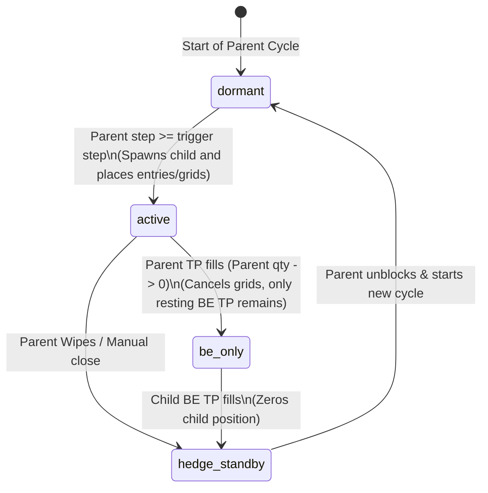
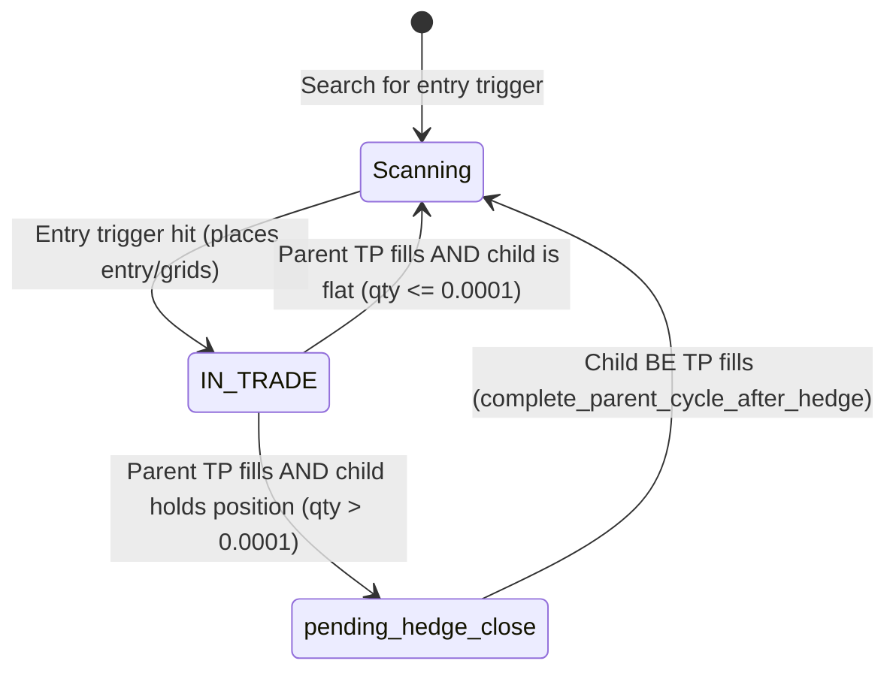

# Crypto Quant Bot — High-Level Engine Architecture

This document defines the current state of the engine's data flows and state machines as of **v4.1.4**.

## 📊 Data Flow & Ledger Synchronization

The system employs a **Proof-Only Reconciliation Architecture**. Database state updates strictly flow from the raw exchange events/receipts recorded in `bot_orders` into the consolidated state in `trades` through `seal_trade_state()`.

```mermaid
graph TD
    subgraph Exchange Reality
        BinanceWS[Binance WebSocket / REST]
    end

    subgraph Proof Ledger (Database)
        BO[bot_orders]
        T[trades.open_qty / trades.total_invested]
    end

    BinanceWS -->|credit_fill| BO
    BO -->|seal_trade_state| T

    subgraph Virtual Exposure Calculation
        GPVN[get_pair_virtual_net]
        T -->|sum direction-signed open_qty| GPVN
    end

    classDef db fill:#1e293b,stroke:#3b82f6,stroke-width:2px,color:#f8fafc;
    classDef ws fill:#0f172a,stroke:#10b981,stroke-width:2px,color:#f8fafc;
    class BO,T,GPVN db;
    class BinanceWS ws;
```

---

## 🔄 Lifecycle State Machines

### 1. Hedge Child Lifecycle State Machine (post-INV-29)

The hedge child bot moves through the following states during the parent's lifecycle:



---

### 2. Parent Bot Lifecycle State Machine

The parent bot transitions through these states to prevent re-entry overlap with its hedge:


