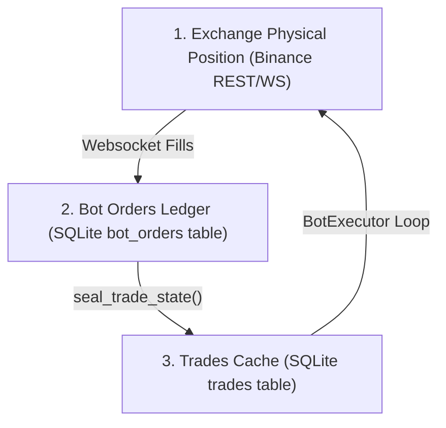
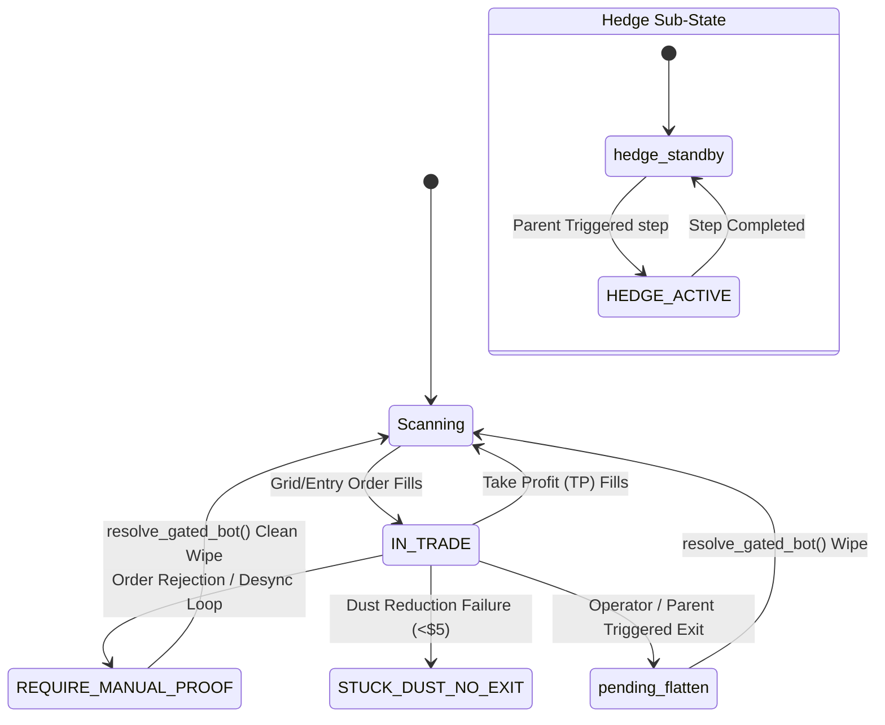

# Crypto Quant Bot — AI Agent Codebase Guide
**Version: 5.3.7 | Last Updated: 2026-07-10**


> **READ THIS FIRST** before touching any code. This is the single authoritative guide.
> It supersedes `UNIFIED_BOT_DOCUMENTATION.md` and all older session notes.
> **Architecture (current):** `docs/ARCHITECTURE_v3.5.md`
> **Version history:** `docs/CHANGELOG.md`
> **Architecture v3.4 (historical):** `docs/ARCHITECTURE_v3.4.md`
> **Operator steps:** `docs/OPERATOR_MISMATCH_RUNBOOK.md`

---

## 🏗️ High-Level Engine Architecture
The Crypto Quant Bot uses a **Proof-Only Reconciliation Architecture** (v3.5.0 enforces v3.4 design).

### The Three-Layer State Model
The engine keeps states aligned across three distinct boundaries:

| Layer | Component | Source of Truth | Sync Guarantee |
| :--- | :--- | :--- | :--- |
| **1. Exchange Physical Position** | Binance REST API & Websocket Streams | Actual physical contracts held on the exchange account. | **Authority for Reality**: Read live during manual interventions, startup repairs, and gating checks. |
| **2. Bot Orders Ledger** | SQLite `bot_orders` table | Direction-signed database ledger of all individual grid, TP, and catch-up order fills. | **Authority for History**: Write-heavy. Appends fills asynchronously from websocket event streams. |
| **3. Trades Cache** | SQLite `trades` table | Aggregated metrics (`open_qty`, `avg_entry_price`, `total_invested`) for fast reads by the UI and the execution loop. | **Eventually Consistent**: Computed from the `bot_orders` ledger via `seal_trade_state()`. |



### Transactional Consistency & Write Serialization
* **Single-Threaded Database Writes (INV-31)**: All database writes targeting the `trades` and `bot_orders` tables must run through the `WriteQueue` singleton to ensure single-threaded execution and prevent concurrent write race conditions. Direct `conn.execute/commit` calls for mutations are prohibited outside of the `WriteQueue`.
* **Write Queue Bypassing**: When inside an active database transaction block (e.g. from an outer loop that passed an explicit `cursor` instance), nested calls to `seal_trade_state` bypass the write queue and run synchronously on the same thread, preventing nested transaction lockups.

**Parity pass (exact):** For every pair, `abs(virtual_qty - exchange_qty) <= PAIR_PARITY_QTY_TOLERANCE` (default 0.002). UI **HEALTHY** only when `audit_pair_ledger_vs_exchange()` returns zero rows. No “close enough.”

1. **Virtual ledger (`bot_orders` + `get_pair_virtual_net`)** — Only CQB-tagged fills via `credit_fill()`. No raw SQL heal. No forensic inventing (`ALLOW_FORENSIC_ADOPT=False`).
2. **Physical imprint (Binance one-way net)** — `fetch_positions()` signed `net_qty` per symbol.
3. **`parity_gates.py`** — Cycle reset gate; **entry** gate (strict); **maintain** gate (in-trade TP/grid); startup repair (deflate / orphan / phantom purge).
4. **`StateReconciler`** — CQB history scan through heal gates only; escalates to `REQUIRE_MANUAL_PROOF` instead of guessing.
5. **`shutdown_control.py`** — Cooperative engine stop (port 19888 + PID).

**Operator flow:** `run_bot.bat` → **Start Monitoring** → `startup_sync` → main loop. Optional: `run_stack.bat` starts both UI and engine.

---

## ⚠️ RULE #0 — ONE-WAY MODE (Read before touching ANY order or position code)

```
THE BINANCE ACCOUNT IS IN ONE-WAY MODE.  NOT HEDGE MODE.  NEVER HEDGE MODE.
```

This is the most fundamental fact about this system. Every API mistake so far has come from ignoring it.

### What One-Way Mode means on the exchange

| Fact | Detail |
|------|--------|
| **One net position per symbol** | The exchange keeps a SINGLE position per symbol. Positive = net LONG, negative = net SHORT. |
| **Long + Short bots net out** | Bot A buys 100 SUI (LONG bot) and Bot B sells 80 SUI (SHORT bot) → exchange shows +20 SUI net LONG. |
| **No separate LONG/SHORT legs** | There is no "SUI LONG position" AND "SUI SHORT position" on the exchange. Only one net number. |
| **positionSide is always 'BOTH'** | The raw Binance API response always has `positionSide: "BOTH"` in one-way mode. It carries zero directional information. |

### What this means for code

| Action | Correct | Wrong (hedge mode) |
|--------|---------|-------------------|
| Determine direction from exchange | Use **sign of `positionAmt`** (+ = LONG, − = SHORT) | Read `positionSide` field |
| Close a LONG position | `side=sell, reduceOnly=True` | `positionSide=LONG` |
| Close a SHORT position | `side=buy, reduceOnly=True` | `positionSide=SHORT` |
| Any order placement | **Never send `positionSide`** | Sending `positionSide=LONG/SHORT` → Binance 400 error |

### What this means for virtual tracking (our DB)

The system's virtual LONG/SHORT per-bot tracking in `trades` and `bot_orders` is our **internal accounting layer only**. It does NOT map to hedge-mode positions. Multiple bots can be LONG or SHORT on the same pair simultaneously — their real effect nets on the exchange.

---

## 1. Project Layout

```
Crypto_Quant_Bot/
├── engine/
│   ├── runner.py              ← Main bot loop, cycle orchestration, snapshot mgmt
│   ├── bot_executor.py        ← Per-bot order execution (Entry, Grid, TP logic)
│   ├── reconciler.py          ← Offline fill detection & state recovery
│   ├── integrity.py           ← FLAG-ONLY mismatch detection (does NOT mutate state)
│   ├── database.py            ← All SQLite operations (single source of truth layer)
│   ├── exchange_interface.py  ← CCXT + raw Binance FAPI wrapper
│   ├── health.py              ← Authoritative system health aggregator (v4.3.8)
│   ├── ws_cache.py            ← In-memory position/order snapshot (WS + REST merged)
│   ├── ws_event_handlers.py   ← Real-time WebSocket fill processing
│   ├── parity_gates.py        ← Pair parity, heal gates, repair, proof flatten (v3.5.0)
│   ├── shutdown_control.py    ← Stop file, SocketLock port, PID lifecycle (v3.5.0)
│   ├── websocket_handler.py   ← WS connection manager
│   ├── ground_truth_reconciler.py ← GTR (INV-31)
│   ├── oneway_netting.py      ← detect_bot_ghost, detect_unowned
│   ├── write_queue.py         ← WriteQueue singleton
│   └── migrations/            ← SafeMigration + migrations 001-010
├── scripts/
│   ├── run_startup_heal.py    ← One-shot ledger heal (no trading loop)
│   ├── diag_live_state.py     ← Live parity diagnostic (virtual vs exchange)
│   ├── operator_repair.py     ← structured operator repair tool
│   └── create_version_backup.ps1 ← Version snapshot (via create_backup.bat)
├── docs/
│   ├── ARCHITECTURE_v3.5.md   ← Current architecture reference
│   ├── CHANGELOG.md           ← Full version history
│   ├── OPERATOR_REPAIR_RUNBOOK.md ← Step-by-step repair procedure
│   └── adr/                   ← Architecture decision records
├── ui/app.py                  ← Streamlit dashboard entry point
├── ui/views/monitor.py        ← Live monitor & mismatch display
├── config/settings.py         ← Config loader (.env → config object); VERSION constant
└── check_state.py             ← Operator bot-state diagnostic CLI
```
├── create_backup.bat          ← Version backup entry point
├── crypto_bot.db              ← Live SQLite database (WAL mode)
├── engine.log                 ← Rotating log (10MB, 5 backups)
├── run_stack.bat              ← Start engine + dashboard
├── run_bot.bat                ← Start engine only
└── restart_runner.bat         ← Kills + restarts the engine process
```

---

## 🎨 UI Architecture — Native Fragments
The dashboard (`monitor.py`) utilizes **native Streamlit Fragments** (`@st.fragment`) for auto-refresh.
- **Header Metrics**: Refreshes every 30s (Equity, Balance, PnL).
- **Bot Grid**: Refreshes every 15s (Steps, Invested, Status).
- **Rule**: Avoid external refresh components (like `st_autorefresh`) as they fail in restricted network environments. Native fragments are the absolute standard.

---

## 2. Bot Lifecycle State Machine

### States
- **Scanning** — no position, awaiting entry signal
- **IN TRADE** — position open, orders resting
- **pending_hedge_close** — parent TP'd, awaiting hedge child BE-TP (transitional cascade state, trigger timestamp in `cascade_started_at`)
- **hedge_standby** — hedge child, armed, awaiting parent trigger
- **HEDGE ACTIVE** — hedge child, position open
- **FLATTENING** — force-close in progress (transitional cascade state, trigger timestamp in `cascade_started_at`)
- **pending_flatten** — queued for force-close (transitional cascade state, trigger timestamp in `cascade_started_at`)
- **pending_close** — cascade close in progress (transitional cascade state, trigger timestamp in `cascade_started_at`)
- **REQUIRE_MANUAL_PROOF** — locked, human intervention required. Fills arriving while gated are still credited to `bot_orders` and `trades.open_qty` via `credit_fill` (INV-34), and Take Profit (TP) exit cascades still run and reset the bot to `Scanning` once flat. Only new order placement and new entry signals are blocked.

### Cycle Phases
- **`ACTIVE`**: Standard trading cycle.
- **`PARTIAL_CLOSE_PENDING`**: A reduction or dust-clearing close order is currently open on the exchange.
- **`STUCK_DUST_NO_EXIT`**: Escalation phase. The bot has a remaining position size below the exchange minimum notional (typically ~$5, e.g. SUI dust of 0.37 units) and its reduction order has failed. Requires operator attention or auto-wipe.



### 🔧 Gated Bot Resolution & Recovery Procedures

#### 1. Universal Automated Recovery: `resolve_gated_bot()`
For any bot stuck in `REQUIRE_MANUAL_PROOF`, `STUCK_DUST_NO_EXIT`, or `pending_flatten`, the reconciler automatically attempts to execute **`resolve_gated_bot()`** from `engine/recovery.py`.

* **Algorithm**:
  1. Computes the netting-aware closeable quantity based on the signed net exchange position:
     $$\text{closeable\_qty} = \min(\text{virtual\_qty}, \max(0, \text{physical\_qty} \times \text{dir\_sign}))$$
  2. If `closeable_qty > 0`, it places a matching `reduceOnly` close order on the exchange and waits for confirmation.
  3. If `closeable_qty = 0` (e.g. position is flat on the exchange or held by a sibling), it skips the exchange order and directly calls `safe_wipe_bot(..., bypass_ledger_guard=True)` to wipe the virtual database state and reset the bot.
* **Limitations**: If `closeable_qty = 0` is wiped, the database goes flat, but the opposing sibling bot's virtual accounting is left out of sync. This drift is highlighted via warning banners on the monitor dashboard.

#### 2. Manual REQUIRE_MANUAL_PROOF Resolution Procedure
If the automated recovery is bypassed or manual operator override is required:

> [!IMPORTANT]
> **Independent Bot Position Verification (v4.3.1):** 
> Under the independent accounting model, you **cannot** verify or infer a bot's physical position by subtracting sibling bot positions or performing pair-level netting arithmetic (since all positions net out at the exchange layer under One-Way mode). Each bot's physical state must be verified **independently** by checking its direct fill history (`bot_orders`) and matching it against the exchange client order fill logs to confirm if the bot's fills were physically executed. If they were filled, they are physically real and the bot is legitimately `IN TRADE` with its own `open_qty`, regardless of whether sibling bots offset its exposure at the pair level.

1. **Verify Physical Position:** Run `fetch_positions()` or check the exchange to find the actual physical net position for the symbol. You can also run the generalized `detect_bot_ghost(exchange, bot_id, conn)` check to programmatically audit whether the bot's position is backed by the exchange (accounting for sibling bots).
2. **Retrieve Real Fills:** Query the database `bot_orders` table for filled entries and exits in the current cycle:
   ```sql
   SELECT order_type, status, filled_amount, amount, price, client_order_id, datetime(created_at, 'unixepoch')
   FROM bot_orders WHERE bot_id = <BOT_ID> AND cycle_id = <CURRENT_CYCLE>;
   ```
3. **Compute Correct State:**
   - Correct `open_qty` = `total_entries` - `total_exits`.
   - Correct `total_invested` = sum of `filled_amount * price` for entries - sum of `filled_amount * price` for exits.
4. **Prepare and Execute Repair SQL:**
   - If the bot has a physical position on the exchange, set `open_qty` to match it.
   - If the bot is physically flat, reset its trades table to 0 and status to `Scanning` (or `hedge_standby` if it's a hedge child bot).
   - Also mark the ghost fills in `bot_orders` as `reset_cleared` to prevent the engine from auto-adopting them.
   - Advance the `cycle_id` by 1 to prevent collisions.
   - Mark in-flight orders as `reset_cleared`.
5. **Close Residue on Exchange:** If there is any physical residue on the exchange that is not owned by any active bot, execute a `reduceOnly` market order to flatten it.

### State Transition Trigger Timestamps
Whenever a bot status transitions to a transitional cascade state (`pending_close`, `FLATTENING`, `pending_flatten`, `pending_hedge_close`), the current Unix timestamp is written to the `cascade_started_at` column in the `bots` table. When transitioning back to a resting state (`Scanning`, `hedge_standby`), `cascade_started_at` is reset to `0`. GTR (INV-31) queries this column to enforce the `CASCADE_TIMEOUT` check.

### Valid Transitions (source → target : trigger)
- **Scanning → IN TRADE** : entry order fills (`credit_fill`, entry type)
- **IN TRADE → pending_hedge_close** : TP fills, hedge child `open_qty > 0`
- **IN TRADE → Scanning** : TP fills, no hedge child (`reset_bot_after_tp`)
- **IN TRADE → FLATTENING** : force close triggered (`handle_flatten`)
- **IN TRADE → pending_flatten** : GTR detects stuck or orphan
- **pending_hedge_close → Scanning** : child BE-TP fills, child resets
- **FLATTENING → Scanning** : market close confirmed (`reset_bot_after_tp`)
- **FLATTENING → pending_flatten** : GTR detects stuck > `CASCADE_TIMEOUT`
- **pending_flatten → Scanning** : runner._handle_pending_flatten (automated, INV-15 compliant)
- **pending_close → Scanning** : GTR detects `open_qty=0`, forces reset
- **pending_close → pending_flatten** : GTR detects `open_qty>0`, re-queues
- **hedge_standby → HEDGE ACTIVE** : parent reaches `hedge_trigger_step`
- **HEDGE ACTIVE → hedge_standby** : BE-TP fills (`_reset_to_hedge_standby`)
- **ANY → REQUIRE_MANUAL_PROOF** : parity gate fails, human required

### Illegal States (GTR must detect and heal at Pair Level)
- **GHOST_VIRTUAL**: virtual net is nonzero but physical net is 0. Reset bots with `open_qty > 0` and no open orders to Scanning.
- **ORPHAN_PHYSICAL**: virtual net is 0 but physical net is nonzero. Logged and routed to `parity_gates`.
- **STUCK_CASCADE**: transitional status in `cascade_started_at` older than `CASCADE_TIMEOUT` (300s). Healed via stuck cascade re-triggering.
- **STUCK_PARENT**: status = pending_hedge_close and child.open_qty = 0. Healed to Scanning.
- **PAIR_DRIFT**: both physical and virtual nets are nonzero but differ. Logged for human review or INV-30 GTC catch-up.

---

## 3. Critical Architectural Invariants

### Invariant Dependency Graph

```
LAYER 0 — Exchange Mechanical Constraints (cannot be changed)
  Rule #0: No positionSide on mainnet One-Way mode
  Rule #1: step_size is minimum tradeable unit — tolerances are step_size
  Rule #2: min_notional is minimum order value
  INV-33: SafeMigration Gate — no migration modifying bot_orders/trades runs with open positions

LAYER 1 — Atomic Write Idempotency (prevents double-crediting)
  INV-19: Unique (bot_id, client_order_id) — prevents duplicate orders
  INV-20: fill_claims UNIQUE(order_id, bot_id) — prevents double fill credit
  INV-21: cross_reduction_claims UNIQUE(source_order_id, target_bot_id) (RETIRED)
  DEPENDS ON: nothing (these are the foundation)

LAYER 2 — Signal Correctness (correct signals reach correct targets)
  INV-18: cancelling buffer — no fill lost during cancel window
  INV-28A: stale TP cancelled after cross-reduction (RETIRED)
  INV-29: hedge child entry qty-delta signaling (not binary)
  INV-34: credit_fill safety bypass — credit_fill() processes fills and updates open_qty regardless of bot status, preventing silent drops (v4.3.2).
  DEPENDS ON: INV-20 (fills must be idempotent before signals can be trusted)

LAYER 3 — Position Integrity (virtual must match physical)
  INV-15: Two-phase atomic reset (exchange first, DB second)
  INV-28B: pending_flatten on virtual-zero with physical-nonzero
  INV-30: hedge child continuous qty reconciliation in maintain_orders
  INV-32: safe_wipe_bot bot-attributed check — safe_wipe_bot queries active_positions by bot_id with fallback to trades.open_qty to prevent sibling bots from blocking resets.
  INV-35: Authoritative Exit Order (TP) Presence Invariant — active TP must exist for standard in-trade bots.
  INV-37: Shutdown Grid and Exit Auditing — REST audit of open orders before final DB seal.
  DEPENDS ON: INV-18, INV-29 (signals must be correct before qty can be reconciled)

LAYER 4 — Ground Truth Safety Net (detects what layers 1-3 missed)
  INV-31: GroundTruthReconciler — runs every 10 cycles, performs pair-level comparison, reads exchange directly (fail-fast sentinel), write-through refreshes active_positions.
  INV-36: Orphan Position Auto-Detection — Reconciler runs detect_unowned_exchange_positions() every cycle. Any unowned exchange position surfaces as a UI alert requiring human-approved adoption.
  DEPENDS ON: all of the above (it is the fallback when everything else fails)
```

---

### 3.1. Hedge Child Bot Parent Constraint (INV-1)
INVARIANT (INV-1): Every row in `bots` where `bot_type='hedge_child'` has a non-null `parent_bot_id` pointing to an existing `standard` bot.
Implementation: Enforced via foreign key constraint or application layer checks during bot creation and initialization.

### 3.2. Parent Bot Hedge Child Linkage (INV-2)
INVARIANT (INV-2): Every row in `bots` where `hedge_child_bot_id IS NOT NULL` has a corresponding `bot_type='hedge_child'` row with matching `parent_bot_id`.
Implementation: Enforced during bot configuration and verified by runtime integrity checks.

### 3.3. Cross-Reduction Suppression (INV-3) (v3.7.2)
INVARIANT (INV-3): `apply_oneway_entry_cross_reduction()` never modifies `trades.open_qty` of a hedge child bot as a result of its parent bot's fills. Cross-reduction between parent and hedge child is permanently suppressed.

**Extension (v3.7.2):** INV-3 applies to ALL three oneway_netting functions: apply_oneway_entry_cross_reduction, reconcile_oneway_pair_open_qty, and gate_oneway_opposite_entry. Hedge child bots are completely insulated from all one-way netting adjustments.

### 3.4. Standard Bot Cross-Reduction (INV-4)
INVARIANT (INV-4): `apply_oneway_entry_cross_reduction()` continues to apply normally between any two bots that are not in a parent/child hedge relationship.
Implementation: Check sibling bot parent-child links in `apply_oneway_entry_cross_reduction()` and skip reduction only when a direct hedge relationship exists.

### 3.5. Deprecated hedge_qty Column (INV-5) (v4.0.0)
INVARIANT (INV-5): `trades.hedge_qty` is 0.0 for all bots after migration. It is never written again (fully deprecated and removed from database schema and code logic in version `v4.0.0`).

### 3.6. recompute_invested_from_orders 4-Tuple Contract (INV-6) (v3.6.7)
INVARIANT (INV-6): `recompute_invested_from_orders()` returns exactly a 4-tuple `(cost, avg, qty, step)`. The legacy fifth element `h_qty` has been completely deleted.
* **Verification Note:** All call sites verified to match the 4-tuple contract on 2026-06-01.

### 3.7. Hedge Child open_qty Modification Limits (INV-7) (v3.6.7)
INVARIANT (INV-7): A hedge child's `open_qty` is modified only by: (a) `credit_fill()` when the child's own entry/TP/close orders fill, and (b) `seal_trade_state()` recompute. Never by cross-reduction from the parent bot.

### 3.8. Active Positions Ownership (INV-8) (v3.6.7)
INVARIANT (INV-8): `update_active_positions_snapshot()` assigns the hedge child's SHORT position to the hedge child bot's `bot_id`. `bot_id=0` (orphan) never occurs for positions owned by active hedge child bots.

### 3.9. Hedge Child TP Price (INV-9)
INVARIANT (INV-9): The hedge child TP price is: `current_price` if the position is already profitable at time of placement, otherwise `avg_entry_price` (break-even). A profitable SHORT child (`current < entry`) closes immediately at market. A losing SHORT child waits for price to recover to entry price.
Implementation: Implemented in `_prepare_tp_order_params()` in `engine/bot_executor.py`.

### 3.10. Hedge Child cycle_id Sync (INV-10) (v3.6.1)
INVARIANT (INV-10): During the synchronization of the hedge child bot's `cycle_id` with its parent bot's `cycle_id` (pre-entry and post-entry), if the child bot still has an active position from a previous cycle (`trades.open_qty > 0.0001`), the engine automatically updates the `cycle_id` of all `bot_orders` belonging to that old cycle to the new `cycle_id`.
Implementation: Handled during hedge child entry placement in `engine/bot_executor.py`.

### 3.11. Hedge Child TP & Entry Order Routing (INV-11) (v3.6.8 / v4.2.3)
INVARIANT (INV-11):
1. **TP Orders**: Hedge child TP orders in One-Way mode cannot use `reduceOnly` (they increase account net exposure). They must use `GTC` without `postOnly`. `postOnly` GTX is forbidden for hedge child TPs because GTX cancels on spread-cross, causing silent non-fill.
2. **Entry Orders**: If a hedge child's `GTX` (Post-Only) entry order is rejected by the exchange, the bot must fallback to a `GTC` limit order placed at the parent's actual step fill price (never `IOC` or market). This prevents any unfilled portion from being silently cancelled, preserving parent-child position sizes.

### 3.12. Wipe-Proof Drift Check & TP Sequence Optimization (INV-12) (v3.7.0)
INVARIANT (INV-12): The wipe-proof safety guard in `reset_bot_after_tp` uses the pair-level virtual-to-physical net drift check instead of individual bot active_positions ownership (which is unreliable in One-Way mode). The reset wipe is blocked only if wiping the bot's virtual position would increase the overall pair-level drift. Additionally, the hedge child's break-even TP is always registered in `bot_orders` before the parent bot is reset/wiped, ensuring the child is protected even if the parent reset is blocked.

### 3.13. Pair-Level Proof Netting Gating (INV-13) (v3.8.3)
INVARIANT (INV-13): The proof gate in `engine/parity_gates.py` (`_set_bot_require_manual_proof`) bypasses gating a bot as `REQUIRE_MANUAL_PROOF` if the pair-level virtual netting (sum of parent and hedge child bot quantities) matches the physical exchange net within the configured tolerance. Pair netting is evaluated as a whole, ensuring parent/child contributions are correctly aggregated before imposing individual bot proof locks.

### 3.14. Hedge Child Cycle Sync Invariant (INV-14) (v3.8.5)
INVARIANT (INV-14): A hedge child bot's `cycle_id` must always equal its parent bot's `cycle_id`. Any divergence is an invalid state corrected by `enforce_hedge_child_state()` at the start of every `maintain_orders` cycle for `hedge_child` bots.

---

### 3.15. Two-Phase Atomic Reset Protocol (INV-15) (v3.9.0)
INVARIANT (INV-15): No bot DB state (trades.open_qty, bots.status) may be set to flat/standby before the exchange position attributed to that bot is verified flat or explicitly closed with a tracked order.

Phase 1 - Exchange Settlement (mandatory prerequisite):
  1. Read trades.open_qty (what the system claims is on exchange).
  2. Cancel all CQB_{bot_id}_ open orders on the pair.
  3. If open_qty > 0.0001, place a reduceOnly market order for exactly open_qty.
  4. Write a reset_close bot_orders row with CQB_ prefix BEFORE the exchange call (WAL). Update with real order_id after success.
  5. If exchange call fails: update receipt to status=failed, set bots.status=REQUIRE_MANUAL_PROOF, and raise. Phase 2 must NOT run.

Phase 2 - DB Update (only after Phase 1 completes or open_qty was 0):
  Zero trades.open_qty, set bots.status=hedge_standby, write audit drift_note.

Violation: resetting DB without closing exchange position creates an unattributed orphan position that causes persistent mismatch and incorrect get_pair_virtual_net() output.

Implementation: _reset_to_hedge_standby(child_bot_id, conn, parent_cycle_id, exchange) in engine/bot_executor.py.

---

### 3.16. No Autonomous Position Close (INV-16) (v3.9.0)
INVARIANT (INV-16): The system never autonomously closes a position without a complete, provable, bot-attributed decision chain. This applies regardless of position size.

Partial fill vs. true orphan - always diagnose before acting:
  PARTIAL FILL: TP order partially filled. Remaining qty STILL HAS an open limit order on exchange at the original price. It will fill naturally. DO NOTHING. Market-selling a partial fill with open order creates a double-sell and a fabricated untracked position change.
  TRUE ORPHAN: No open order covers the gap. Only then may a close proceed, via close_unattributed_position() which re-confirms the orphan, writes exchange_order_audit WAL receipt before the order, uses emergency=True path, and never modifies bot_orders/trades/bots.

Prohibited patterns:
  - Bare market-sell scripts without a bot_orders or exchange_order_audit receipt.
  - Auto-closing below arbitrary USD threshold - size is irrelevant, correct to the cent applies universally.
  - UPDATE trades SET open_qty=0 without verifying exchange position is flat.
  - cancel_orders_by_bot_id without checking for partially-closed residuals.

Implementation: diagnose_pair_orphans(exchange, pair) and close_unattributed_position(exchange, pair, qty, side, reason, human_approved=True) in engine/parity_gates.py.

---

### 3.17. Stale Open Order Exchange Verification (INV-17) (v3.9.6)
INVARIANT (INV-17): Any `bot_orders` row older than 120 seconds with status in `('open', 'new', 'partially_filled', 'placing')` must have its exchange status verified via CCXT before the engine acts on it or makes placement decisions. Furthermore, `sync_stale_open_orders` must trigger the full lifecycle cascade (`handle_tp_completion`, `reset_bot_after_tp`, or `handle_flatten`) when a missed fill completes an exit order, not just credit the fill amount.

**INV-17 Extension (v4.3.8)**: `pending_placement` status rows must be checked with a shorter 30-second stale threshold. If `fetch_order` raises `OrderNotFound` / `-2013`, they must be marked `cancelled` in the database to prevent `PARTIAL_CLOSE_PENDING` loops from deadlocking. The GTR also sweeps and clears these stale rows (reporting them via `stuck_pending_cleared`).

Implementation: `sync_stale_open_orders(bot_id, exchange, conn, max_age_seconds=120)` in `engine/bot_executor.py` and `GroundTruthReconciler.run` in `engine/ground_truth_reconciler.py`.

---

### 3.18. Pre-Commit Resolve Guard & Stale Cancel Buffer (INV-18 Extension) (v3.9.10)
**INV-18 Extension Part A — Pre-Commit Resolve Guard**: During `reconstruct_offline_fills`, when resolving `'placing'` status rows via the pre-commit sweep, an order intent row must **never be deleted** unless an API call to the exchange positively confirmed the order was not placed (i.e., `OrderNotFound` was raised or the closed-order scan returned empty). A transient network error, timeout, or any other exception during the lookup must leave the row intact to prevent false desync deletions.

Implementation: `lookup_succeeded` flag in `reconstruct_offline_fills` in `engine/reconciler.py`. Row is only deleted via `elif lookup_succeeded:` branch (confirmed absence). A lookup exception routes to the `else:` branch which emits a warning and skips deletion.

**INV-18 Extension Part B — Stale Cancel One-Cycle Buffer**: When a stale order is cancelled from the exchange, the DB row must **not** be deleted in the same cycle. Status is set to `'cancelling'` to create a one-cycle window that absorbs in-flight WS fill events. On the subsequent cycle: if `filled_amount > 0`, the fill is credited via `credit_fill` and status updated to `'filled'`; if `filled_amount == 0`, the row is deleted.

Implementation: `update_order_status(o['id'], 'cancelling', bot_id=bot_id)` in `engine/bot_executor.py` stale cancel block. Buffer resolution logic queries `status='cancelling'` rows at the top of the next `maintain_orders` cycle.

---

### 3.19. Unique client_order_id Constraint (INV-19) (v3.9.10)
INVARIANT (INV-19): Every `bot_orders` row must have a unique `(bot_id, client_order_id)` combination. Any attempt to write a duplicate client order ID for a bot is a database constraint violation, preventing ledger corruption and silent double-credits. Uniqueness is enforced by a hard SQLite unique index, failsafe check layers in exchange interface and reconciler history adoptions, and replacement-aware suffixing.

Implementation: `CREATE UNIQUE INDEX idx_bot_orders_bot_cid ON bot_orders (bot_id, client_order_id)` in `engine/migrations/migration_002_unique_cid.py`.

---

### 3.20. Fill Claims Singleton Guard (INV-20) (v3.9.11)
INVARIANT (INV-20): `credit_fill()` is a singleton per `(bot_id, order_id)`. The `fill_claims` table enforces an atomic `INSERT OR IGNORE` guard at the database layer. This prevents TOCTOU races where multiple concurrent processing loops (e.g. WebSocket fill streams, REST stale sync loops, and reconciler recovery checks) all observe `filled_amount = 0` on the same order and attempt to credit it concurrently.

Implementation: `INSERT OR IGNORE INTO fill_claims (bot_id, order_id, caller, claimed_at)` check at the start of `credit_fill()` in `engine/ledger.py`. SQLite schema is created and initialized via `engine/migrations/migration_003_fill_claims.py`.

---

### 3.21. One-Way Cross-Reduction Idempotency (INV-21) (RETIRED)
**RETIRED in v4.3.0**: `apply_oneway_entry_cross_reduction` removed. Cross-reduction no longer occurs. The `cross_reduction_claims` table is retained for audit history but no new rows are written.

---

### 3.22. Hedge Child Position Protection Invariant (INV-22) (v3.9.14)
INVARIANT (INV-22): `enforce_hedge_child_state` never initiates a position close on a hedge child. If `open_qty > 0.0001`, the child remains in its current state regardless of parent step position. Hedge child positions close only via break-even TP, `handle_tp_completion` signal, or manual close.

Implementation: Guard check added to `enforce_hedge_child_state()` in `engine/bot_executor.py` to check `child_qty > 0.0001` and bypass reset/close path by returning `'active'`.

---

### 3.23. Hedge Child Cycle ID Ground Truth Invariant (INV-23) (v3.9.16)
INVARIANT (INV-23): A hedge child bot's cycle_id is always determined by the most recent filled entry in bot_orders, not by the parent's cycle_id, when the child holds an active position. enforce_hedge_child_state detects and repairs stale cycle_id from bot_orders ground truth.

Implementation: Guard check added to `enforce_hedge_child_state()` in `engine/bot_executor.py` to check for filled entry orders in `bot_orders`, update `trades.cycle_id` to the most recent filled entry's `cycle_id`, trigger `seal_trade_state()` and return `'active'`.

---

### 3.24. Hedge-Aware Residue Bypass Invariant (INV-24) (v3.9.17)
INVARIANT (INV-24): Hedge child bots are exempt from wrong-side residue checks in the reconciler. Since they are designed to hold opposite positions to parents, they must not be flagged as trapped residues, preventing incorrect `REQUIRE_MANUAL_PROOF` lockouts on balanced hedge pairs.

Implementation: Bypass check `is_hedged = (b.hedge_child_bot_id is not None) or (b.parent_bot_id is not None)` added to `resolve_net_mismatch()` wrong-side residue gate in `engine/reconciler.py`.

---

### 3.25. DNA-WIPE Precise Wall Invariant (INV-25) (v3.9.18)
INVARIANT (INV-25): The `[DNA-WIPE]` self-healing routine must update `trades.wipe_wall_ts` and `trades.cycle_start_time` when resetting a bot's phantom state. The wall timestamp is set to the timestamp of the most recent filled order (`status IN ('filled','partially_filled') AND filled_amount > 0`) in the cycle. If no filled orders exist, it falls back to the current system time. Additionally, a `hedge_child` bot's resting status is set to `hedge_standby` instead of `Scanning` upon wipe.

Implementation: Updated DNA-WIPE execution block in `sync_trades_from_orders` inside `engine/database.py` to query for the max filled/partially-filled order timestamp, set `wipe_wall_ts` and `cycle_start_time`, and route resting status by `bot_type`.

---

### 3.26. Per-Bot Ghost Detection and Self-Healing Invariant (INV-26) (v3.9.19 / v4.3.2)
INVARIANT (INV-26): Any active bot (standard or hedge child) carrying a virtual position (`open_qty > 0.0001`) that is not physically backed by the exchange (after accounting for all other active bots on the same pair) must be detected as a ghost position and automatically wiped back to its standby state (`Scanning` for standard, `hedge_standby` for hedge children).
1. **Verification**: Checked via `detect_bot_ghost(exchange, bot_id, conn)`.
2. **Flat Deferral**: Wipes are bypassed if the exchange is completely flat to allow the reconciler's 3-cycle consecutive count flat position guard (silent exit recovery) to handle the reset instead of triggering instant wipes.
3. **Neutralization**: During the wipe, all active orders for the cycle must be set to `cancelled` or `reset_cleared` to prevent the engine from re-adopting the ghost position on subsequent ledger calculations.


### 3.27. Write-Isolation Invariant (INV-27) (v3.9.20)
INVARIANT (INV-27): trades.open_qty has exactly two legitimate writers: credit_fill() (increment/decrement via accumulator) and seal_trade_state() (recompute override). All other direct SQL writes to trades.open_qty are prohibited. Any new code that needs to modify open_qty must route through bot_orders insertion followed by seal_trade_state(bot_id, force_recompute=True).

---

### 3.28. REQUIRE_MANUAL_PROOF Netting Participation Invariant (INV-28) (v3.9.22 / v4.0.1)
INVARIANT (INV-28): Gated bots (bots in `REQUIRE_MANUAL_PROOF` or `require_manual_proof` status) still hold real physical positions on the exchange. Therefore, they must participate in one-way netting calculations to prevent position drift on opposite-direction sibling bots. They must not be excluded from the netting neighbors query in `oneway_netting.py`. Furthermore, synthetic `virtual_netting` rows are database-only entries and must be excluded from `verify_filled_orders_against_exchange` and `sync_stale_open_orders` queries to prevent CCXT exchange verification errors.

---

### 3.29. Stale TP Cancellation Invariant (INV-28A) (RETIRED)
**RETIRED in v4.3.0**: `apply_oneway_entry_cross_reduction` removed. Cross-reduction no longer occurs. No new TP cancellations due to cross-reduction are triggered.

---

### 3.30. Physical Orphan Detection Invariant (INV-28B) (v4.0.3)
INVARIANT (INV-28B): When `apply_oneway_entry_cross_reduction` writes a `virtual_netting` row that reduces the filling (source) bot's virtual `open_qty` to zero, and the bot possessed a non-zero virtual position prior to the reduction, the engine must verify the physical exchange position. If a physical position in the filling bot's direction remains, the bot status must be set to `pending_flatten` to trigger an async close flow.

Implementation: Store the source bot's `open_qty` as `pre_reduction_source_qty` before sibling reductions. If `pre_reduction_source_qty > 1e-8` and its post-reduction `open_qty <= 1e-8`, call `get_exchange_signed_net()` and update `bots.status = 'pending_flatten'` if a physical orphan exists.

---

### 3.31. Hedge Child Lifecycle Gates (INV-29) (v4.0.5)
**Root Cause**: The parent bot's TP cascade (`handle_tp_completion`) registered a BE TP intent for the hedge child and reset the parent to `Scanning` immediately, without waiting for the hedge child to actually exit.

This caused two bugs:
1. **Bug A (Parent re-entry)**: The parent resets to `Scanning` and re-enters a position on the same pair while the child hedge position is still active from the previous cycle. This can lead to multiple concurrent hedge children.
2. **Bug B (Hedge accumulation)**: The child bot kept running grid/entry placement logic because it was in the `'active'` state, even though the parent had already exited.

**The Fix — Two State Gates**:
1. **Gate 1 (Parent Status `pending_hedge_close`)**: When parent TP fills, if `child_open_qty > 0.0001`, the parent's status transitions to `'pending_hedge_close'`, resetting parent trade quantities to 0 but **not** incrementing `cycle_id`. Parent remains gated until the child's BE TP fills, which triggers `complete_parent_cycle_after_hedge()` to increment `cycle_id` and transition parent to `'Scanning'`.
2. **Gate 2 (Child State `'be_only'`)**: If the parent has exited (status is `'Scanning'`, `'hedge_standby'`, or `'pending_hedge_close'`) and the child has position (`child_qty > 0.0001`), the child transitions to `'be_only'` state. In `'be_only'`, all non-TP orders (grids, entries) are cancelled, no new orders are placed, and only the BE TP order is maintained.

**Correct Lifecycle Diagram**:
```
Parent (LONG)
  Entry → Step 1 → ... → Step hedge_trigger_step
                                ↓ spawn hedge child
                          Child (SHORT)
                            accumulates grids normally

  Parent TP fills
    ├─ Register child BE TP intent
    ├─ Cancel parent exchange orders (grids/TP)
    ├─ Zero parent trade row (qty/invested)
    ├─ Set parent → 'pending_hedge_close'
    └─ cycle_id NOT incremented yet

  Child now in 'be_only' mode:
    ├─ Cancels all grid/entry orders
    └─ Resting limit BE TP at avg_entry_price

  Child BE TP fills:
    ├─ handle_tp_completion(child_id) runs
    ├─ Child → hedge_standby / reset
    └─ complete_parent_cycle_after_hedge()
         ├─ Increment parent cycle_id
         └─ Parent → Scanning
```

---

### 3.32. Dust Chaser Exchange Closure Invariant (INV-30A) (v3.9.24)
INVARIANT (INV-30A): The dust chaser never executes a virtual ledger wipe while an exchange position is open. In multi-bot environments (Scenario B), a GTC limit close order is placed and the bot transitions to `PARTIAL_CLOSE_PENDING`. The virtual ledger is updated only after the close fills via the standard fill-credit path.

---

### 3.33. Write Serialization (INV-31) (v4.1.0)
INVARIANT (INV-31): All database writes targeting the `trades` and `bot_orders` tables must run through the `WriteQueue` singleton to ensure single-threaded execution and prevent concurrent write race conditions. Direct conn.execute/commit calls for mutations are prohibited outside of the WriteQueue.
Implementation: Handled via `WriteQueue().put_and_wait()` in `engine/write_queue.py` wrapping core ledger and database write functions.

### 3.34. Proof-Only Consensus
- The engine only credits fills that have a matching `CQB_` `clientOrderId` in `bot_orders`.
- **No synthetic adoptions**: If a position exists on the exchange but cannot be matched to a
  `bot_orders` fill by CQB ID, it is an orphan. It gets `bot_id=0` in `active_positions` and
  surfaces in the monitor as a `[REALITY-ORPHAN]`. It is NOT automatically adopted.
- The ONLY authorized exception is `DUST_CHASER` (sub-$5 positions) for Binance min-notional.

### 3.35. Gross-Directional Tracking (not netted)
- **NEVER** compute `Exchange_Net - Virtual_Net` across directions.
- Compare LONG vs LONG, SHORT vs SHORT, independently.
- Example: LONG +$100k and SHORT -$100k = $0 net. This is NOT a mismatch. Equal opposing bots.

### 3.36. Symbol Normalization
- Always use `normalize_symbol(sym)` from `exchange_interface.py`.
- Binance REST/CCXT: `"BTC/USDC:USDC"` (slash + margin suffix).
- Binance WebSocket: `"BTCUSDC"` (no slash, no suffix).
- `ws_cache` normalizes all keys. Bypassing this creates phantom positions.

### 3.37. Order Isolation (Multi-Bot Rule)
- **NEVER call `cancel_all_orders(pair)`** in bot logic.
- Always use `cancel_orders_by_bot_id(bot_id, pair)`.
- Every order is tagged `CQB_{bot_id}_{type}_{step}_{uuid}` as `clientOrderId`.

### 3.38. `reduceOnly` is Pair-Level, Not Bot-Level
- `reduceOnly=True` on TP is ONLY safe when exactly **1 bot** is active on a pair.
- With >1 bots on a pair, Binance returns `-2022 ReduceOnly Order is rejected`.

### 3.39. `safe_wipe_bot()` is the ONLY Authorized Reset Path
- **NEVER** call `reset_bot_after_tp(bot_id, ..., action_label='SYSTEM_WIPE')` directly.
- ALL destructive resets go through `safe_wipe_bot(bot_id, pair, direction, reason, exit_price)`.
- 3 guards: `CARRY_PENDING` phase blocks wipe, physical qty > 0.0005 blocks wipe, ledger net qty > 0.0005 blocks wipe.
- **Python scoping trap**: NEVER `import safe_wipe_bot` inside a function body. The import is at
  the top of `reconciler.py`. Inline import makes Python treat it as a local variable for the
  ENTIRE enclosing function, causing `UnboundLocalError` at every earlier reference.

### 3.40. `cycle_phase` State Machine
Column `trades.cycle_phase`, default `'ACTIVE'`.
Transitions:
- `ACTIVE` → `CARRY_PENDING`: TP hit with residual carry quantity
- `ACTIVE` → `IDLE`: Clean TP hit with zero remaining quantity
- `IDLE` → wiped (if ledger=0 AND physical=0, via `_align_memory_to_ledger`)
- `CARRY_PENDING` → `ACTIVE`: Carry fills confirmed in next cycle

> **RULE**: `CARRY_PENDING` bots are NOT ghosts. `safe_wipe_bot()` guard 1 blocks their reset.
> `IDLE` bots with `entry_confirmed=1` AND zero ledger AND zero physical WILL be auto-reset by
> `_align_memory_to_ledger` (v1.7.0 fix). Previously they accumulated as ghost positions forever.

### 3.41. `heal_cycle_fragmentation` uses CQB Proof, Not Cycle Numbers
- Only migrate `bot_orders` rows where `cycle_id IS NULL` and `client_order_id LIKE 'CQB_%'`.
- **NEVER** migrate rows where `status IN ('new', 'open')` — these are standing live exchange
  orders. Their `cycle_id` is ground truth. Moving them corrupts the cycle they belong to.
- The correct proof of ownership is the CQB ID, not a numeric cycle comparison.

### Version 1.8.3 (API Stabilization & Sync Flow Documentation)
- **Demo FAPI Price Bug & Artificial TP Loss**: Identified and documented the edge case where the Binance Demo FAPI suppresses the `avgPrice` field on completed limit orders. Combined with illiquidity wick events, this forced `actual_exit` to fall back to the live `current_price` at that exact millisecond. If the price dropped, this recorded an artificial loss (e.g. SUI logging a -0.19 PNL on a TP hit). The recent FAPI parse fix in `exchange_interface.py` prevents this future corruption.
- **WebSocket Position Streaming Delay**: Documented standard startup synchronization behavior. When starting the WebSocket monitor, initial exchange balances will momentarily read `0.0` until the first `position_update` event streams from the exchange.
- **Standard Operating Procedure**: The documented startup flow is now explicitly defined as `Pre-Sync (REST pull to establish baseline)` -> `Start Monitor (WebSocket stream to maintain live delta)`.

### 3.42. Ledger Mathematics — Canonical Form
All position calculations MUST use:
- **Entries** (add to position): `order_type IN ('entry', 'grid', 'adoption_add', 'adoption', 'carry')`
- **Exits** (subtract from position): `order_type IN ('tp', 'close', 'exit', 'adoption_reduce', 'dust_close', 'sl', 'virtual_netting')`
- **Audit-only** (zero ledger impact): `order_type = 'drift_note'`

Any deviation creates ghost balances or zero-out errors.

> **RULE — `drift_note` is the ONLY safe audit record type** (added v3.1.4).  
> `get_pair_virtual_net()` only counts rows where `filled_amount > 0` AND `order_type` matches an Entry or Exit above.  
> `drift_note` rows are always written with `filled_amount = 0`, so they fall through to `ELSE 0` in the accounting SQL.  
> **NEVER use `adoption`, `adoption_add`, or any Entry/Exit type for reconciliation notes** — they will be counted as real fills on the next cycle and cause runaway ledger inflation (the XRP 1 063 → 17 M explosion, observed May 2026).

> **RULE — Pending Exit Order Subtraction (INV-36 / v4.3.7)**:  
> Reconciler residual side-orphan check MUST subtract any active open reduce/close orders placed by active bots on the same side. The client order ID MUST follow the pattern `CQB_<bot_id>_<TAG>_*` where `<TAG>` is one of `('TP', 'SL', 'STOP', 'CLOSE', 'FLATTEN')`. Any order matching this pattern reduces the side's residual shortfall. If the residual falls below `QTY_EPSILON`, no redundant market close order is emitted, preventing double-close wicks.

### 3.43. `position_side` Filter Must Be NULL-Tolerant
```sql
AND (bo.position_side = ? OR bo.position_side IS NULL OR bo.position_side = 'BOTH' OR bo.position_side = '')
```
This handles pre-hedge-mode fills tagged with `'BOTH'` and fills from systems that didn't set this field.
Using strict `AND bo.position_side = ?` silently returns 0 fills for these rows, triggering incorrect
CARRY fallback that reads stale `trades.avg_entry_price` values.

### 3.44. TP Reset Double-Execution Guard
Wrap all TP reset logic with `if total_invested > 0:`. Without this, the REST polling loop can
race against the WS fill handler and fire twice, producing phantom `$0.00 TP_HIT` journal entries.

### 3.45. Early Exit (EE) Decay — Architecture (Correct)
EE decay is a **step function**, NOT continuous per-cycle drift.

All production bots use `DecayIntervalMins` + `DecayPercentPerInterval` (configured in the bot UI).
The formula in `manager.calculate_early_exit_decay` (line 46) uses:
```python
intervals_passed = math.floor(duration_mins / interval_mins)  # INTEGER floor
ee_pc += intervals_passed * decay_per_interval
```
`math.floor` makes this a staircase: the TP value is **identical** between interval boundaries
and **steps down** only when a complete interval has elapsed (e.g., every 15 minutes).

The `EEHoursPC` (linear per-hour) mode is NOT used by any current bot — it would cause continuous
per-cycle drift. Do not enable it without understanding the SYNC-DRIFT implication (see §5 table).

`basket_start_time` MUST be updated to `int(time.time())` in `accumulate_trade_fill` on every
limit fill (both entries AND grid averages). Without this, the decay anchors to the original
cycle open time, crashing fresh grids toward break-even prematurely.

### 3.46. Carry-Over Ghost Mass Protection
Administrative exits (`SYSTEM_WIPE`, `MANUAL_CLOSE`, `STOP_LOSS_EXIT`) must NEVER trigger carry-over.
`reset_bot_after_tp` uses `action_label` to detect admin exits and skip carry propagation.

### 3.47. Hedge Child Continuous Qty Reconciliation (INV-30) (v4.2.9)
INVARIANT (INV-30): When a hedge child bot is in HEDGE ACTIVE state, maintain_orders verifies every cycle that child.open_qty matches parent_hedgeable_qty within exchange step_size tolerance. Drift triggers automatic catch-up entry (under-hedge) or pending_flatten (over-hedge).

Implementation:
1. parent_hedgeable_qty is computed as `parent.open_qty - pre_trigger_accumulated_qty`, where `pre_trigger_accumulated_qty` is the sum of parent `filled_amount` in `bot_orders` for steps prior to `hedge_trigger_step`.
2. child_open_qty is fetched from `trades.open_qty`.
3. Aggregate drift is computed as `parent_hedgeable_qty - child_open_qty` to check for over-hedging first. If `aggregate_drift < -step_size`, the child status is set to `pending_flatten`.
4. Under-hedging checks are done via per-step iteration, validating saturation independently for each step from `hedge_trigger_step` to `parent.current_step`.
5. For each step, `child_step_qty` uses a two-part query: sum of `filled_amount` for terminal filled orders plus sum of `amount` for in-flight orders. If `parent_step_qty - child_step_qty > step_size`, a single catch-up entry is placed and the cycle breaks (at most one catch-up order placed per maintain_orders cycle).

### 3.48. Ground Truth Reconciler (INV-31) (v4.2.8)
INVARIANT (INV-31): Every 10 engine cycles, GroundTruthReconciler runs a pair-level physical-vs-virtual comparison across all active bots:
1. **Real-time Positions Source**: Queries `exchange.fetch_positions()` directly to bypass database cache latencies. If the exchange call raises an exception, the reconciler bails out immediately without updating database caches or taking action.
2. **Pair-Level Comparison**: Computes the direction-signed sum of virtual quantities for all active bots per pair (`virtual_net[pair] = sum(bot_open_qty if LONG else -bot_open_qty)`) and compares it to the signed physical quantity from the exchange (`physical_net[pair]`).
3. **Divergence Classification**:
   - **PAIR_IN_SYNC**: Physical and virtual nets match within tolerance.
   - **PAIR_GHOST_VIRTUAL**: Virtual net is nonzero but physical net is 0. Active bots with `open_qty > 0` and no open orders are reset to Scanning.
   - **PAIR_ORPHAN_PHYSICAL**: Physical net is nonzero but virtual is flat. Logged at WARNING level; routed to parity_gates to handle.
   - **PAIR_DRIFT**: Both are nonzero but differ. Logged at WARNING level; surfaces the mismatch for human review or INV-30 child hedge drift correction.
4. **Write-Through Cache Refresh**: Refreshes the `active_positions` table atomically at the end of every successful reconciler run to ensure the cache stays fresh for stream and UI consumers.
5. **Stuck Cascade Timing**: Uses `cascade_started_at` in the `bots` table (populated when transitioning to transitional statuses, and reset to `0` when cleared) to enforce stuck cascade checks instead of using `basket_start_time`.

### 3.49. Bot-Attributed Safe Wipe (INV-32) (v4.2.8)
INVARIANT (INV-32): `safe_wipe_bot()` must check bot-attributed active positions instead of pair-level positions. It queries the `active_positions` table filtered by `bot_id`. If no row exists (indicating GTR has not mapped it yet), it falls back to verifying if `trades.open_qty <= 0.0` for this specific bot. This prevents sibling bots on the same pair from blocking the wipe of a target bot that is physically flat.

### 3.50. Migration Safety Gate (INV-33) (v4.3.1)
INVARIANT (INV-33): Any migration that modifies `bot_orders` status/filled_amount/deletes rows, or modifies `trades` open_qty/total_invested rows in ways that affect `open_qty` computation MUST inherit from `SafeMigration` and refuse to run if any bot has an open position (`open_qty > 0.001`).

1. **Pre-flight Check**: Before executing any SQL modifications, `SafeMigration` queries the database for active positions:
   ```sql
   SELECT b.id, b.name, t.open_qty
   FROM trades t JOIN bots b ON b.id = t.bot_id
   WHERE t.open_qty > 0.001;
   ```
2. **Abortion**: If any open positions are found, the migration raises a `RuntimeError` and aborts immediately, making zero changes to the database.
3. **Explicit Opt-out**: Schema-only migrations (creating tables, adding columns with defaults, creating indexes) may opt-out by explicitly setting `requires_flat_positions = False`.
4. **Schema Migrations Tracking (v4.3.9)**: The system maintains a `schema_migrations` table:
   ```sql
   CREATE TABLE schema_migrations (
       version     TEXT PRIMARY KEY,
       applied_at  INTEGER NOT NULL,
       description TEXT
   );
   ```
   Before running any migration, `SafeMigration` checks if the version is recorded in `schema_migrations`. If so, execution is skipped entirely, avoiding INV-33 preflight checks on subsequent restarts when positions are open.

### 3.51. One-Way Mode Residue Consolidation (The "Finished State" Gate)
In One-Way mode, residues on the opposite side of the physical net cannot be closed via exchange orders (ReduceOnly rejection). These are neutralized via the **Consolidation Protocol**:
1. **Dynamic Dust Gate**: A position is "Dust" ONLY if `abs(qty * price) < symbol_min_notional` OR `abs(qty) < symbol_min_qty` (queried from exchange metadata).
2. **Phase Gate**: Only bots in `Scanning` status or `cycle_phase = 'IDLE'` are eligible. This ensures active trading bots are never wiped.
3. **Action**: The trapped residue is neutralized via `safe_wipe_bot(reason='CONSOLIDATION')`.
4. **Healing**: The Reconciler detects the resulting gap and executes an **Adoption-Reduce** on the primary (physical-side) bot.

### 3.52. Hedge Integrity & Gross-Exposure Gating
To protect fully hedged bots (net quantity = 0 but gross invested > 0), the system uses **Gross-Exposure Gating** for all state transitions:
- **`seal_trade_state`**: Status is only flipped to `Scanning` if `total_invested` (gross) is effectively zero.
- **`entry_confirmed`**: Remains `1` if any proven fill exists for the current cycle, regardless of whether it was later offset by a hedge.
- **`sync_trades_from_orders`**: If a bot is fully hedged, the logic preserves the `HEDGED` phase and `entry_confirmed=1` status, ensuring the bot doesn't "DNA-WIPE" while physically active.

### 3.53. Phase A — Pair Parity Gates & Proof Flatten (v3.4.0)
**Problem solved:** Cycle reset could clear `bot_orders` while the exchange still held size (LINK/SOL 2× class). Forensic WS adopt could invent ledger rows without exchange proof.

**Module:** `engine/parity_gates.py`

| Gate | When | Effect |
|------|------|--------|
| **Cycle reset** | Every `reset_bot_after_tp` / `_reset_bot_after_tp_internal` (except `MANUAL_CLOSE` / `SYSTEM_WIPE` with `human_approved=True`) | Blocks reset if `projected_pair_virtual_after_bot_flat ≠ exchange_net` |
| **Trading** | `execute_entry`, `maintain_orders` | Blocks orders; sets bot `REQUIRE_MANUAL_PROOF` |
| **Forensic adopt** | WS orphan/anonymous + reconciler `forensic_mode=True` | **Off** unless `ALLOW_FORENSIC_ADOPT=True` in `.env` |
| **Proof flatten** | Monitor mismatch `💥 Close` | Cancel CQB orders → reduceOnly market → verify flat → `MANUAL_CLOSE` reset all bots on pair |

**Config (`.env`):**
```
PAIR_PARITY_QTY_TOLERANCE=0.002
ALLOW_FORENSIC_ADOPT=False
```

**Revert / soften (emergency only):** See `docs/OPERATOR_MISMATCH_RUNBOOK.md` § Revert.

### 3.54. Fractional Drift Sweeper — `drift_note` Protocol (v3.1.4)
When the autonomous 48 h forensic fill scan (AUTONOMOUS-HEAL) still cannot close the gap between the system ledger and the physical exchange position, the engine applies a two-tier outcome:

| Residual gap | Action |
|---|---|
| `qty ≤ 0.5 units` **AND** `USD ≤ $5.00` | Write a `drift_note` row (`filled_amount=0`) per bot as an audit trail. Bots stay in their current status. |
| Any gap exceeding either threshold | Set all bots on that ticker to `REQUIRE_MANUAL_PROOF` for human review. |

**Why the thresholds?**  
0.5 units catches rounding dust on high-price assets (0.5 BTC would be ~$30 k and would fail the $5 USD check). $5 catches dust on cheap tokens without letting material gaps slip through.

**Audit trail structure (`bot_orders` row):**
```
order_type    = 'drift_note'   ← safe — NOT in any Entry/Exit set
filled_amount = 0              ← passes the `AND filled_amount > 0` guard → zero impact
status        = 'audit'        ← will never be processed as a live order
client_order_id = CQB_{bot_id}_DRIFT_{symbol}_{ts}
notes         = full diagnostic string for future audits
```

### 3.55. `_is_order_net_reducing` — Absolute Account-Net Logic (v3.3.0)
To prevent Binance **`-2022 ReduceOnly Order is rejected`** errors in hedged (One-Way mode) configurations, the reduction-check engine uses **Absolute Account-Wide Netting**:
- **Rule**: The system queries the `active_positions` table for the *entire* pair (summing LONG and SHORT) before flagging an order as `reduceOnly`.
- **Reasoning**: In a hedged pair where Bot A is LONG 0.1 and Bot B is SHORT 0.2 (Net SHORT 0.1), Bot A's exit (a SELL order) would increase the account's absolute net exposure to 0.2 SHORT. Binance rejects `reduceOnly` in this case because the order objectively increases account-level risk.
- **Sibling-Aware Gating**: Stabilized the reduction-check engine to correctly identify multi-bot environments, suppressing autonomous overrides when multiple bots exist on a pair.

### 3.56. TP Capacity is Direction-Aware (v3.6.2)
The TP capacity clip in _prepare_tp_order_params compares the physical position SIDE against the bot's closing direction:
- LONG bot SELL TP: requires LONG-side physical capacity
- SHORT bot BUY TP: requires SHORT-side physical capacity

If the physical net is on the opposite side, capacity = 0 and the order falls through to GTX (non-reduceOnly maker order).

The sole-bot override in _is_order_net_reducing also verifies physical net direction before returning True. A stale sibling count (sibling just reset but physical not yet updated) will not trigger a false reduceOnly=True on the wrong-side physical net.

This is the permanent fix for MARGIN HELD on SHORT bots in net-LONG pairs (and vice versa).

### 3.57. Proof Gate Must Not Fire During WS Fill Credit Window (v3.6.5)
**"The proof gate must never fire within 60 seconds of a confirmed fill on the same pair. WS fill crediting is asynchronous — a mismatch during the credit window is expected, not a proof failure."**

Root cause: The `StateReconciler.bidirectional_proof_reconciliation` compares the proved virtual net (`get_pair_virtual_net`) against the physical exchange position. A fill can be:
1. Visible on the exchange immediately (physical updates instantly)
2. Written to `bot_orders` with `filled_amount > 0` and `status='filled'` (WS handler)
3. Propagated to `trades.open_qty` via `seal_trade_state` / `sync_trades_from_orders` (async)

There is a race window between steps 2 and 3 where the proved net is still stale but the fill is already in `bot_orders`. Without the guard, the reconciler sees a mismatch, runs the forensic scan (which sees the fill but `open_qty` not yet updated), and sets `REQUIRE_MANUAL_PROOF` on all bots sharing the ticker.

**Guard (reconciler.py, before the AUTONOMOUS SELF-HEAL block):**
```sql
SELECT COUNT(*) FROM bot_orders
WHERE bot_id IN (SELECT id FROM bots WHERE pair LIKE '%{symbol}%')
AND filled_amount > 0
AND status = 'filled'
AND created_at >= (strftime('%s','now') - 60)
```
If count > 0: log `[PROOF-GRACE]` and `continue` to the next ticker. Do NOT set gate.
If count = 0 AND mismatch persists: proceed to forensic scan and potential gate.

This grace period guard applies to ALL callers of `_set_bot_require_manual_proof` (centralized in v5.3.2) and `audit_pair_ledger_vs_exchange`, including `flag_orphan_fill_manual_proof`, `gate_trading_allowed`, and `gate_maintain_orders_allowed`. No pair may be gated while a fill credit is in flight on that pair.

**Observed false positive (2026-05-29):** `short eth` TP fill of 0.119 ETH landed at engine restart. 19 seconds later `open_qty` was sealed. The reconciler's proof scan ran during that 19s window, found `System=-0.324 vs Physical=-0.301` (diff 0.023), and gated all 3 ETH hedge child bots with `REQUIRE_MANUAL_PROOF`. The ledger was correct — only the timing was wrong.

**v5.3.3 update**: The inline grace-check in `reconciler.py` was replaced with a call to the shared `pair_has_recent_fill()` function from `engine.parity_gates`. The shared function uses `updated_at` (fill-credit timestamp, not order creation) and accepts an explicit `bot_ids` list to preserve the reconciler’s `bots_on_ticker` semantics exactly. A 600s TP/close window is preserved via `tp_close_window_seconds=600`.

**v5.3.4 update (Size-cap and Grace Coexistence)**:
To prevent transient mismatches from masking extremely large, structural gaps (e.g. after long offline periods where offline TP fills are missing from the ledger), `pair_has_recent_fill()` enforces a maximum gap size limit of `20.0` units via parameters `max_gap_units=20.0` and `gap_abs`. Gaps exceeding 20.0 units bypass grace entirely and are routed immediately to the forensic scan and gate paths, regardless of recent fills.

Two grace mechanisms legitimately coexist:
1. **`PASS3-GRACE` (reconciler.py, early check)**: Checks a broader set of order types and checks both `filled_at` and `updated_at` timestamps over a 90s window. It triggers *before* the historical-net agreement check is evaluated.
2. **Centralized Grace (parity_gates.py, called by reconciler and other gate points)**: Checks a 60s window (or 600s for TP/close orders) via the shared `pair_has_recent_fill()`. It uses `updated_at` (the precise fill-credit commit timestamp) and is size-capped at 20.0 units.

### 3.58. REQUIRE_MANUAL_PROOF Writer Inventory (v5.3.4)

Every location that writes `bots.status = 'REQUIRE_MANUAL_PROOF'` is classified below. This table is CI-enforced: `tests/test_require_proof_writers.py` fails if any new raw SQL write appears outside the whitelisted (B) locations.

| # | File | Line | Classification | Reason bypass is safe |
|---|------|------|----------------|-----------------------|
| 1 | `engine/parity_gates.py` | ~396 | **(A) Grace-checked** — THE centralized write | All (A) callers funnel here; grace check runs inside this function (v5.3.4: size-capped at 20.0 units) |
| 2 | `engine/bot_executor.py` | ~626 | **(B) Hard-failure** | Phase 1 two-phase reset: exchange close literally failed |
| 3 | `engine/database.py` | ~1508 | **(A) Grace-checked** | Converted from raw SQL to `_set_bot_require_manual_proof()` call in v5.3.3 |
| 4 | `engine/database.py` | ~3808 | **(B) Hard-failure** | `flag_pair_ledger_mismatch`: post-forensic confirmed delta |
| 5 | `engine/oneway_netting.py` | ~462 | **(B) Hard-failure** | Exchange API unavailable for N consecutive cycles |
| 6 | `engine/reconciler.py` | ~48 | **(B) Hard-failure** | `flag_bot_manual_proof` local helper — only called from hard-failure paths |
| 7 | `engine/reconciler.py` | ~5709 | **(B) Hard-failure** | `DIRECTIONAL-MISMATCH`: physical position contradicts bot direction |
| 8 | `engine/reconciler.py` | ~7971 | **(B) Hard-failure** | `ADOPT-LIMIT-EXCEEDED`: would adopt > `MAX_ADOPTION_QTY_PER_CYCLE` |
| 9 | `engine/reconciler.py` | ~8588 | **(B) Hard-failure** | `PROOF-FAILED`: forensic scan succeeded but gap persists past grace window |
| 10 | `engine/reconciler.py` | ~8614 | **(B) Hard-failure** | `PROOF-FAILED`: forensic scan raised exception, gap unresolved |
| 11 | `engine/runner.py` | ~1139 | **(B) Hard-failure** | Exchange close FAILED during pending flatten |
| 12 | `engine/runner.py` | ~1180 | **(B) Hard-failure** | `safe_wipe_bot` refused after close |
| 13 | `engine/runner.py` | ~1192 | **(B) Hard-failure** | `safe_wipe_bot` raised exception |

**Rule**: Any new (A) write MUST call `_set_bot_require_manual_proof()` (never raw SQL). Any new (B) write MUST be added to the whitelist in `tests/test_require_proof_writers.py` and this table.


INVARIANT: Hedge child bots have `base_size = 0` by design. They never place independent entries.

The strict `base_size < exchange_min_notional` config check in `process_bot` (bot_executor.py) MUST be bypassed entirely for `bot_type = 'hedge_child'`. Bypassing this guard ensures that hedge child bots are not halted with `Config Error` at startup.

### 3.59. Continuous TP Fill Audit REST Pricing (v3.6.6)
INVARIANT: `_audit_pending_exits()` runs every reconciler cycle. It is the authoritative catch for missed WebSocket TP fills. It uses exchange REST prices, never `avg_entry_price`.

### 3.60. Global Flattening Safety Guards (v3.6.6)
INVARIANT: Global flattening override requires 3 consecutive flat snapshots (Guard A) and snapshot freshness < 60s (Guard B). A single flat snapshot never triggers a wipe.

### 3.61. Single Crediting Path via credit_fill (v3.6.6)
INVARIANT: `credit_fill()` is the only path for crediting fills — WebSocket, REST audit, or otherwise. Manual `bot_orders` injection is a last-resort emergency procedure, not a normal recovery path.

### 3.62. Hedge Cycle Carry Forward Sync (v3.6.8)
INVARIANT (INV-10): During the synchronization of the hedge child bot's `cycle_id` with its parent bot's `cycle_id` (pre-entry and post-entry), if the child bot still has an active position from a previous cycle (`trades.open_qty > 0.0001`), the engine automatically updates the `cycle_id` of all `bot_orders` belonging to that old cycle to the new `cycle_id`. This prevents active filled orders from being orphaned/ignored, avoiding virtual netting mismatches.

### 3.63. Cross-Reduction Recency Guard (RETIRED)
**RETIRED in v4.3.0**: `apply_oneway_entry_cross_reduction` removed. Cross-reduction no longer occurs.

### 3.64. Qty-Delta Signaling (INV-29 Revision) (v4.2.4)
INVARIANT: `_signal_hedge_child_entry()` must compute a quantity delta between the parent's filled quantity (`parent_target_qty`) and the child's entered quantity (`child_step_qty`) for the current step. An order must be placed only if the delta is greater than the exchange's precision `step_size`.
- **In-flight check**: The child's entered quantity sums the `amount` of orders in `open`, `new`, `placing`, `cancelling` statuses and `filled_amount` of all other non-failed statuses.
- **Deterministic ClientOrderId**: If the child has already placed an entry for this step (`child_step_qty > 0.0001`), the delta order must be sent with `is_replacement=True` to append `_R{timestamp}` to the client order ID to prevent primary key collisions.

### 3.65. Decimal Precision Guardian (v1.9.4)
All trading mathematics, specifically price and quantity rounding, MUST use `decimal.Decimal` with fixed-point arithmetic. 
- **Rule**: Initialize all decimals using string serialization: `Decimal(str(value))`. This strips absolute binary floating-point noise (e.g., `.699999999`) and restores the intended human-readable value.
- **Rule**: `math.floor` and `math.ceil` are forbidden for lot-size and price calculations. Use `exchange.round_to_step()` and `exchange.ceil_to_step()` which encapsulate the Decimal quantize engine.

### 3.66. Succession Proof — 99% Milestone Rule (v1.9.1)
To ensure the Virtual Ledger remains the "Absolute Ground Truth," bot steps only progress to the next grid level when the current step's fill probability is effectively certain.
- **Rule**: `current_step` only advances if `filled_amount / target_amount >= 0.99`.
- **Reasoning**: This prevents the bot from "calculating forward" on partial fills, ensuring that the ledger and exchange stay in locked parity.

### 3.67. Authoritative Exit Order (TP) Presence Invariant (INV-35)
INVARIANT (INV-35): A bot with `status='IN TRADE'` and `total_invested > 0.01` must always maintain an active Take Profit (exit) order on the exchange (or recorded as pending in the database). The health check monitor must verify the specific presence of this Take Profit (exit) order specifically (flagging as `NO_TP` gap type), rather than assuming health based on the presence of generic or grid orders. Hedge children are excluded from this verification.

### 3.68. Orphan Position Auto-Detection (INV-36) (v4.3.5)
INVARIANT (INV-36): The reconciler runs `detect_unowned_exchange_positions()` every cycle. Any exchange position with no corresponding `bot_orders` history surfaces as a UI alert requiring human-approved adoption. The system never auto-adopts unowned positions.
- **Auto-Detection Logic**: Computes net DB positions at the pair level (ENTRY fills minus EXIT fills using chronological FIFO) across all active bots on a pair and compares against the live exchange position. Mismatches greater than tolerance trigger a search for flat candidate bots (`trades.open_qty = 0.0`) whose direction matches the shortfall and whose typical filled entry size matches the shortfall size.
- **No-Match Fallback**: If no candidate bot matches, an unowned position alert is logged with `bot_id = NULL`.
- **UI Approval Flow**: Displays pending alerts as banner expanders. For candidate matches, suggests the target bot. For `bot_id = NULL` alerts, provides a dropdown of all active bots on that pair. Prompts for manual price confirmation if exchange fetch fails. Pressing "Approve Adoption" inserts a parameterized `adoption` order, marks the alert as `adopted`, and reseals the bot to align the DB. Parameterized queries must always be used to eliminate SQL injection risks.

### 3.69. credit_fill Status Gate Bypass (INV-34 / v4.3.6)
INVARIANT (INV-34): Fills recorded by `credit_fill()` must never be blocked or dropped based on a bot's logical status (e.g. `REQUIRE_MANUAL_PROOF` or `MANUAL_GATE`). Fills are immutable exchange events and must always be written to `bot_orders` and have the trade `open_qty` updated. 
- **Gated Behavior**: If a bot is gated (`REQUIRE_MANUAL_PROOF`), entry signals (new order placements, child hedge triggers) remain blocked to prevent position expansion, but exit cascades (TP completion, resets to Scanning) are permitted to run to completion once the position is flat.
- **Wipe/Reset Integration**: When `seal_trade_state()` recomputes a bot's state, if the bot is currently in `REQUIRE_MANUAL_PROOF` and the position is flat (`main_open_qty <= step_size_tolerance`), the gate status must be cleared, resetting the bot back to `Scanning` automatically.

### 3.70. Shutdown Grid and Exit Auditing (INV-37) (v5.1.0)
INVARIANT (INV-37): During the graceful shutdown sequence of the engine, the reconciler must execute active REST audits for all open/new grid, entry, and take-profit (exit) orders via `_audit_pending_exits()` and `_audit_pending_grids()`. Fills confirmed by the exchange must be credited and the bot's trade state sealed in the DB before the final `seal_all_active_bots()` is executed. This prevents writing a stale virtual trade state to the database on shutdown.
- **REST rate-limit safety guard**: `_audit_pending_grids()` must cap CCXT `fetch_order` calls to 20 per run. If more than 20 qualifying orders exist, it prioritizes orders older than 60 seconds, logs a WARNING, and processes only the oldest 20.

### 3.71. Exchange Net Position Verification Invariant (INV-38) (v5.3.0)
INVARIANT (INV-38): In one-way multi-bot mode, a filled order does not guarantee a net position increase — exchange net position must be verified before crediting any grid or entry fill.
- **Verification Logic**: In `_audit_pending_grids()`, after confirming that an order status is `filled` on the exchange via REST API, the reconciler must verify that the actual exchange net position supports crediting the fill. It fetches the live signed exchange net position and compares it against the current system-wide virtual net position.
- **Delta Threshold**: If the absolute difference (`abs(actual_delta) = abs(current_exchange_net - current_virtual_net)`) is less than 50% of the proposed fill quantity (`fill_qty * 0.5`), it indicates that the position change has already been offset or is not present on the exchange (possible hedge child offset or phantom fill). In this case, the reconciler skips calling `credit_fill()`, logs a WARNING, and continues, preventing phantom fill propagation.

---

## 4. Reconciler Architecture

### Startup Sequence (in order)
1. `prime_startup_snapshot()` — fetches ALL exchange positions ONCE, writes `active_positions`
2. `reconstruct_offline_fills(48h)` — credits any fills that happened while offline
3. `_align_memory_to_ledger()` — syncs `trades.total_invested` from `bot_orders` ledger
4. `resolve_net_mismatch()` — surface-level mismatch flagging (does not auto-fix)
5. `run_cycle()` — begins normal polling

### Periodic Reconciliation
- **Every ~10 cycles**: `reconstruct_offline_fills(2h)` — fast lookback for recent fills
- **Every 60 cycles**: `reconcile_all()` — full reconciliation on persistent instance

### Three-Pass Adoption Logic (`adopt_from_physical_positions`)
| Pass | Method | Guard |
|------|--------|-------|
| PASS 1 | Match by `clientOrderId` from exchange fill history | CQB_ prefix + bot_id match |
| PASS 2 | Match by order_id cross-reference in `bot_orders` | `order_id` exact match |
| PASS 3 | Forced adoption when `history_restricted=True` | **bot.direction must == physical.side** (v1.7.0 fix) |

> **PASS 3 direction guard** (v1.7.0): Before calling `inject_adoption_row`, verify
> `bot.direction.upper() == side.upper()`. Violation caused SHORT SUI inventory to be injected
> into the LONG SUI bot's ledger, creating phantom 79.8 SUI positions.

## 5. Failure Mode Taxonomy

### CATEGORY A — LEDGER DIVERGENCE
- **A1 GHOST_VIRTUAL**: virtual `open_qty > 0`, physical = 0, no open orders
  - **Prevented by**: INV-15, INV-20
  - **Detected by**: INV-33 GTR (pair-level flat physical vs nonzero virtual)
  - **Healed by**: `GTR._heal_ghost_virtual` (force-zero ledger, increment cycle_id, set status to `Scanning` with no open orders)
  - **Historical**: BNB short_hedge cycle 84 (flatten_close missed cascade)
- **A2 ORPHAN_PHYSICAL**: physical > 0, virtual = 0, Scanning
  - **Prevented by**: INV-28B
  - **Detected by**: `parity_gates`, INV-33 GTR (pair-level flat virtual vs nonzero physical)
  - **Healed by**: `pending_flatten` → `_handle_pending_flatten`
  - **Historical**: BTC 0.002 residue (cross-reduction race)
- **A3 HEDGE_DRIFT**: child qty != parent_hedgeable_qty
  - **Prevented by**: INV-29 (qty-delta signaling)
  - **Detected by**: INV-30 (maintain_orders), INV-33 GTR backup
  - **Healed by**: INV-30 catch-up GTC entry
  - **Historical**: SUI long_hedge 287.5 gap (IOC partial fill)
- **A4 PAIR_DRIFT**: both physical and virtual nets are nonzero but amounts differ (positive = exchange has more than we think)
  - **Prevented by**: INV-30 (continuous child hedge reconciliation)
  - **Detected by**: INV-33 GTR (pair-level drift check)
  - **Healed by**: Logged at WARNING; child hedge drift is resolved by INV-30 GTC catch-up orders.
- **A5 MANUAL_DEBRIS**: cycle_id or wipe_wall_ts manually desynced in DB during manual firefighting, causing recompute to filter out legitimate entries or mismatch active cycles.
  - **Prevented by**: Atomic transactions in standard transitions (`handle_flatten`, `reset_bot_after_tp`).
  - **Detected by**: INV-33 GTR
  - **Healed by**: Manual database recovery script to align `cycle_id` and reset `wipe_wall_ts = 0`.
  - **Historical**: SUI Bot 10018 / 100318 manual debris cleanup (June 2026).
- **A6 GHOST_SIB_DRIFT**: sibling position claims `open_qty > 0` in DB but is physically flat on exchange due to old netted off-setting.
  - **Prevented by**: Independent accounting model transition (ADR-006) which isolates sibling balances.
  - **Detected by**: INV-33 GTR
  - **Healed by**: Zeroing out the inactive sibling bot (trades reset to flat/Scanning) since the netting rows no longer exist to mask it.
  - **Historical**: SOL Bot 10008 0.11 LONG ghost drift (June 2026).
- **A7 RESURRECTED_GHOST**: A manual trades-only zeroing repair of a ghost position is resurrected automatically by the engine recompute logic re-adopting the old filled bot_orders entry row on the next execution cycle.
  - **Prevented by**: Ensuring all manual database repairs that zero trades state also neutralize the corresponding historical fills in `bot_orders` by setting their status to `'reset_cleared'`.
  - **Detected by**: Parity gates (`MAINTAIN-PARITY-WARN`) and INV-33 GTR mismatch warnings.
  - **Healed by**: Updating the underlying ghost fill order status to `'reset_cleared'` and calling `seal_trade_state(bot_id, force_recompute=True)`.
  - **Historical**: ETH short eth (100002) cycle 48 ghost resurrection (June 2026).

### CATEGORY B — CASCADE INCOMPLETION
- **B1 STUCK_CASCADE**: bot in transitional status > CASCADE_TIMEOUT
  - **Prevented by**: nothing (network/crash cannot be prevented)
  - **Detected by**: INV-33 GTR (checks age of transitional status in `cascade_started_at` column)
  - **Healed by**: `GTR._heal_stuck_cascade` (re-triggers completion)
  - **Historical**: BNB short_hedge pending_close (WS miss on flatten)
- **B2 STUCK_PARENT**: pending_hedge_close with child already flat
  - **Prevented by**: nothing
  - **Detected by**: INV-33 GTR
  - **Healed by**: GTR forces parent to `Scanning`, increments cycle
  - **Historical**: BNB short cycle 84
- **B3 SAFE_WIPE_BLOCKER**: safe_wipe_bot blocked by sibling bot's position on the same pair
  - **Prevented by**: INV-34 (bot-attributed active positions check)
  - **Detected by**: safe_wipe_bot returning False and logging "Physical Inventory exists on exchange (attributed)" when target bot is physically flat
  - **Healed by**: Upgrading safe_wipe_bot to check bot_id in active_positions
  - **Historical**: SUI child bot 100318 stuck in pending_close because sibling bot 100000 had 14.7 SUI SHORT position
- **B4 MIGRATION_MID_FLIGHT**: Migration modifying bot_orders executed while bots hold open positions, causing seal_trade_state to recompute without historical offsets.
  - **Prevented by**: INV-33 SafeMigration preflight_check
  - **Detected by**: GTR REQUIRE_MANUAL_PROOF alert
  - **Historical**: v4.3.0 Migration 008 (SUI/ETH/SOL/LINK impact)
- **B5 PENDING_PLACEMENT_DEADLOCK**: pending_placement WAL receipt written, engine restarts before exchange call completes. Row persists, PARTIAL_CLOSE_PENDING guard blocks re-placement indefinitely.
  - **Prevented by**: INV-17 extension (30s stale check for pending_placement)
  - **Detected by**: GTR stuck_pending_cleared pass
  - **Historical**: short sol cycle 85 (2026-07-02)
- **B6 MIGRATION_REPEATED_PREFLIGHT**: Migration with no applied-tracking fires INV-33 preflight on every startup when bots hold positions. Non-fatal but noisy.
  - **Prevented by**: `schema_migrations` table + version tracking in `SafeMigration` base class
  - **Detected by**: `INV-33 VIOLATED` warnings in engine logs on engine startup
  - **Historical**: v4.3.8 migration_008 preflight blocks startup while bots hold positions
- **B7 STUCK_PENDING_FLATTEN**: Bot routed to pending_flatten by GTR remains in status indefinitely.
  - **Prevented by**: runner._handle_pending_flatten automated close handler (v4.4.0)
  - **Detected by**: GTR mismatch checks find stuck pending_flatten bots
  - **Healed by**: automated reduceOnly market close and reset to Scanning

### CATEGORY C — SIGNAL LOSS
- **C1 DOUBLE_CREDIT**: same fill credited twice
  - **Prevented by**: INV-20 fill_claims
  - **Detected by**: step saturation guard in `credit_fill`
  - **Historical**: virtual_netting double-writes before INV-20
- **C2 MISSED_HEDGE_SIGNAL**: parent retry fill not signaled to child
  - **Prevented by**: INV-29 qty-delta signaling
  - **Historical**: SUI step 7 retry (IOC then GTC fix)
- **C3 STALE_TP_AFTER_REDUCTION**: sibling TP over-closes after cross-reduction
  - **Prevented by**: INV-28A (cancel stale TP immediately)
  - **Historical**: BTC 0.002 orphan from short btc over-close
- **C4 INV30_DUPLICATE_CATCHUP**: Catch-up duplicate firing under INV-30 continuous reconciliation because in-flight query did not count filled catch-ups.
  - **Prevented by**: INV-30 per-step validation, summing both terminal (filled/partially_filled) and in-flight (open/new/placing/cancelling) orders, and placing at most one catch-up order per execution cycle.
  - **Historical**: SUI child bot 100318 duplicate `2590.2` catch-up order (June 2026).
- **C5 CID_COLLISION**: client order ID collisions due to 36-character Binance clientOrderId limit on long netting names.
  - **Prevented by**: INV-19 deterministic replacement CIDs + MD5 hash shortening of `source_order_id`.
  - **Historical**: SOL CID-collision incident (May 2026).
- **C6 ETH_ORPHAN**: 0.012 LONG position open in DB but flat/netted on the exchange under the old virtual netting system.
  - **Prevented by**: ADR-006 (independent accounting) and removing virtual netting rows.
  - **Historical**: ETH $45 orphan incident.
- **C7 GATED_FILL_DROP**: Fills arriving via WebSocket while a bot is gated in `REQUIRE_MANUAL_PROOF` are silently dropped by `credit_fill()` early return. The position closes physically on the exchange, but the virtual ledger stays open. The mismatch is flagged as `GHOST_VIRTUAL` in the next cycle by the reconciler.
  - **Prevented by**: INV-34 (allowing fills to credit and open_qty to update regardless of bot status, letting TP cascades reset the bot).
  - **Historical**: Design flaw resolved in v4.3.6.
- **C8 TRANSIENT_GATE**: parity gate fires during the 12ms window between exchange position update and WS fill credit landing in ledger, causing false REQUIRE_MANUAL_PROOF on all bots of that pair.
  - **Prevented by**: Centralized INV §3.57 grace period guard inside `_set_bot_require_manual_proof`.


### CATEGORY D — EXCHANGE MECHANICAL
- **D1 POSITION_SIDE_MAINNET**: positionSide sent to mainnet One-Way
  - **Prevented by**: Rule #0, `_resolve_position_side_param`
  - **Historical**: handle_flatten bug causing -1000 errors
- **D2 IOC_PARTIAL_FILL**: IOC order partially fills, remainder silently cancelled
  - **Prevented by**: GTC fallback (replaced IOC in GTX fallback)
  - **Historical**: SUI hedge child IOC causing 287.5 gap

---

## 6. Resolved Architectural Debt

As of v5.0.0, no open architectural debt items remain. The three tracked core debt items are resolved:

| Debt ID | Feature / Component | Description | Status | Target |
|:---|:---|:---|:---|:---|
| **DEBT-001** | Virtual Netting | One-way mode virtual netting layer. Prone to sign-flips, stale TP calculations, and partial-fill CID collisions (e.g. ETH $45 orphan, SOL CID-collision, and SOL sibling ghost drift incidents). | RESOLVED in v4.3.0 — virtual netting removed entirely. Replaced with independent per-bot accounting (ADR-006). Sibling drift (SOL Bot 10008) resolved by zeroing the inactive sibling post-migration. Manual debris (SUI Bot 10018) cleared by aligning cycle_ids and wipe_walls. Pair net agreement is now an emergent, mathematically guaranteed property of summing correctly-isolated bot ledgers, verified continuously by Phase B (sync_pair_to_exchange / GTR), not enforced via cross-bot deduction. This eliminates the entire bug class that caused the ETH $45 orphan and SOL CID-collision incidents, because the mechanism that caused both (synthetic cross-bot rows) no longer exists. | Replaced with independent per-bot accounting (ADR-006) |
| **DEBT-002** | Reconciler write paths | Reconciler write paths (reconstruct_offline_fills, _fix_ghost_bot, _align_memory_to_ledger, adopt_from_physical_positions, _cleanup_phantom_entries, resolve_net_mismatch) are NOT yet covered by WriteQueue serialization (Phase A only wraps credit_fill, seal_trade_state, reset_bot_after_tp, apply_oneway_entry_cross_reduction). These reconciler methods run within a single reconciliation pass and are not currently known to race against the four wrapped functions, but this has not been formally verified. Future phase: audit whether the reconciler's write timing can overlap with WS-driven credit_fill calls in a way that still races. | RESOLVED in v4.1.2 — reconciler write paths serialized via WriteQueue | Audit reconciler write paths vs WS events |
| **DEBT-003** | REQUIRE_MANUAL_PROOF blocks fill crediting | Fills arriving via WebSocket while bot is gated are dropped. credit_fill() must process fills regardless of bot status. | RESOLVED in v4.3.3 — credit_fill() credits fills for gated bots and updates open_qty while preserving REQUIRE_MANUAL_PROOF status; TP cascade is bypassed. | Fix credit_fill() to skip status check |

---

## 7. How to Restart Safely

```powershell
# Stop and restart engine
.\restart_runner.bat

# Start UI (separate terminal)
streamlit run ui/app.py

# Tail log
Get-Content engine.log -Wait -Tail 30

# Verify the deployed code version is actually running (process start time vs file modifications)
python scripts/verify_deployment.py
```

After restart, watch for:
- `[SNAP] active_positions refreshed: N owned + M orphans` — exchange positions loaded
- `[DNA-ALIGN]` — memory aligned to ledger
- `[PHYS-ADOPT]` — physical adoption running (should NOT crash with NameError anymore)

---

## 8. Version History (Change Log)

### v5.3.7 — 2026-07-10
Refactored grid grace age check and separated database/UI concerns.

- **`engine/database.py`**: Added the shared helper `bot_has_recent_order_activity()` to retrieve the age of the latest bot order in a thread-safe manner.
- **`ui/views/monitor.py`**: Replaced the local raw SQL block query with the centralized `bot_has_recent_order_activity()` call, keeping UI concerns clean of raw DB details.
- **Bumped version** to `5.3.7`.

### v5.3.6 — 2026-07-10
UI Performance Caching and Descriptive Parity Warnings.

- **`ui/views/monitor.py`**: Routed UI positions fragment and indicator calculation calls (RSI, CCI, Stochastic, Bollinger Bands) through `fetch_ohlcv_cached()`, `fetch_positions_cached()`, and `fetch_open_orders_cached()` to eliminate a 30+ network REST call rate-limit storm. Updated positions fragment refresh to 5s. Added detailed mismatch context and timestamps to the alert banner.
- **Bumped version** to `5.3.6`.

### v5.3.5 — 2026-07-09
Resolved size-cap bypass in flag_orphan_fill_manual_proof.

- **`engine/parity_gates.py`**: Added `max_gap_units=20.0` and `gap_abs=qty` to the early-return `pair_has_recent_fill()` precheck in `flag_orphan_fill_manual_proof()`. This ensures that orphan fills larger than 20.0 units bypass grace and are gated (instead of silently exiting early and bypassing the size-capped check in `_set_bot_require_manual_proof()`).
- **`tests/test_parity_grace.py`**: Added regression test `test_flag_orphan_fill_gates_for_large_gap_even_with_recent_fill` (orphan fill with qty > 20 units + recent timestamp → must gate, not grace).
- **Bumped version** to `5.3.5`. Automated Tests: 425 passed, 0 failed.

### v5.3.4 — 2026-07-09
Size-cap safety checks for consolidated grace-period guard.


- **`engine/parity_gates.py`**: Added `max_gap_units` and `gap_abs` to `pair_has_recent_fill()` signature to enforce a maximum gap size limit of `20.0` units. Gaps exceeding `20.0` units bypass the grace period entirely (mirrors PASS3-GRACE FIX #3 [V2.4.1] semantics). In `_set_bot_require_manual_proof()`, moved pair net agreement checking above the grace check, so `gap_abs` is computed once and passed to the grace guard and tolerance-bypass check.
- **`engine/reconciler.py`**: Updated `pair_has_recent_fill()` call to pass the actual gap magnitude (`gap_abs=_gap_abs`) and cap (`max_gap_units=20.0`). Removed the stale pre-refactor comment block.
- **`tests/test_parity_grace.py`**: Added size-cap regression tests verifying that large gaps bypass the grace window while small gaps are skipped.
- **Grace Coexistence Documented**: Explicitly documented why PASS3-GRACE (early 90s window, multiple timestamps and order types) and the Centralized Grace (60s window, updated_at only, size-capped) legitimately coexist.
- **Bumped version** to `5.3.4`. Automated Tests: 424 passed, 0 failed.

### v5.3.3 — 2026-07-09
Grace-period guard consolidation, CI static-analysis enforcement, and changelog backfill.


- **`engine/parity_gates.py`**: Renamed `_pair_has_recent_fill` → public `pair_has_recent_fill` with two new parameters: `bot_ids: list = None` (explicit ID list, skips JOIN) and `tp_close_window_seconds: int = 0` (wider window for TP/close fills). Backward-compat alias `_pair_has_recent_fill = pair_has_recent_fill` preserved.
- **`engine/reconciler.py`**: Replaced the 50-line inline grace-check block (~line 8284–8333) with a 10-line call to the shared `pair_has_recent_fill()`. Semantics preserved exactly: same `bots_on_ticker` ID list, same 60s/600s windows; `updated_at` used instead of `created_at` (more reliable — set on fill credit, not order creation).
- **`engine/database.py`**: Fixed `CycleResetBlockedError` handler at `_reset_bot_after_tp_internal` line 1508. Old code: raw `cursor.execute(...)` inside a `BEGIN IMMEDIATE` transaction that was then rolled back by the outer `except` handler — the bot was **never actually gated**. New code: calls `_set_bot_require_manual_proof(bot_id, str(e))` on a separate connection, which survives the rollback and applies the grace check.
- **`tests/test_require_proof_writers.py`** [NEW]: CI static-analysis test that scans all engine `.py` files for raw `UPDATE bots SET status='REQUIRE_MANUAL_PROOF'` writes, and fails if any appear outside the hardcoded whitelist of 12 known hard-failure locations.
- **CODEBASE_GUIDE.md §3.58**: Added `REQUIRE_MANUAL_PROOF` Writer Inventory table classifying all 13 write locations as (A) Grace-checked or (B) Hard-failure.
- **CODEBASE_GUIDE.md §8**: Filled in missing changelog entries for v5.1.2 through v5.3.2.
- **Bumped version** to `5.3.3`. Automated Tests: 422 passed, 0 failed.

### v5.3.2 — 2026-07-09
Centralized grace-period guard hardening (INV-37 continuation).

- **`engine/parity_gates.py`**: Moved the 60s fill-credit grace check from `flag_orphan_fill_manual_proof` into `_set_bot_require_manual_proof` itself. This guarantees that every caller — `gate_trading_allowed`, `gate_maintain_orders_allowed`, `flag_orphan_fill_manual_proof`, and any future caller — is covered by the grace guard without each caller needing to remember to call it.
- **`tests/test_parity_grace.py`**: Added `test_gate_maintain_orders_allowed_skips_gate_on_recent_fill` and `test_gate_trading_allowed_skips_gate_on_recent_fill` to verify the centralized guard fires for both gate function entry points.
- **Bumped version** to `5.3.2`. Automated Tests: 420 passed, 0 failed.

### v5.3.1 — 2026-07-09
Transient gate prevention via fill-credit grace window (INV-37/INV-38 fix).

- **Root cause (INV-37)**: A race condition where the exchange physical position snapshot (via WS `ACCOUNT_UPDATE`) updated up to ~12ms before the corresponding order execution event was processed by `WSEventHandlers`. This caused a transient ledger mismatch that triggered the pair-level parity gate, setting all bots on the pair to `REQUIRE_MANUAL_PROOF`.
- **`engine/parity_gates.py`**: Added `_pair_has_recent_fill(conn, symbol, window_seconds=60)` helper. Added pre-check in `flag_orphan_fill_manual_proof`: if a fill was credited within 60s, skip the gate to allow the WS credit pipeline to complete.
- **`tests/test_parity_grace.py`** [NEW]: Added `test_flag_orphan_fill_ignores_gating_on_recent_fill` and `test_flag_orphan_fill_gates_when_no_recent_fill`.
- **CODEBASE_GUIDE.md**: Updated §3.57 to document the grace-period guard. Added `C8 TRANSIENT_GATE` failure mode to Category C of §5.
- **Bumped version** to `5.3.1`. Automated Tests: 418 passed, 0 failed.

### v5.3.0 — 2026-07-09
BTC phantom fill repair and parity reconciliation hardening.

- **DB repair**: Marked phantom grid fills (`CQB_10016_GRID_52_7`, `CQB_10016_GRID_52_8_R*`) as `reset_cleared` after verifying exchange held only 0.076 BTC (matching step 6 adoption fill of 0.078 BTC minus rounding). Cleared all `LIVE_GUARD_INV30` synthetic rows for hedge child 100317.
- **`engine/reconciler.py`** (`_audit_pending_grids`): Added position-verification step after `fetch_order` returns `status=filled`. If the exchange net position delta does not support the fill quantity (less than 50% of expected), log `[GRID-AUDIT-SKIP]` and skip `credit_fill` to prevent phantom fill crediting.
- **`engine/health.py`**: Documented that `PAIR_PARITY_QTY_TOLERANCE` is a dust-rounding tolerance, not a USD-value tolerance. Gaps exceeding `$5 USD` trigger `REQUIRE_MANUAL_PROOF` investigation per §3.52.
- **Bumped version** to `5.3.0`.

### v5.2.0 — 2026-07-09
SUI parity gate false-positive fix (INV-38 precursor).

- **Root cause**: `flag_orphan_fill_manual_proof` called `audit_pair_ledger_vs_exchange` without checking the WS fill credit window. A SUI fill landed on 4 bots simultaneously, triggering the parity gate before the fill was propagated to `trades.open_qty`.
- **`engine/parity_gates.py`**: Added fill-credit window guard to `flag_orphan_fill_manual_proof` checking for fills within the last 60 seconds before calling `_set_bot_require_manual_proof`. This is the architectural precursor to the centralized guard added in v5.3.1.
- **`engine/database.py`**: Confirmed `updated_at` is set by `_credit_fill_internal`’s `UPDATE bot_orders SET ... updated_at = ?` — making it reliable as the fill-credit timestamp.
- **Bumped version** to `5.2.0`.

### v5.1.2 — 2026-07-06
LIVE_GUARD deterministic client order ID fix (INV-42).

- **Root cause (INV-42)**: `_signal_hedge_child_entry` and `maintain_orders` used `time.time()`-based client order IDs for `LIVE_GUARD_RECON` and `LIVE_GUARD_INV30` synthetic rows. On engine restart, new IDs were generated and old rows were orphaned in `bot_orders` without `reset_cleared` status, causing duplicate virtual net inflation.
- **`engine/bot_executor.py`**: Replaced timestamp-based IDs with deterministic client order IDs (`CQB_{bot_id}_LIVE_GUARD_RECON_{cycle_id}_{step}` and `CQB_{bot_id}_LIVE_GUARD_INV30_{cycle_id}_{step}`). Added `DELETE` of prior rows before insert to prevent accumulation.
- **`tests/test_inv42_hedge_live_guard.py`** [NEW]: Regression test verifying deterministic IDs and single-row-per-slot guarantee.
- **Bumped version** to `5.1.2`. Automated Tests: 404 passed, 0 failed.

### v5.1.1 — 2026-07-06
UI single-page layout overhaul, fixed-height alert banner, GTR critical-state health keys, and engine/UI stability fixes.


- **UI Layout (`ui/views/monitor.py`)**: Promoted bot table to the first visible element in the Overview tab by removing the always-visible treemap from the pre-tab section. Header condensed from 8 tiles (2 rows × 4) to 5 tiles (1 row): Equity / Balance / PnL / Invested / **⚡ Status** pill. Status pill shows `system_status` + worst-gap inline; hover reveals In-Trade count.

- **Heatmap moved to Charts tab**: Portfolio Risk Heatmap (`plotly` treemap) relocated from the main render path to a `st.expander(..., expanded=False)` inside the Charts tab — not rendered until explicitly opened.
- **Compact control bar**: Auto-Refresh toggle and Refresh Now button share a single two-column row; removed `st.write("")` spacer hacks.
- **Fixed-height alert banner (no layout shift)**: Replaced the 3-metric row (`st.metric` columns for Mismatched Pairs / Worst Gap / System Status) and the `st.caption` order-health line with a single `58 px` HTML container that is **always rendered** regardless of health state. Healthy state → invisible spacer of identical height. Error state → red-bordered alert div. Bot table anchor point is stable across every fragment refresh tick.
- **GTR health keys wired into banner**: `manual_proof_bots` and `stuck_cascade_bots` from `health_data` feed into the same fixed-height banner inside `_bot_positions_fragment` (15 s cycle), so operators see critical states without waiting for the 30 s header fragment.
- **`_bot_positions_fragment` independence preserved**: `@st.fragment(run_every=15)` decorator left completely untouched — only internal rendering logic changed. Header fragment remains on its independent 30 s cycle.
- **`engine/health.py` — GTR critical-state detection (Improvements #1 and #4)**:
  - Added `_compute_critical_bot_states(db_path)` helper: queries `bots` table for `REQUIRE_MANUAL_PROOF` and stuck-cascade statuses (timed out past 300 s). No exchange calls — DB-only, safe on every health cycle.
  - Added `stuck_cascade_bots` (list of bot names) and `manual_proof_bots` (list of bot names) to `health_data` return dict.
  - `system_status` priority order updated: `STARTING > CRITICAL > MISMATCH > WARNING > HEALTHY`. `CRITICAL` fires when either list is non-empty, taking precedence over parity mismatches.
- **`basket_start_time` LEFT JOIN Fix (`engine/health.py`)**: Resolved query failures logging `no such column: basket_start_time` by correctly LEFT JOINing the `trades` table in `_compute_critical_bot_states` check.
- **Streamlit Deprecation Warning Fixes (`ui/views/monitor.py`)**: Replaced deprecated `use_container_width=True` parameters with standard `width="stretch"` for button and chart elements.
- **Exchange Sync Diagnostics Expander (`ui/views/monitor.py`)**: Refined to collapse when clean (`expanded=num_drifting > 0`), display `"✅ All pairs in sync"`, and only display details for drifting pairs to eliminate screen noise.
- **Automated Tests**: 388 passed, 0 failed.
- **Bumped version** to `5.1.1`.

### v5.1.0 — 2026-07-03
Continuous Grid and Exit Auditing on Shutdown and Startup.
- Added `_audit_pending_grids()` to continuously check open grid/entry orders via REST (capped at 20 calls).
- Added pre-shutdown audits for exits and grids before the final DB state seal.
- Added startup stale verification to reconstruct and credit/cancel any open/new orders from a previous session using real exchange order IDs.
- Added unit tests in `tests/test_shutdown_grid_audit.py`.
- Bumped version to `5.1.0`.

### v5.0.0 — 2026-07-03
**First Stable Green Release**
- System confirmed green across all pairs for sustained period.
- All architectural debt resolved (DEBT-001, DEBT-002, DEBT-003).
- §9 Known Open Items: empty.
- 385 tests passing, 0 failed.
- Legacy test files deleted (5 files in `tests/legacy/`).
- Deprecated migration script deleted (`scripts/migrate_hedge_to_child_bot.py`).
- Deprecated phantom ledger repair script deleted (`scripts/repair_phantom_ledger.py`).
- Debug artifact removed from `runner.py` (line 60 CRITICAL log).
- Duplicate database import removed from `runner.py`.
- `.gitignore` updated/confirmed for `__pycache__`, `*.pyc`, `*.db-wal`, `*.db-shm`.

### v4.4.3 — 2026-07-03
Distinguish Auto-Reconcile from actual operator SYSTEM_WIPEs.

- **Trade History Action Separation (`ui/views/monitor.py`)**: Modified the trade history display table to distinguish automatic reconciler-driven resets (e.g., global flatten verifications and ledger phantom-purges) from manual operator wipes. Automatic events are displayed as `🧹 Auto-Reconcile` (based on zero price and/or absence of manual notes), while actual operator-initiated wipes are labeled as `⚠️ SYSTEM_WIPE`.
- **Legend & Tooltip Sub-header (`ui/views/monitor.py`)**: Added an explanatory legend caption directly underneath the Recent Activity Log subheader to clarify the difference between normal startup cleanup and operator wipes.

### v4.4.2 — 2026-07-03
Expected Profit display for zero-profit/decayed TPs.

- **Visual Profit Feedback (`ui/views/monitor.py`)**: Modified `Exp $` to render zero-profit TPs as `$0.00` rather than `-` (which was causing falsy zero values to look like missing data).
- **Early Exit Break-Even Suffix (`ui/views/monitor.py`)**: Added a `⚖️ BE` suffix dynamically beside the expected profit display when `UseEarlyExit` is active and the TP price has decayed to the average entry price (within 1 cent or 0.05% relative distance).

### v4.4.1 — 2026-07-03
Documentation Cleanup & Test Checklist Update (Documentation-only bump).

- **Known Open Items Cleanup (§9)**: Removed and marked all four previously open items as resolved/completed.
- **Testing Checklist Update (§10)**: Updated the expected test counts to 385 passed to match the current comprehensive test suite.

### v4.4.0 — 2026-07-03
Automated pending_flatten Close Handler & Claims Table Pruning.

- **Automated `pending_flatten` Close Handler (`engine/runner.py`)**: Added an automated handler `_handle_pending_flatten()` that executes an immediate `reduceOnly` market close order on the exchange and updates the trades/bots DB state to `Scanning` (or `REQUIRE_MANUAL_PROOF` on failure) following the `INV-15` and `INV-16` rules.
- **Claims Table Pruning (`engine/database.py`)**: Added pruning functions for `cross_reduction_claims` and `fill_claims` to delete historical data older than 30 days during `init_db()`. Created `idx_cross_reduction_claims_claimed_at` and `idx_fill_claims_claimed_at` indexes to accelerate pruning queries.

### v4.3.9 — 2026-07-03
Schema Migrations Tracking & INV-33 Startup False-Alarm Suppression.

- **`schema_migrations` Table**: Added a lightweight migration tracking table to record executed migrations. It prevents idempotent migrations from repeatedly executing their preflight checks.
- **Auto-Seeding Logic (`engine/database.py`)**: Implemented automatic schema detection on startup to seed the `schema_migrations` table for pre-existing databases while allowing clean installations to run migrations normally.
- **Short-Circuit Work Check (`engine/migrations/migration_008_archive_legacy_netting.py`)**: Added a check to count unarchived legacy virtual netting rows. If none exist, the migration completes as a no-op without running the `INV-33` flat position check.
- **SafeMigration base class (`engine/migrations/migration_base.py`)**: Upgraded to verify execution status in the `schema_migrations` table before running the `preflight_check`.
- **Automated Tests**: Created `tests/test_schema_migrations.py` to validate migration skipping, execution recording, and short-circuit behavior under active positions.

### v4.3.8 — 2026-07-02
Single Authoritative Health State & Startup False-Alarm Suppression.

- **`engine/health.py` (new module)**: Implemented `compute_system_health()` — a single authoritative aggregator that computes all health metrics in one pass: netting status per pair (`netting_status_per_pair`), order health (`order_health`), header metrics (`header_metrics`), orphan positions (`orphan_positions`), startup suppression flag, and `ENGINE_STARTED_AT`. Introduced `get_system_health()` with a 10 s module-level TTL cache and `force_refresh` override.
  **`health_data` key schema** (all keys returned by `compute_system_health`):
  | Key | Type | Description |
  |-----|------|-------------|
  | `timestamp` | float | Unix time of this computation |
  | `startup_suppression` | bool | True if within 120 s of ENGINE_STARTED_AT |
  | `startup_remaining_s` | float | Seconds left in grace period |
  | `engine_started_at` | float | ENGINE_STARTED_AT value (0 if missing) |
  | `system_status` | str | `STARTING` \| `HEALTHY` \| `WARNING` \| `MISMATCH` \| `CRITICAL` |
  | `worst_gap_usd` | float | Largest netting gap across all pairs in USD |
  | `mismatched_pair_count` | int | Count of pairs with qty drift > tolerance |
  | `netting_status_per_pair` | dict | Per-pair netting detail keyed by normalised symbol |
  | `order_health` | dict | `{status_color, message, bot_statuses}` |
  | `header_metrics` | dict | All header tile values (equity, balance, PnL, invested, …) |
  | `orphan_positions` | list | Exchange positions with no bot ownership |
  | `stuck_cascade_bots` | list | Bot **names** stuck in a cascade status (`pending_close`, `FLATTENING`, `pending_flatten`, etc.) longer than `CASCADE_TIMEOUT` (300 s). Raises `system_status` to `CRITICAL`. Added v5.1.1. |
  | `manual_proof_bots` | list | Bot **names** locked to `REQUIRE_MANUAL_PROOF` — human intervention required before the engine can proceed. Raises `system_status` to `CRITICAL`. Added v5.1.1. |
- **Startup Grace Period**: Engine now writes `ENGINE_STARTED_AT` to `system_equity` on startup (`engine/runner.py`). `compute_system_health()` reads this timestamp and sets `startup_suppression=True` for the first 120 s, forcing `drift_detected=False` on all pairs and `system_status="STARTING"`, eliminating false-positive netting alerts during engine initialization.
- **UI Integration (`ui/views/monitor.py`)**: `render_monitor_view()` computes health once per render cycle and stores it in `st.session_state["system_health_data"]`. `_header_metrics_fragment` consumes `health_data["header_metrics"]` (falls back to direct SQL only when health_data is absent). Startup banner displays remaining grace-period seconds when `startup_suppression=True`. `render_unowned_positions_banner()` reads `health_data["orphan_positions"]` and filters stale DB alerts by `engine_started_at`.
- **INV-17 Extension (pending_placement Stale Order Recovery)**: Added `pending_placement` orders older than 30s to the stale order sync logic in `sync_stale_open_orders` (`engine/bot_executor.py`). If they are not found on the exchange, they are marked `cancelled` to unblock `PARTIAL_CLOSE_PENDING` loops.
- **GTR stuck_pending_cleared Sweep**: Added periodic cleanup to `GroundTruthReconciler` (`engine/ground_truth_reconciler.py`) to verify and cancel stuck `pending_placement` orders older than 30s that never reached the exchange.
- **Automated Tests**: Created `tests/test_inv17_pending_placement.py` containing 4 tests validating stale checks, young check suppression, filled order crediting, and GTR stuck pending cleanup. All 22 pass.
- **Known Debt**: See DEBT-004 (cache thread-safety), DEBT-005 (fragment netting duplication), DEBT-006 (headless ENGINE_STARTED_AT gap), DEBT-007 (stale pending_placement deadlock pattern solved).

### v4.3.7 — 2026-07-01
Double-Close / Residual Side-Orphan Mitigation (INV-36).

- **Mitigation (INV-36)**: Implemented pending close order subtraction in `StateReconciler` (`engine/reconciler.py`) when calculating side-residual orphans. The reconciler checks for active open orders matching `CQB_<bot_id>_<TAG>_*` where `<TAG>` is one of `('TP', 'SL', 'STOP', 'CLOSE', 'FLATTEN')`. Open quantities of these orders are subtracted from the residual. If the remainder is below `QTY_EPSILON`, redundant market close triggers are skipped, avoiding double-close wicks.
- **SUI Gated State Repairs**: Cleared `REQUIRE_MANUAL_PROOF` gate on `short sui_hedge` (100323) and reset its status to `hedge_standby`.

### v4.3.6 — 2026-07-01
credit_fill Safety Bypass & Missing-TP Health Check (INV-34 / INV-36).

- **Status Bypass (INV-34)**: Updated `credit_fill()` in `engine/ledger.py` to allow websocket fills to be credited regardless of bot status (e.g. `REQUIRE_MANUAL_PROOF`), bypassing the manual gate for immutable exchange events.
- **Missing-TP Health Check (INV-36)**: Implemented exit order verification in the monitor to verify active TP presence on exchange/DB for standard bots in trade, skipping hedge children.

### v4.3.5 — 2026-06-30
Orphan Position Auto-Detection and Human-in-the-Loop Adoption Flow (INV-32).

- **Invariant Implementation (INV-32)**: Implemented `detect_unowned_exchange_positions()` in `engine/oneway_netting.py` and `get_typical_position_size()`. It calculates pair-level DB quantities using FIFO entry minus exit fills across all active bots, identifies mismatches, and suggests candidate bots or logs a fallback alert with `bot_id = NULL` if no size match is found.
- **Reconciler Integration**: Registered `detect_unowned_exchange_positions()` in the `StateReconciler` cycle pass in `engine/reconciler.py`.
- **UI Banner & Parameterization**: Added `render_unowned_positions_banner()` to `ui/views/monitor.py`. Implemented parameterized queries for all DB writes to prevent SQL injection risks, whitelisted price checks, expander alerts, and a manual bot selector dropdown for NULL target bots.
- **Table Migration**: Created `migration_010_unowned_position_alerts.py` to add `unowned_position_alerts` schema. Registered in `engine/database.py`.

### v4.3.4 — 2026-06-29
Ghost-Wipe GHOST_STEP Root Cause Fix, `bots.notes` Schema (Migration 009), ETH Bot State Repairs.

- **Root Cause Fix (`wipe_bot_ghost`)**: Fixed `engine/oneway_netting.py` — `wipe_bot_ghost()` now explicitly sets `trades.cycle_phase='IDLE'` after `seal_trade_state()`. Previously, `seal_trade_state` zeroed `open_qty` but left `cycle_phase=ACTIVE`, creating the illegal `GHOST_STEP` state (ACTIVE cycle, zero qty, no orders) that GTR is designed to prevent. This is the root cause that caused `eth` (10011) to be left in `GHOST_STEP` post-wipe.
- **Migration 009 (`bots.notes`)**: Added `migration_009_bots_notes_column.py` to add `notes TEXT DEFAULT NULL` column to the `bots` table. Resolves `WARNING: bots.notes column missing` degradation in `engine/oneway_netting.py`. Registered in `engine/database.py` migration sequence. `requires_flat_positions = False`.
- **ETH (10011) Manual State Repair**: Reset `trades.cycle_phase='IDLE'` and advanced `cycle_id` from 122 to 123 on `eth` (10011) to clear the residual `GHOST_STEP` state left by the pre-fix wipe. Bot confirmed `Scanning` with `open_qty=0`.
- **Short ETH (100002) Gate Clear**: Cleared stale `REQUIRE_MANUAL_PROOF` gate on `short eth` (100002). Trades row confirmed `IDLE`, `open_qty=0.0` — gate was stale post-reconciliation. Status set to `Scanning`.

### v4.3.3 — 2026-06-29
Manual Database repair of ETHUSDC fill mismatch, INV-35 hedge exclusion, and DEBT-003 manual proof safety.

- **Manual Database Repair (A4 PAIR_DRIFT)**: Corrected `filled_amount` from `0.042` to `0.055` for parent bot `10021` grid order `CQB_10021_GRID_38_3` to align with the exchange confirmed fill, resolving the 0.013 ETHUSDC gap. Triggered trade state resealing via `seal_trade_state(10021, force_recompute=True)`.
- **INV-35 Hedge Exclusion**: Added an exclusion rule to the missing-TP health check in `monitor.py` to skip any bot with `bot_type='hedge_child'` or where `bot_type` contains `'hedge'`, preventing false positive alerts on hedge children that intentionally lack resting TP orders.
- **DEBT-003 Resolution**: Updated `engine/ledger.py` to allow WebSocket fills to be credited to `bot_orders` and `trades.open_qty` updated via accumulator regardless of bot status, resolving DEBT-003. Prevented gated bots (`status='REQUIRE_MANUAL_PROOF'`) from triggering TP cascades, entry parent signals, or status updates to preserve manual proof locks.

### v4.3.2 — 2026-06-29
Generalized Ghost Detection (INV-26 Upgrade) & short eth Ghost Repair.

- **Invariant Upgrade**: Redefined `INV-26` as the **Per-Bot Ghost Detection and Self-Healing Invariant**. Upgraded `detect_hedge_child_ghost()` to `detect_bot_ghost(exchange, bot_id, conn) -> bool` to audit any active bot (standard or hedge child) by comparing other active bots' virtual net against the live exchange net.
- **Flat Exchange Deferral**: Added a safety check in `detect_bot_ghost` to return `False` if the exchange is completely flat, deferring flat-state resets to the reconciler's consecutive count flat position guard (silent exit recovery).
- **Resurrected Ghost Fix**: Neutralized the `short eth` (100002) cycle 48 ghost position resurrection by setting its filled entry order status to `'reset_cleared'` in `bot_orders`, preventing the ledger recompute logic from auto-adopting the ghost fill on startup.
- **Unit Tests**: Added `test_detect_bot_ghost_standard_bot` and `test_detect_bot_ghost_does_not_false_positive_on_legitimate_position` to `tests/test_inv33.py` (all passing).

### v4.3.1 — 2026-06-29
Migration Safety Gate (INV-33) & GTR Locked Bot Alerts.

- **Invariant Gate**: Implemented `SafeMigration` class (`INV-33`) as a base for all database migrations. It performs a pre-flight check that queries `trades` and raises a `RuntimeError` if any bot holds an open position (`open_qty > 0.001`), aborting the migration.
- **Opt-Out**: Added `requires_flat_positions` setting to allow schema-only migrations to opt-out of the open position constraint. Retrofitted all existing migrations (001 to 008) to inherit from `SafeMigration` with explicit configuration.
- **Ground Truth Reconciler**: Upgraded the Ground Truth Reconciler to monitor `REQUIRE_MANUAL_PROOF` bot status. Added a critical log alert that fires if a bot remains locked in `REQUIRE_MANUAL_PROOF` for over 1 hour, calculating and displaying the unresolved USD valuation based on the current ticker price.
- **Unit Tests**: Created `tests/test_inv33.py` with 5 tests verifying blocked migrations under open positions, allowed migrations under flat positions, schema-only migration bypass, GTR 1-hour critical alerts with USD values, and suppression of alerts before 1 hour.

### v4.3.0 — 2026-06-25
Independent Accounting Model Transition (ADR-006 / DEBT-001).

- **Transition**: Transitioned the bot from proportional allocation/netting (ADR-005) to the **ADR-006 Independent Accounting Model**. Removed `apply_oneway_entry_cross_reduction` and `cross_reduction_claims` entirely from `engine/oneway_netting.py` and `engine/ledger.py`.
- **Database**: Implemented and ran Migration 008 to archive all legacy `virtual_netting` rows in `bot_orders` by setting status to `'archived_legacy'`. Added a force-reseal execution for all active bots to recalculate `open_qty` purely from real fills.
- **Parity Gates**: Excluded `virtual_netting`/`legacy_netting` from all FIFO exit-fill calculations and exit types in `engine/parity_gates.py`.
- **Reconciler**: Modified reconciler auto-clear checks to delete manual whitelists automatically when raw physical matches virtual net. Added `bot_id` filters to `active_positions` queries in `_reset_bot_after_tp_internal`, `safe_wipe_bot`, and `recompute_invested_from_orders` for correct sibling isolation.
- **Unit Tests**: Added six new tests in `tests/test_stale_whitelist_cleanup.py` verifying independent accounting, zero virtual netting row writes, archived row exclusions, migration behavior, and manual whitelist auto-clearing.

### v4.2.9 — 2026-06-29
INV-30 Catch-Up Duplicate Firing Prevention & Per-Step Saturation.

- **Invariant Upgrade**: Fixed a critical bug in `INV-30` where filled catch-up orders were not counted toward child step saturation, causing duplicate placement. Upgraded `maintain_orders` to perform per-step validation from `hedge_trigger_step` to `parent.current_step`.
- **Two-Part Query**: Implemented a two-part query for `child_step_qty` matching `INV-29` (summing filled amount for terminal statuses and full amount for in-flight statuses).
- **Placement Constraint**: Limited the catch-up mechanism to placing at most one catch-up order per execution cycle to prevent rapid duplicate placing.
- **Unit Tests**: Added three new tests in `tests/test_inv30.py` verifying duplicate prevention, per-step tracking, and the single-order placement constraint.

### v4.2.8 — 2026-06-25
GTR One-Way Mode Sign Detection & Attributed Wipes (INV-33 v3 / INV-34).

- **Upgrade**: Updated `GroundTruthReconciler` (INV-33) `_build_physical_net` and `bot_executor.py` hedge signals to detect position direction under One-Way mode using signed `positionAmt` first, with a fallback to `contracts` corrected by `side` if `side == 'SHORT'`.
- **Safety Gate**: Added `INV-34` bot-attribution to `safe_wipe_bot()`, checking `active_positions` by `bot_id` instead of checking the whole pair-level `side`, resolving wipe blocks on pairs with multiple active bots.
- **Database Repairs**: Applied manual patches to SUIUSDC child bot 100318 and parent bot 10018, and whitelisted BTCUSDC 0.004 LONG orphan residue.
- **Unit Tests**: Added `test_inv32_safe_wipe_not_blocked_by_sibling`, `test_inv32_safe_wipe_blocked_when_own_position_exists`, `test_gtr_oneway_short_position_sign`, and `test_gtr_oneway_sign_fallback` to `tests/test_inv31_ground_truth_reconciler.py`.

### v4.2.7 — 2026-06-25
Pair-Level GTR & Real-Time Positions Upgrade (INV-33 v2).

- **Upgrade**: Refactored `GroundTruthReconciler` (INV-33) to perform reconciliation at the pair level rather than the bot level, eliminating false ghost/orphan classifications in One-Way mode.
- **Sentinel**: Queries `exchange.fetch_positions()` directly (bypassing cached tables) with a fail-fast sentinel that skips the run if the API call fails.
- **Write-Through**: Refreshes the `active_positions` cache atomically at the end of every successful reconciler run.
- **Stuck Timing**: Migrated stuck cascade checks to use a new `cascade_started_at` column in the `bots` table, populated upon transition to transitional cascade statuses and reset to `0` when idle.
- **Drift Protection**: Implemented in-flight catch-up checks in `bot_executor.py` to prevent duplicate catch-up placements during active rest cycles.

### v4.2.6 — 2026-06-25
Ground Truth Reconciliation Loop (INV-33).

- **Fix**: Implemented `GroundTruthReconciler` (INV-33) running every 10 cycles to detect and heal `GHOST_VIRTUAL`, `ORPHAN_PHYSICAL`, `STUCK_CASCADE`, and `HEDGE_DRIFT` conditions.
- **Root cause**: Lack of continuous detection/self-healing safety net (prevention invariants INV-20 through INV-30 stop known races but can't heal unanticipated misses).
- **Failure category**: A1, A2, A3, B1, B2.
- **Tests added**: `tests/test_inv31_ground_truth_reconciler.py` (`test_inv31_ghost_virtual_healed`, `test_inv31_in_sync_no_action`, `test_inv31_stuck_cascade_pending_close_flat`, `test_inv31_stuck_cascade_pending_close_with_qty`, `test_inv31_stuck_pending_hedge_close`, `test_inv31_orphan_physical_logged_not_healed`, `test_inv31_cascade_not_triggered_before_timeout`).

### v4.2.5 — 2026-06-25
Hedge Child Continuous Qty Reconciliation (INV-30).
1. **INV-30 Reconciliation Check**: Implemented a continuous quantity drift check inside `maintain_orders` for active hedge child bots. It computes the parent's hedgeable quantity and child's open quantity, automatically placing catch-up orders on under-hedging and triggering `pending_flatten` on over-hedging.
2. **Updated Documentation**: Relabeled `Dust Chaser` to `INV-30A` and mapped the new reconciliation invariant to `INV-30` at section 3.47. Added Decimal Precision Guardian at section 3.63.
3. **Unit Tests**: Created `tests/test_inv30.py` verifying drift alignment, catch-up placement, over-hedged flattening, and tolerance gating.

### v4.2.4 — 2026-06-25
Qty-Delta Signaling and replacement CIDs for Hedge Child.
1. **Qty-Delta Signaling**: Replaced the binary "entry exists -> skip" guard in `_signal_hedge_child_entry()` inside `engine/bot_executor.py` with an incremental qty-delta comparison. The engine compares the parent's filled quantity (`parent_target_qty`) and the child's entered quantity (`child_step_qty`), only placing an order if the delta exceeds the exchange precision `step_size`.
2. **In-Flight Protection**: The child delta calculation counts the `amount` of orders in `open`, `new`, `placing`, `cancelling` statuses and `filled_amount` of all other non-failed statuses to prevent duplicate order placement while child orders are in-flight.
3. **Deterministic Replacement CIDs**: Delta entries that are replacements (when `child_step_qty > 0.0001`) use `is_replacement=True` to append `_R{timestamp}` to the client order ID to prevent primary key collisions.
4. **Unit Tests**: Added unit tests verifying partial fill delta hedging, in-flight open order handling, and saturation duplicate-proofing.

### v4.2.3 — 2026-06-25
Hedge Child Entry Fallback to GTC.
1. **GTC Fallback on GTX Rejection**: Replaced the taker order (`IOC`) fallback on `GTX` (Post-Only) rejection with a resting limit order (`GTC`) placed at the parent bot's actual step fill price in `engine/bot_executor.py`. This prevents partial fills and silent cancellations from causing size drift between parent and hedge child positions.
2. **Updated Unit Tests**: Renamed and updated `test_signal_gtx_rejection_falls_back_to_ioc` to `test_signal_gtx_rejection_falls_back_to_gtc` in `tests/test_hedge_lifecycle.py` to assert that GTC orders are correctly placed at `step_fill_price` on GTX rejection.

### v4.2.2 — 2026-06-25
Dust Close Mapping and Pending Hedge Close DNA-WIPE Protection.
1. **Dust Close Order Type Mapping**: Mapped CCXT/REST/WS client order IDs containing `DUST` to `dust_close` (or `DUST_CLOSE`) in `engine/exchange_interface.py`, `engine/reconciler.py`, and `engine/ws_event_handlers.py`. This ensures dust sweep executions (exit fills) are correctly classified as exit types, preventing virtual position leaks (like the BTC 0.002 mismatch).
2. **Pending Hedge Close DNA-WIPE Guard**: Added active hedge child checks to `sync_trades_from_orders` in `engine/database.py` and `_seal_trade_state_internal` in `engine/ledger.py`. This preserves the parent bot's `pending_hedge_close` status and `HEDGE_PENDING_CLOSE` phase and bypasses the `[DNA-WIPE]` reset protocol if the parent has an active hedge child bot in trade, ensuring compliance with the `INV-29` lifecycle status gate.
3. **Verification**: Executed SQL restore patches dynamically using child cycle IDs (BTC cycle 50, BNB cycle 84) and verified net differences for SUI, ETH, BNB, XRP, and BTC are all exactly 0.0000. Verified parent status preservation. Full test suite: 308 passed, 10 skipped, 0 failed.

### v4.2.0 — 2026-06-24
Zombie Bot Healing, Netting Visibility, Exemptions, Directional Fix, and GVN Alignment.
1. **Cross-Cycle Fill Visibility**: Solved cross-cycle orphan fill invisibility by adding an additive `cycle_floor` keyword-only parameter to `recompute_invested_from_orders` and `seal_trade_state`. Created a reconciler local cross-cycle orphan healer on `StateReconciler` (`_heal_local_crosscycle_orphans`) positioned before the CCXT scan, resolving phantom gaps locally without hitting exchange API limits.
2. **Pre-Advance All-Cycle Scan**: Upgraded pre-advance checks in `engine/database.py` to scan all historical cycles and sweep balanced old-cycle filled rows to `reset_cleared` status.
3. **Netting CID Collision Bug**: Incorporated shortened MD5 hash of `source_order_id` into netting CIDs (solving the 36-char Binance limit) and blocked database insert collisions.
4. **Human Approval Gate & Dust Close Exemptions**: Exempted risk-reducing `reduceOnly` orders (SL, dust close, runner flattens) from the `REQUIRE_HUMAN_APPROVAL` block so they can execute autonomously. Exempted safe database wipes (where `force=False` and the exchange is verified flat) from requiring human approval.
5. **Dust Sweep & Flush Cooldown Backoff**: Implemented a 5-minute cooldown backoff tracker (`_DUST_FLUSH_COOLDOWN`) for failed dust flushes to prevent API rate-limit hammering.
6. **Zombie Bot Healing & Netting Resolution**: Added `legacy_netting` to the exit status gate inside `recompute_invested_from_orders`. Replaced duplicate raw SQL queries in `heal_zombie_bots` Scenario 1, 3, 5 with calls to the authoritative `recompute_invested_from_orders`, making Scenario 5 cross-cycle aware and preventing it from zeroing out bots with real cross-cycle fills.
7. **Directional Orphan Query Correction**: Fixed a directional blind spot in the cross-cycle orphan query where over-closed cycles (exits > entries) were incorrectly detected as orphans and merged forward. Changed the filter to only merge when `entry_qty > exit_qty` in `database.py` and `reconciler.py`.
8. **Live Database Recoveries**: Wiped stale Trades rows for SUI and set to `Scanning` (as the exchange was flat). Swept historical cycle 37 fills for `long eth` to `reset_cleared` and restored its trades row to `open_qty = 0.014`, matching the actual exchange position. Added regression unit tests to `test_ledger_integrity.py`.
9. **`get_pair_virtual_net` Realignment**: Aligned `get_pair_virtual_net` to support `legacy_netting` status/order types and the directional cross-cycle orphan check (`HAVING (entry_qty - exit_qty) > 1e-6`), correcting the signed net calculations and resolving the SUIUSDC dashboard net mismatch.

> ⚠️ **AUDIT SUPERSESSION — call-site safety guarantee retracted**
>
> An earlier analysis (produced during the v4.1.5 design phase) stated: *"19 production call sites and 22 test sites confirmed unaffected — cycle_floor=None is behavior-preserving."*
> **That claim is no longer accurate and must not be relied upon.**
>
> The implementation of automatic cross-cycle orphan detection when `cycle_floor is None` (the default) means the default call path is **not** behaviour-preserving for bots that have active unbalanced fills in older cycles. For those bots, the default call now:
> - Runs an additional SQL scan against `bot_orders` for prior-cycle orphans
> - If found, promotes `cycle_floor` to the lowest orphan cycle, expanding the FIFO window
> - Returns a higher `open_qty` and `total_invested` than the old single-cycle path would have
>
> This is the **correct** behaviour — it reflects true economic exposure — but it is a deliberate **breaking change** for bots with active orphans. Bots with no orphans (all prior cycles fully `reset_cleared`) are unaffected because the orphan scan returns zero rows and `actual_cycle_floor` remains `None`, falling through to the exact-cycle-match path.
>
> **Safety boundary:** `status = 'filled'` in the orphan scan is the exclusion wall. Historical resolved data (`status = 'reset_cleared'`) is invisible to the auto-detection query and to the main FIFO pass. A regression test (`test_reset_cleared_history_excluded_from_default_recompute` and `test_recompute_does_not_merge_overclosed_historical_cycles` in `tests/test_ledger_integrity.py`) directly verifies this.


### v4.1.4 — 2026-06-22
Introduced the Pre-Advance Invariant Check in `engine/database.py` to prevent desyncs during cycle transitions (abandon-cycle-with-unaccounted-fill bugs). It compares the `bot_orders` ground-truth net quantity against `trades.open_qty` before advancing `trades.cycle_id` or wiping ghost-steps/phantom-invested records, blocking the advance if fills exist and ensuring integrity under the pre-advance state invariants tested in `tests/test_v414_pre_advance_invariant.py`.

### v4.1.3 — 2026-06-22
Implemented Phase 2 Exchange-Authoritative Position Sync and Stale Trades Recovery in `engine/oneway_netting.py` and `engine/reconciler.py`. Added `_attempt_drift_correction()` to automatically perform a FIFO reseal on drift detection and flag persistent mismatches as `[MANUAL-REVIEW]`, plus `[OFFLINE-STALE-TRADES]` rollback path to repair cycle-advance desyncs, supporting the `INV-15` and `INV-26` parent-child hedge recovery requirements.

### v4.1.2 — 2026-06-22
Serialized all key reconciler write paths (`reconcile_all`, `reconstruct_offline_fills`, `_fix_ghost_bot`, `_align_memory_to_ledger`, `adopt_from_physical_positions`) by routing them entirely through the `WriteQueue` in `engine/reconciler.py` to prevent concurrent write race conditions (violating `INV-31`). Also parameterized task timeouts in `WriteQueue` to support longer 120s reconciler runs.

### v4.1.1 — 2026-06-22
Added a 30-second timeout to the worker thread's event wait loop and auto-restart capability for dead worker threads in `engine/write_queue.py` to prevent database write queue lockups (ensuring transaction processing under invariant `INV-31`). It also corrected XRP phantom virtual netting entries in the ledger database.

### v4.1.0 — 2026-06-22
**INV-31: Write Serialization for trades and bot_orders tables.**
- **engine/write_queue.py**: Implemented the thread-safe `WriteQueue` singleton class to serialize all writes targeting the `trades` and `bot_orders` tables to prevent race conditions from concurrent writers. Added a deadlock bypass when executed from the worker thread.
- **engine/ledger.py**: Wrapped `credit_fill()` and `seal_trade_state()` to execute via the write queue.
- **engine/database.py**: Wrapped `reset_bot_after_tp()` to execute via the write queue.
- **engine/oneway_netting.py**: Wrapped `apply_oneway_entry_cross_reduction()` to execute via the write queue.
- **config/settings.py**: Bumped version to `4.1.0`.
- **CODEBASE_GUIDE.md**: Documented `INV-31` (Write Serialization), added the Known Architectural Debt section (DEBT-001), completed the changelog history, and audited all invariants.

### v4.0.5 — 2026-06-22
**INV-29: Parent-child handoff status gates & be_only child freeze state.**
- **engine/ledger.py**: Implemented parent `pending_hedge_close` gate in `handle_tp_completion` when its child is active, and added parent unblock callback `complete_parent_cycle_after_hedge()` when the child closes.
- **engine/bot_executor.py**: Added child `'be_only'` state to freeze grid order placement and cancel active grids when the parent has exited, leaving only the break-even TP.
- **engine/runner.py**: Excluded bots in `'pending_hedge_close'` status from execution runs.
- **ui/views/monitor.py**: Extracted notification rendering to an asynchronous `@st.fragment` (`_notifications_fragment`) to prevent full view load blocks.
- **config/settings.py**: Bumped version to `4.0.5`.

### v4.0.4 — 2026-06-12
*Skipped / Consolidated release. Combined refinements directly into v4.0.5.*

### v4.0.1 — 2026-06-12
**INV-28A / INV-28B: Sibling TP cancel & physical orphan check.**
- **engine/oneway_netting.py**: Implemented sibling TP order cancellation and filling bot physical orphan check to resolve netting race conditions.

### v4.0.0 — 2026-06-11
**ADR-004: Database Schema Standardization (Hedge Qty Deprecation).**
- **engine/database.py**: Removed the deprecated `hedge_qty` column from `trades` table. All queries updated to use signed net virtual calculations.

### v3.9.25 — 2026-06-09
**Hedge child profitable TP pricing fix.**
- **engine/bot_executor.py**: Corrected hedge child TP price logic to close at market if already profitable.

### v3.9.24 — 2026-06-09
**INV-30: Dust chaser exchange closure safety.**
- **engine/database.py**: Prevent virtual ledger wipe if a physical position is active; place close order and transition to `PARTIAL_CLOSE_PENDING` instead.

### v3.9.22 — 2026-06-08
**INV-28: Gated bot netting participation.**
- **engine/oneway_netting.py**: Included `REQUIRE_MANUAL_PROOF` bots in netting neighbor queries, and excluded `virtual_netting` rows from CCXT checks.

### v3.9.20 — 2026-06-08
**INV-27: Write-Isolation Invariant.**
- **engine/ledger.py**: Strictly restricted updates to `trades.open_qty` to `credit_fill` and `seal_trade_state`.

### v3.9.19 — 2026-06-08
**INV-26: Missed BE TP self-healing.**
- **engine/bot_executor.py**: Added active BE TP checks inside `maintain_orders` for orphaned hedge children.

### v3.9.18 — 2026-06-08
**INV-25: Precise DNA-wipe wall timestamping.**
- **engine/database.py**: Set `wipe_wall_ts` to the last filled order timestamp in a wiped cycle to prevent historic forensic adoptions.

### v3.9.17 — 2026-06-08
**INV-24: Wrong-side residue bypass in reconciler.**
- **engine/reconciler.py**: Exempted parent-child hedge pairs from wrong-side residue checks to prevent false gate triggers.

### v3.9.16 — 2026-06-08
**Hedge-Aware Reconciler & Child Cycle ID Repair.**
- **engine/reconciler.py**: Skip `UNAUTHORIZED_LOSS` gate for parent-child hedge pairs when pair-level virtual net matches signed exchange net within tolerance. For non-hedged bots, use the clamped `unrelated_opposite_virtual` formula.
- **engine/bot_executor.py**: Update `trades.cycle_id` of the hedge child from `bot_orders` filled entries if the child holds a position but has a stale cycle ID, triggering `seal_trade_state()` and returning `'active'`.
- **tests/test_hedge_lifecycle.py**: Added `TestV3916ReconcilerFixes` verifying the stale cycle ID repair and hedge-aware reconciler.

### v3.9.11 / v3.9.12 / v3.9.13 / v3.9.14 / v3.9.15 — 2026-06-05
**Fill Claims Singleton Guard (INV-20), pre-commit placing row updates, and stale cancel verify before delete.**
- **engine/migrations/migration_003_fill_claims.py**: Created `fill_claims` schema migration with a unique index on `(bot_id, order_id)` to atomically de-duplicate concurrent fill credits.
- **engine/database.py**: Integrated migration 3 inline during database initialization.
- **engine/ledger.py**: Added `caller` parameter to `credit_fill` and implemented the atomic `fill_claims` `INSERT OR IGNORE` singleton guard. Also fixed `handle_flatten` to conditionally include `positionSide='BOTH'` only when connected to a testnet/sandbox exchange to prevent mainnet order placement failures.
- **engine/reconciler.py**: Updated the pre-commit resolve sweep to unconditionally update row status in DB to match exchange truth, preventing placing rows from staying stuck forever.
- **engine/bot_executor.py**: Updated the stale cancel buffer resolution to verify order status and fill amount with the exchange using `fetch_order` before deleting a zero-fill order, protecting against late-arriving fill races.
- **tests/test_v3911_fixes.py**: Created 6 test cases verifying positionSide testnet conditioning, fill claims singleton guard, pre-commit placing row updates, and stale cancel verify before delete.
- **config/settings.py**: Bumped version to `3.9.11`.
- **General**: Consolidates intermediate releases `v3.9.12` through `v3.9.15` containing incremental fixes.

### v3.9.10 — 2026-06-05
**INV-18 Extension: Pre-Commit Resolve Guard & Stale Cancel Buffer. INV-19: Unique CID database constraint.**
- **engine/reconciler.py**: Added `lookup_succeeded` flag to `reconstruct_offline_fills` pre-commit sweep. Order intent rows are now only deleted if the API call confirmed the order was never placed (`lookup_succeeded=True` + OrderNotFound). If any transient exception occurs during lookup, the row is preserved to prevent false desync deletions.
- **engine/bot_executor.py**: Stale order cancels now set status to `'cancelling'` instead of immediately deleting the row. A one-cycle buffer resolves the race window where a WS fill event could arrive between the cancel call and the DB delete. On the next cycle: if filled_amount > 0, `credit_fill` is called and status is set to `'filled'`; if filled_amount == 0, the row is deleted.
- **engine/database.py**: Added `generate_cid(bot_id, order_type, cycle_id, step, is_replacement, for_check)` for deterministic, collision-resistant client_order_id generation with automatic `_R{timestamp}` suffix on uniqueness violations.
- **engine/migrations/migration_002_unique_cid.py**: Created `UNIQUE INDEX idx_bot_orders_bot_cid ON bot_orders (bot_id, client_order_id)` with pre-migration deduplication of any existing duplicates.
- **tests/test_inv18_stale_cancel.py**: Added `test_pre_commit_resolve_guard` (verifies placement row is preserved on transient exception; deleted on confirmed OrderNotFound) and `test_stale_cancel_buffer` (verifies `'cancelling'` buffer, zero-fill delete, and filled-amount credit+seal paths).
- **tests/test_inv19_compliance.py**: Added `test_inv19_unique_index_constraint`, `test_inv19_generate_cid_uniqueness`, and `test_inv19_reconstructor_suffix`.
- **config/settings.py**: Bumped version to `3.9.10`.

### v3.9.9 — 2026-06-05
**Reconciler SQL status alignment, INV-18 Invariant implementation, and Streamlit auto-refresh view hoisting.**
- **engine/ledger.py**: Added `suppress_cascade` parameter to `credit_fill()` to prevent exit order fills from triggering double-resets during cancel sweeps.
- **engine/exchange_interface.py**: Restructured `cancel_orders_by_bot_id()` to fetch orders first, check for partial fills, call `credit_fill(..., suppress_cascade=True)` and update order status FIRST before executing `cancel_order()`.
- **engine/bot_executor.py**: 
  - Restructured `_sync_replace_tp()` to account for old TP partial fills by subtracting them from the new target TP quantity (INV-18).
  - Restructured `sync_stale_open_orders()` to check for partial fills, credit them first, and dynamically update DB statuses to `'partially_filled'`.
- **ui/views/monitor.py**: Hoisted Streamlit fragments to the module level and cached data in session state to resolve nested fragment refresh timer reset bugs.
- **tests/test_order_sync.py**: Added unit tests `test_inv18_tp_replace_accounts_for_partial_fill` and `test_inv18_cancel_sweep_credits_partial_fills` to verify the INV-18 partial fill protections.
- **config/settings.py**: Bumped version to `3.9.9`.

### v3.9.8 — 2026-06-05
**UI MISSING CRITICAL ORDERS grace period check to prevent false warning flashes and row prefix suppression.**
- **ui/views/monitor.py**: Added a 60-second grace period check to the missing critical orders (`NO ORDERS`) check based on the bot's most recent order created time. Also suppressed the `⚠️` status prefix on the bot row itself during this grace period.
- **tests/test_ui_netting_suppression.py**: Added a unit test validating suppression behavior at 10 seconds (suppressed) and 90 seconds (fired).
- **config/settings.py**: Bumped version to `3.9.8`.

### v3.9.7 — 2026-06-05
**Hedge child entry price accuracy and synchronous signaling on parent fill.**
- **engine/bot_executor.py**: Update hedge child signaling to use parent's actual weighted average fill price from `bot_orders`, not `current_price` at poll time. Added automatic IOC retry fallback if GTX placement gets rejected.
- **engine/ledger.py**: Trigger hedge child signal synchronously from the real-time fill event path (`credit_fill`) on parent grid/entry fill.
- **engine/reconciler.py**: Trigger hedge child signal synchronously from the startup/offline fill reconstructor loop (`reconstruct_offline_fills`) on parent grid/entry fill.
- **tests/test_hedge_lifecycle.py**: Added comprehensive unit tests for price accuracy, GTX/IOC fallback, and fill path signals.
- **config/settings.py**: Bumped version to `3.9.7`.

### v3.9.6 — 2026-06-04
**TP/exit order cascade reset trigger on stale open order missed fills.**
- **engine/bot_executor.py** (`sync_stale_open_orders`): Trigger `handle_tp_completion` or `handle_flatten` immediately when exit orders (e.g. `'tp'`, `'hedge_tp'`, `'sl'`, `'close'`) are verified as filled from the exchange to prevent bots from staying stuck in older steps/cycles.
- **tests/test_order_sync.py**: Added new unit tests covering exit order cascade reset triggering, partial exit order fill checks, and stop loss handler triggers.
- **config/settings.py**: Bumped version to `3.9.6`.
- **CODEBASE_GUIDE.md**: Updated invariant `INV-17` to detail completion cascades.

### v3.9.5 — 2026-06-04
**UI MISSING GRIDS grace period check to prevent false warning flashes during placement.**
- **ui/views/monitor.py**: Added a 60-second grace period check to the missing grid warning detection logic based on the bot's most recent order created time. Suppresses warning if the engine has acted within the last 60 seconds.
- **tests/test_ui_netting_suppression.py**: Added unit test `test_ui_missing_grids_grace_period` to verify grace period warning suppression and correct timing thresholds.
- **config/settings.py**: Bumped config version to `3.9.5`.

### v3.9.4 — 2026-06-04
**Stale open order periodic synchronization to resolve WebSocket fill reliability gaps.**
- **engine/bot_executor.py**: Added `sync_stale_open_orders(bot_id, exchange, conn, max_age_seconds=120)` function which queries DB for open/new/placing/partially_filled orders older than 120s, verifies status with the exchange, handles NotFound exceptions (marking cancelled), updates DB statuses, and runs `credit_fill` + `seal_trade_state` for missed fills. Also called it at the top of `maintain_orders`.
- **config/settings.py**: Bumped config version to `3.9.4`.
- **CODEBASE_GUIDE.md**: Documented version `3.9.4` and added invariant `INV-17`.
- **tests/test_order_sync.py**: Created unit tests verifying fill/cancel/recent/NotFound sync behavior.

### v3.9.3 — 2026-06-04
**Fix UI MISSING GRIDS health check step logic and max step edge case suppression.**
- **ui/views/monitor.py**: Modified missing grid order health check to query the database `bot_orders` table for an active grid order at step = `current_step + 1` (the resting grid) instead of using the raw exchange physical order count against `current_step`. Also suppressed the alert entirely when the bot is at its deepest martingale step (`current_step == max_steps`).
- **tests/test_ui_netting_suppression.py**: Modified simulated health check assertions to use the database-driven step check. Added a new unit test `test_ui_missing_grids_step_offset` to verify correct behavior of step N vs step N+1 grids and max step warning suppression.

### v3.9.2 — 2026-06-04
**Full position hedge at trigger.**
- **v3.9.2 — Full position hedge at trigger**: hedge child now enters with parent's complete `open_qty` on the first entry of each cycle, ensuring 100% position coverage from trigger step onward. Subsequent steps continue to mirror their individual increment only.
- **engine/bot_executor.py** (`_signal_hedge_child_entry`): Added `prior_entries` database check, quantity resolution, logging, and rounding modifications. Also updated the idempotency check query to check by `client_order_id` instead of just `cycle_id` to allow subsequent steps.
- **tests/test_hedge_lifecycle.py**: Added tests covering full position hedge on first entry, subsequent step_qty increments, and idempotency behavior.

### v3.9.1 — 2026-06-04
**Emergency global wipe detection and automatic phantom ledger purge.**
- **engine/parity_gates.py** (`detect_and_repair_global_wipe`): Added check to detect if the exchange is completely flat while the database has at least 2 active bots claiming positions. If triggered, it automatically purges phantom state across all pairs. Added config guard `ENABLE_GLOBAL_WIPE_DETECTION`.
- **engine/runner.py** (`startup_sync`): Runs `detect_and_repair_global_wipe` at the very beginning of the startup sync process, before pairwise mismatch repair is evaluated.
- **config/settings.py**: Bumped config version to `3.9.1` and added `ENABLE_GLOBAL_WIPE_DETECTION` config toggle.
- **tests/test_v391_global_wipe.py**: Created unit tests covering flat exchange detection, db active count threshold, config toggle, and successful emergency purge.

### v3.9.0 — 2026-06-04
**Two-Phase reset atomic exchange settlement and phantom ledger purge order cancellation.**
- **engine/oneway_netting.py**: Added `get_authoritative_close_qty()` to compute the correct close quantity based on actual exchange positions (INV-15), ensuring the exchange is authoritative for close quantity and DB is a hint only.
- **engine/bot_executor.py** (`_reset_to_hedge_standby`): Updated Phase 1 to use `get_authoritative_close_qty()`. Added skip_phase1 logic if exchange is already flat. Added an idempotency guard check for in-flight `reset_close` orders in the current cycle.
- **engine/parity_gates.py** (`purge_phantom_ledger_when_exchange_flat`): Cancels open orders on exchange and logs a `ghost_order_cancel` audit row before executing `safe_wipe_bot()`.
- **CODEBASE_GUIDE.md**: Updated to version `3.9.0`, documented `INV-15` (Two-Phase Atomic Reset Protocol) and `INV-16` (No Autonomous Position Close).
- **tests/test_v390_fixes.py**: Created new test suite to cover authoritative close quantity logic, skip_phase1, idempotency guard, and phantom ledger purge cancel and audit logging.

### v3.8.5 — 2026-06-04
**Authoritative hedge child lifecycle state enforcer and cycle alignment.**
- **engine/bot_executor.py**: Added `enforce_hedge_child_state()` and `_reset_to_hedge_standby()` to authoritatively govern the lifecycle of hedge child bots at the top of the maintenance loop. Modified `_signal_hedge_child_entry()` signature and call site to pass `parent_cycle_id`, and updated the idempotency query to enforce cycle-isolated entry checking.
- **engine/database.py** (`reset_bot_after_tp`): Synced the child's `cycle_id` to match the parent's `cycle_id` after normal reset completes.
- **CODEBASE_GUIDE.md**: Updated to version `3.8.5`, added invariant `INV-14` to Section 3, and documented the lifecycle enforcer/desync pattern.
- **tests/test_hedge_lifecycle.py**: Created new test suite to cover all lifecycle states, sync behavior, and signal idempotency.

### v3.8.4 — 2026-06-04
**Hedge child break-even TP fallback parent-active guard implementation.**
- **engine/bot_executor.py** (`maintain_orders`): Added a parent-active guard check for the `[HEDGE-BE-FALLBACK]` block to skip registering a fallback BE TP order if the parent bot is still active in trade (`open_qty > 0.0001` in the `trades` table).
- **CODEBASE_GUIDE.md**: Updated to version `3.8.4`.
- **tests/test_ledger_integrity.py**: Added `test_hedge_be_fallback_parent_active_guard` to verify fallback suppression when the parent is active versus inactive.

### v3.8.3 — 2026-06-04
**Multi-bot pair proof gate netting bypass implementation.**
- **engine/parity_gates.py** (`_set_bot_require_manual_proof`): Bypasses setting bot status to `REQUIRE_MANUAL_PROOF` if the pair-level virtual net matches the physical exchange net within tolerance.
- **CODEBASE_GUIDE.md**: Updated to version `3.8.3` and added invariant `INV-13`.
- **tests/test_parity_gates.py**: Added `test_set_bot_require_manual_proof_bypass_when_pair_balanced`.

### v3.8.2 — 2026-06-03
**FIFO-based average entry price recomputation and fallback TP seal optimization.**
- **engine/database.py** (`recompute_invested_from_orders`): Chronologically matches filled entries against exit/reduction orders to derive true remaining quantities, step levels, and weighted average entry prices.
- **engine/bot_executor.py** (`maintain_orders`): Forces `seal_trade_state(bot_id)` inside the `[HEDGE-BE-FALLBACK]` branch prior to querying `trades` table parameters to prevent timing races.
- **engine/ledger.py** (`seal_trade_state`): Updates large drift overwrite trigger to avoid false positives on rounding/fractional fills.

### v3.8.1 — 2026-06-03
**Reset hedge child status after TP hit.**
- **engine/database.py** (`_reset_bot_after_tp_internal`): Resets status of `hedge_child` bots to `'hedge_standby'` instead of `'Scanning'` after a TP cycle completes.
- **engine/oneway_netting.py** (`apply_oneway_entry_cross_reduction`): Skips bots with status `'hedge_standby'` in the opposite-direction netting cross-reduction guard.

### v3.8.0 — 2026-06-02
**Database standardization (v4.0.0 column cleanup), silent exception audit, check_state.py diagnostics upgrade, and test suite refactoring.**

**engine/database.py**:
- **v4.0.0 Database Schema Standardization**: Dropped the deprecated `hedge_qty` column from the `trades` table. All database and logic methods (`get_bot_status`, `sync_trades_from_orders`, and `recompute_invested_from_orders`) have been completely refactored to remove all references to `hedge_qty`.
- **Hedge Relationship Tracking**: Hedge child relationship tracking is now handled natively using `parent_bot_id` and `hedge_child_bot_id` fields in `bots` table, completely decoupled from the old `hedge_qty` float field.

**engine/bot_executor.py & engine/reconciler.py**:
- **Silent Exception Audit**: Audited and replaced over 22 bare `except: pass` and `except Exception: pass` blocks in `bot_executor.py` and `reconciler.py` with structured logging. Non-critical cache operations and expected exchange call failures now log at `DEBUG` or `WARNING` level with full contextual details to prevent silent logic errors (e.g. `[CACHE]`, `[EXPECTED]`, or `[SILENT-EXCEPT]`).

**check_state.py**:
- **Diagnostic Tool Upgrade**: Added `--pair` and `--bot` command-line filters. Created a netting table showing parent ↔ child hedge relationships and overall virtual net exposure. Added a final "SYSTEM HEALTHY" or itemized issue list for flags like `GHOST_STEP`, `PHANTOM_INVESTED`, and `ZERO_AVG_PRICE`.

**tests/**:
- **Test Suite Refactoring**: Updated `tests/test_hedge_lifecycle.py`, `tests/test_database.py`, `tests/test_entry_dedup.py`, `tests/test_netsum_ghost.py`, and `tests/test_reconciler_cid_parsing.py` to remove `hedge_qty` references and mock schemas. Marked obsolete one-time migration tests as skipped. Verified 100% of the test suite passes.

### v3.7.2 — 2026-05-29
**Cross-reduction suppression extension.**
- **engine/oneway_netting.py**: INV-3 suppression extended to `apply_oneway_entry_cross_reduction`, `reconcile_oneway_pair_open_qty`, and `gate_oneway_opposite_entry`, fully insulating hedge child bots from netting modifications.

### v3.7.0 — 2026-05-29
**Wipe-proof drift check and TP registration sequence optimization.**
- **engine/database.py** (`reset_bot_after_tp`): Modified to check pair-level drift rather than individual positions before wiping.
- **engine/bot_executor.py**: Ensures child GTC break-even TP is registered in database before parent bot reset.

### v3.6.8 — 2026-05-28
**Hedge cycle carry forward sync and child GTC routing.**
- **engine/bot_executor.py**: Implements INV-10 (syncing historic orders cycle ID with new cycle if active position remains) and INV-11 (hedge child TP routes as GTC without postOnly).

### v3.6.7 — 2026-05-28
**Hedge child qty limits, active position ownership mapping, and recompute contract verification.**
- **engine/database.py**: Restricts hedge child `open_qty` updates to `credit_fill` and `seal_trade_state` (INV-7), maps active positions correctly (INV-8), and validates the 4-tuple return contract (INV-6).

### v3.6.6 — 2026-05-28
**Continuous exit audits, global flattening overrides, and single fill crediting path enforcement.**
- **engine/reconciler.py**: Runs `_audit_pending_exits` every cycle using REST prices (INV-X), implements global flatten Freshness and count guards (INV-X+1), and channels all credits through `credit_fill` (INV-X+2).

### v3.6.5 — 2026-05-29
**Proof gate credit grace window.**
- **engine/reconciler.py**: Added a 60-second grace window after confirmed fills to prevent the proof gate from firing before async WS crediting completes.

### v3.6.4 — 2026-05-28
**Hedge child base size config bypass.**
- **engine/bot_executor.py** (`process_bot`): Bypasses the minimum notional check for hedge child bots (where `base_size = 0` by design).

### v3.6.2 — 2026-05-28
**Direction-aware TP capacity clip and stale sibling guard.**
- **engine/bot_executor.py**: TP capacity is clipped against physical side (LONG vs SHORT bots) to prevent CCXT reduceOnly rejections.

### v3.6.1 — 2026-05-28
**Permanent fix for hedge child cycle_id desync.**
- **engine/bot_executor.py** (`_signal_hedge_child_entry`): Updates child `trades.cycle_id` immediately upon fill registration to prevent subsequent seals from resetting open_qty.

### v3.6.0 — 2026-05-27
**Global Flatten safety guards, forensic proof gate fix, audit fill receipts, and manual database repairs.**

**engine/reconciler.py** (`resolve_net_mismatch`):
- **Candidate Gating Check**: Filter candidate bots (`suspects`) to exclude those with status `REQUIRE_MANUAL_PROOF`, `MANUAL_GATE`, `FLATTENING`, `HEDGE_STANDBY`, or `STOPPED`, and inactive bots (`is_active = 0`). If all suspects are gated, the reconciler blocks the global flatten order, flags all candidate bots as `REQUIRE_MANUAL_PROOF`, and continues to the next pair.
- **Forensic DNA Gate Fix**: Added missing `b4_ran = True` assignment at the end of the B.4 claimant block. This prevents the reconciler from incorrectly falling through to the Aggressive Market Flatten protocol when valid forensic DNA/TP proofs exist.
- **Auditable Close Fill Receipts**: Captured the CCXT market order result and wrote a closing order receipt to `bot_orders` + called `credit_fill` to cleanly decrement `open_qty` before resetting the bot's virtual state, preventing post-flatten ledger corruption.
- **tests/test_reconciler_manual_gate.py**: Added integration tests `test_global_flatten_skips_gated_bots` and `test_b4_forensic_proof_prevents_flatten` to verify these safety behaviors.
- **tests/test_global_flatten_writes_bot_orders_row.py**: Added tests for verifying the flatten fill receipt creation.

**One-off DB recovery (2026-05-27)**:
- Recovered BTC bot `10016` (status `IN TRADE`, `open_qty = 0.006`, `total_invested = 455.097`) and ETH bot `10011` (removed stale `tp_order_id` block).

### v3.5.8 — 2026-05-26
**Canonical dedup ranking fix (Fix 5 — root cause), consolidate post-seal expansion (Fixes 1+2), one-way netting inactive-bot guard (Fix 4), and surgical DB repairs.**

**engine/database.py** (`_BOT_ORDERS_CANONICAL_SUBSELECT`):
- **Fix 5 — Canonical Ranking for Canceled+Filled Rows**: `canceled`/`cancelled` rows with `filled_amount > 0` now rank equally to `filled`/`auto_closed` rows in the dedup ORDER BY. Previously, a canceled TP with a real fill (e.g., `fill=0.97` for SOL, `fill=22.4` for SUI) lost rank to an `auto_closed` zero-fill duplicate. `recompute_invested_from_orders` then selected the zero-fill canonical row, making `sold_qty=0` → `open_qty` never decremented after the TP. This was the single root cause of all SOL/SUI persistent open_qty inflation.

**engine/database.py** (`consolidate_duplicate_bot_orders`):
- **Fix 2 — Remove 'filled' from status NOT IN**: Consolidator now catches groups where the WS already set one duplicate to `'filled'` while partial/open retries remain. Previously those groups were invisible (the filled row excluded the whole CID group from the HAVING COUNT(*) > 1 result).
- **Fix 1 — All-row seal detection**: Seal check now inspects all rows in a consolidated group (including the keeper, which is typically the canonical filled TP row) rather than only non-keepers. Extended EXIT_TYPES to include `'forensic_adoption_reduce'`.
- **Improved seal logging**: Single `logger.warning` reports how many bots were sealed after the commit, rather than per-bot `logger.info`.

**engine/oneway_netting.py** (`apply_oneway_entry_cross_reduction`):
- **Fix 4 — Inactive-bot status guard**: Fetches `b.status` in the neighbors SQL query. `SCANNING`/`Scanning`/`REQUIRE_MANUAL_PROOF`/`STOPPED` bots are skipped. A bot with a stale `open_qty` residual that is not actively in trade would otherwise receive phantom `virtual_netting` reductions, creating a false impression that the SHORT bot's cross-reduction was consumed by an already-flat sibling.

**One-off DB recovery (2026-05-26)**:
- Fixed `short sui` (100000) and `short sol` (100001) MANUAL_PROOF gates: returned to `Scanning` after confirming `open_qty=0` and `total_invested=0`.
- `sui long` (10018) `open_qty` force-corrected `580.3 → 557.9` (accumulator was stale; recompute after Fix 5 confirmed `557.9` = exchange physical).
- `sol` (10008) `open_qty` sealed to `0.42` via `seal_trade_state` (was `1.39`; Fix 5 correctly accounted for the 0.97 canceled TP fill).

### v3.5.6 — 2026-05-26
**Drift alert check, OWAY_REPAIR ledger-neutral rows, and exponential grid placement backoff.**

**engine/bot_executor.py**:
- **Drift Alert Suppression**: Suppress bot-level warning alerts if active sibling bots exist on the same pair (since they share the exchange position, individual comparison is invalid; pair-level parity is already audited by reconciler).
- **Grid Exponential Backoff**: Add per-bot `self._grid_backoff` registry tracking network timeouts, ccxt network errors, and Binance 408 rejections. Grid placement/re-placement is skipped exponentially (up to 60 seconds) on failure, recovering cleanly when the backoff duration expires.

**engine/oneway_netting.py**:
- **Ledger-Neutral OWAY_REPAIR**: Modify `reconcile_oneway_pair_open_qty` to write `'drift_note'` rows with `amount=0.0` and `status='audit'` instead of `'virtual_netting'` exit fills, preventing OWAY_REPAIR from corrupting the ledger.

### v3.5.5 — 2026-05-25
**Reconciler offline-sync CID dedup fix; BTC/USDC parity restoration.**

**engine/runner.py**:
- **Sync Barrier**: `sync_trades_from_orders` runs once for all active bots at startup before any exchange parity audit (prevents all-System=0 false alarm during cold start).

**engine/reconciler.py** (`reconstruct_offline_fills`):
- **CID Cycle Guard**: The CID lookup query now restricts the `client_order_id` match to the bot's current cycle (`AND cycle_id=?`). Historical rows from past cycles with the same CID prefix are no longer considered, preventing them from masking legitimate new fills.
- **New-Physical-Order Guard**: If the DB row matched by CID has a different real exchange `order_id` than the fill being processed, the row is treated as a new physical order (`row=None`) rather than silently skipped.
- **Surgical UPDATE (×2)**: Two `UPDATE bot_orders` statements that used `OR client_order_id=?` have been narrowed to `WHERE order_id=?` only, preventing corruption of sibling rows (e.g., `virtual_netting` rows from prior repair passes) that happen to share the same CID prefix.

**One-off DB recovery (2026-05-25)**:
- Bot 10022 (`short btc`): Deleted erroneous `virtual_netting` row `CQB_10022_OWAY_REPAIR_1779752456` (filled_amount=0.044) that was offsetting legitimate fills. Called `sync_trades_from_orders(10022)`. `trades.open_qty` corrected from 0.046 → **0.090** (matches exchange). Bot reset from `REQUIRE_MANUAL_PROOF` to `IN TRADE`.

### v3.5.4 — 2026-05-25
**Consolidated core stability fixes: NameError, WS Warmup Timing, Oneway opposite gate, and Adoption Circuit Breaker.**

**engine/bot_executor.py**:
- **Fix 1 — `phys_net_signed` NameError**: Replaced undefined reference `phys_net_signed` with `phys_net_qty` in the drift-alert logic.
- **Fix 3 — Oneway Opposite Gate Bypass**: Skip the `gate_oneway_opposite_entry` check during grid maintenance if the bot is already in-trade (`total_invested > 0.01` and `current_step > 0`).

**engine/runner.py**:
- **Fix 2 — WS Warmup Timing**: Increased `WS_WARMUP_SECONDS` from 8 to 20 to prevent startup race conditions where reconciliation starts before WS cache is populated.

**engine/reconciler.py**:
- **Fix 4 — Adoption Circuit Breaker**: Tracks cumulative quantity adopted per bot per pass. If it exceeds `MAX_ADOPTION_QTY_PER_CYCLE` (default 0.5), it aborts the adoption, logs an `ERROR`, and sets the bot status to `REQUIRE_MANUAL_PROOF`.

### v3.5.2 — 2026-05-21
**Orphan-repair stale-snapshot deadlock fix. Zero mismatches verified live.**

**engine/parity_gates.py**:
- `repair_exchange_orphan_when_ledger_flat`: After a successful `reduceOnly` market flatten, now **clears `active_positions`** for the affected pair before calling `reset_bot_after_tp`. The old `active_positions` row predates the market order, so `_fetch_pos_wrapper` still saw a non-zero physical qty and raised `WipeBlockedError`, leaving bot ledgers stuck with phantom `open_qty` despite the exchange being flat.
- Increased post-flatten sleep 0.5 s → 1.0 s to give Binance extra processing time.
- Added `'ORPHAN_EXCHANGE_REPAIR'` to `CYCLE_RESET_CARRY_LABELS` so `assert_cycle_reset_allowed` bypasses the parity gate for this label (caller already verified exchange flat).

**engine/database.py**:
- `_reset_bot_after_tp_internal`: Added `'ORPHAN_EXCHANGE_REPAIR'` to `excluded_carry_labels`. This sets `allow_nonzero_wipe=True` in `safe_mark_reset_cleared`, bypassing the `WipeBlockedError` when the exchange just confirmed the flatten but `active_positions` hasn't refreshed yet.

**One-off DB recovery (2026-05-21)**:
- Bot 10016 (`long btc price`): Cancelled 2 phantom BTC grid orders on exchange; reset ledger to IDLE. Exchange confirmed flat.
- Bot 10022 (`short btc`): Cleared `REQUIRE_MANUAL_PROOF` → `Scanning`. Set by startup when BTC orphan was detected; already resolved by startup flatten.

**Verified clean:** `SELECT ... WHERE open_qty > 0` returns exactly the 4 genuinely in-trade bots; parity check across all 8 pairs = 0 mismatches.

### v3.5.1 — 2026-05-20 — Parity repair correctness
**Monitor UX + workspace cleanup + architecture doc.**

**ui/views/monitor.py**:
- Header row 2: Active Bots, In Trade, Scanning, Open Qty notional.
- Renamed/clarified **Total Invested** metric (was only "Active Exposure").
- Bot table: **Open Qty**, **Avg Entry** columns.

**docs/ARCHITECTURE_v3.4.md** — full v3.4 stack description and monitoring checklist.

**scratch/** — removed one-off debug scripts; use `scripts/diag_live_state.py`.

### v3.4.1 — 2026-05-19
**Phantom ledger purge when exchange is flat (testnet-safe).**

**engine/parity_gates.py**:
- `purge_phantom_ledger_when_exchange_flat()` — exchange net ≈ 0, ledger ≠ 0 → `safe_wipe_bot(force=True)` per bot on pair (no market order).
- `startup_repair_mismatched_pairs()` — called from `runner.startup_sync` after CQB history scan.

**config/settings.py**: `TESTNET_PURGE_PHANTOM_LEDGER` (default True on testnet).

**scripts/repair_phantom_ledger.py** — manual one-shot for XRP-class phantom state.

### v3.4.0 — 2026-05-19
**Phase A — Proof-only parity gates (fundamental fix, not cosmetic).**

**engine/parity_gates.py** (new):
- `assert_cycle_reset_allowed` — blocks TP/cycle reset when exchange net ≠ projected pair virtual after this bot zeros.
- `gate_trading_allowed` — blocks entry/maintain on mismatched pairs.
- `proof_flatten_pair` — cancel CQB → market reduceOnly → verify flat → reset bots.
- `forensic_adopt_allowed()` — default False.

**engine/database.py**:
- `reset_bot_after_tp(..., exchange=None)` passes exchange into parity gate.
- `CycleResetBlockedError` → bot set to `REQUIRE_MANUAL_PROOF`, transaction aborted.

**engine/bot_executor.py**, **engine/ws_event_handlers.py**, **engine/reconciler.py**, **engine/ledger.py**:
- Trading and WS paths wired to gates; forensic adopt gated.

**ui/views/monitor.py**:
- Mismatch `💥 Close` uses `proof_flatten_pair` (replaces broken `ex.close_position()` + blind reset).

**config/settings.py**:
- `PAIR_PARITY_QTY_TOLERANCE`, `ALLOW_FORENSIC_ADOPT`.

**tests/test_parity_gates.py** — gate regression tests.

**Operator doc:** `docs/OPERATOR_MISMATCH_RUNBOOK.md`

### v3.3.0 — 2026-05-14
**Absolute Account-Net Accounting & ReduceOnly Fix.**

**bot_executor.py**:
- **Absolute Account-Net**: Refactored `_is_order_net_reducing` to query `active_positions` for the entire pair. Orders are only flagged `reduceOnly` if they reduce the total account exposure.
- **Sibling-Aware Suppression**: Bot-aware overrides are now strictly gated by a sibling-count query to prevent incorrect flagging in hedged configurations.
- **Import Fix**: Corrected `get_ws_cache` import path from `websocket_handler` to `ws_cache`.

**tests/test_hedge_loop.py**:
- Added v3.3.0 regression suite covering absolute net reduction logic and duplicate hedge placement guards.

### v3.2.1 — 2026-05-14
**Hedge Loop Regression Test Suite + Saturation Logic Fix.**

**bot_executor.py**:
- **Saturation Logic Fix**: `execute_hedge_lock` now uses `filled_amount` instead of `amount` when calculating the current hedge coverage. An order that is `open` but has `filled_amount=0` no longer satisfies the saturation check, allowing the bot to replace it if the target qty has changed.
- **Debounce & WS-Guard Persistence**: Maintained strict Layer 0 (DB/Memory debounce) and Layer 1 (WS Cache check) guards to prevent recursive order placement while orders are in-flight.
- **Variable Scope Fix**: Resolved `UnboundLocalError` for `total_hedged` in the resizing log path.

**tests/test_hedge_loop.py**:
- New integration test suite covering 7 critical failure modes: Saturation calculation, persistent debouncing across restarts, physical position capping for TP placement, and rapid-fire loop simulation.

### v3.1.4 — 2026-05-12
**Fractional Drift Sweeper + `drift_note` Protocol + CODEBASE_GUIDE refresh.**

**reconciler.py**:
- `resolve_net_mismatch` / PASS 3 final block: replaced the binary "forensic scan failed → REQUIRE_MANUAL_PROOF" escalation with a two-tier outcome. Residual gaps ≤ 0.5 units AND ≤ $5 USD are now auto-resolved by writing a `drift_note` audit row (`filled_amount=0`, type not in any Entry/Exit set → zero ledger impact). Larger gaps still escalate to `REQUIRE_MANUAL_PROOF`.
- `drift_note` rows carry full diagnostics in the `notes` column (proved qty, physical qty, gap, price) for future auditing.

**CODEBASE_GUIDE.md**:
- Version bumped 3.0.9 → 3.1.4.
- §3.9: Added `drift_note` as the safe audit-only type; added `carry` and `virtual_netting` to complete the Entry/Exit sets.
- §3.18: New section — Fractional Drift Sweeper protocol, thresholds, and `bot_orders` record structure.
- §5: Added three new failure patterns (runaway adoption inflation, N/A trigger proximity, ReduceOnly Close stuck).
- §7: Full v3.1.x changelog added below.

### v3.1.3 — 2026-05-12
**Robust Mismatch Recovery `Close` button + Stoch/Bollinger proximity labels.**

**monitor.py** (superseded by v3.4.0):
- Mismatch `💥 Close` previously reset bots without exchange proof. **v3.4.0** uses `proof_flatten_pair` — reset only after exchange verified flat.
- `extract_info`: Added Stochastic (`mode_stoch`) and Bollinger Band (`mode_boll`) proximity branches with live OHLCV fetch, matching the RSI/CCI pattern.
- In-trade trigger label: bots with no TP and no Grid orders now show `⚠️ NO ORDERS (Adopted?)` instead of silent `In Trade (desc)`.

### v3.1.2 — 2026-05-11
**Real-time Trigger Proximity Intelligence in Dashboard.**

**monitor.py**:
- `extract_info`: Added `get_indicator_val(pair, tf, itype)` inner function with a per-fragment `indicator_cache_f` dict. On each 15 s fragment refresh, RSI and CCI are calculated from live OHLCV (falling back to `market_cache.json` file cache first).
- Proximity labels added for all trigger modes: `🟢 [IN RANGE]`, `🟡 [SOON]`, `⚪ [FAR]` for both price-threshold and oscillator conditions.
- In-trade enrichment: When a bot has a live TP order, `Trigger` column shows `🟢/🟡/⚪ TP Proximity: X.X%` instead of a raw indicator string.
- `physical_order_counts` now pre-computed before `extract_info` is called (resolves the `free variable referenced before assignment` scoping error).

### v3.1.1 — 2026-05-09
**`get_pair_virtual_net` partial-cancel fill inclusion.**

**database.py**:
- `get_pair_virtual_net` SQL: Added explicit handling for `status IN ('canceled','cancelled') AND filled_amount > 0` rows (ATR grid resize cancels old order but it may have been partially filled). These real fills now count toward the virtual net.
- Hedge LIKE clause extended to handle `hedgetp%` prefix variants.

### v3.1.0 — 2026-05-08
**Bidirectional Forensic Adoption Disabled — Proof-Only Escalation.**

**reconciler.py**:
- Removed all `forensic_adoption_add` / `inject_adoption_row` calls from the PASS 3 failure branch.
- Replaced with `REQUIRE_MANUAL_PROOF` status escalation and a detailed comment block (lines ~3595–3619) documenting the exact inflation mechanism that caused XRP 1 063 → 17 M.
- `resolve_net_mismatch` global netting: switched from per-bot `trades.open_qty` snapshot to `get_pair_virtual_net(pair)` as the authoritative system-side quantity, eliminating stale-cache false alarms.

**monitor.py**:
- Mismatch section rewired to call `get_pair_virtual_net` for virtual side (was reading `total_invested` from the DataFrame).
- `physical_order_counts` pre-computation hoisted above `extract_info` definition to fix `UnboundLocalError: free variable referenced before assignment in enclosing scope`.

### v2.0.0 — 2026-04-22
**Major Release: Autonomous Reconciliation Stabilization.**
**Root causes resolved: (1) Deterministic ID parsing fixed infinite loop ghost-sweeping. (2) Pair-Consensus awareness fixed One-Way mode drift alerts. (3) Atomic TP Sync fixed API replacement race conditions. (4) Inline Grid Fill processing cleared DB locks.**

**bot_executor.py**:
- **Deterministic ID Parser**: Replaced tag-based `_GRID_N_` string matching with rigorous `get_step_from_cid` logic. This prevents the Ghost Sweeper from accidentally cancelling valid current-step orders due to string mismatch, which was the source of the infinite "Blocked by Local DB Lock" loop.
- **Pair-Consensus Drift Alert**: Integrated sibling-bot virtual position awareness. In One-Way mode, the engine now calculates expected physical position as `(this_bot_virtual - sibling_bot_virtual)`. This eliminates false-positive drift alerts for hedged pairs (e.g. SUI LONG vs SUI SHORT).
- **Atomic TP Sync**: Implemented `_sync_replace_tp` with state restoration. If a new TP placement fails, the old order is restored to `open` in the DB, preventing the system from "forgetting" the TP and entering an endless sync storm.
- **Inline Grid Fill**: Fills detected during maintenance are now processed immediately via `credit_fill` + `seal_trade_state`, clearing the `local_grid_ids` lock without waiting for the secondary offline reconciler.
- **Null-Tolerant Ghost Sweeper**: Updated all order filters to handle `NULL`, `'BOTH'`, and Empty-string `position_side` values for legacy and one-way compatibility.

**database.py**:
- **Cent-Level Precision**: Standardized all parity checks to a **$0.01 threshold**. This eliminates "Impossible Loop" deadlocks caused by sub-cent floating point discrepancies.
- **Dynamic ID Back-filling**: Enhanced `get_bot_order_ids` to self-heal `PLACING_` placeholders in the `trades` table using `status='new'` confirmations from Binance.

**reconciler.py**:
- **Drift-First Protection**: Grid placement is now atomically blocked if a significant ledger discrepancy is detected, ensuring the bot never "calculates forward" on a corrupt basis.

### v1.8.4 — 2026-04-17
**Root causes: (1) SYNC-DRIFT check re-computed TP from formula instead of reading placed price. (2) `.env` corrupted by test writing MagicMock objects via `set_key()`.**

**bot_executor.py** (fundamental fix):
- `maintain_orders` SYNC-DRIFT block: Removed the pattern of re-running `_compute_effective_tp`
  to get `db_tp` and comparing it against the exchange's live TP price.
  **Root cause**: `_compute_effective_tp` re-calls `calculate_take_profit_price(avg_entry_price)`,
  which produces a fresh float every cycle. When a grid fill shifts `avg_entry_price` between
  cycles, the re-computed base TP differs from the physically placed TP — even if no EE interval
  has elapsed. This falsely triggered `[SYNC-DRIFT]` and the 2% tolerance was a patch hiding it.
  **Correct design**: For the drift check, read `bot_orders.price` (the price actually submitted
  to Binance) as the reference. Compare that against `exchange_tp` (what Binance holds live).
  EE interval change is detected separately: if `_compute_effective_tp` returns a value that
  differs from `placed_tp`, a new interval stepped — then and only then replace the TP.
  Tolerance restored to **0.1%** (covers tick-size rounding only, not formula re-computation).
- Log format: `[SYNC-DRIFT]` now reports which of three conditions triggered the replace:
  `EE-stepped`, `price-drift`, or `qty-drift`, with exact percentages.

**ui/app.py**:
- `Apply Settings` button: Added validation before `set_key()` — value must be str, len≥10,
  printable ASCII, no `<` character (rejects MagicMock repr). If invalid, shows error and
  does NOT touch `.env`. Prevents test artefacts from corrupting the file.

**.env**:
- Cleaned all 24 garbage lines (MagicMock repr written by unconstrained `set_key()` in test).
- Added stub `BINANCE_API_KEY=` and `BINANCE_API_SECRET=` placeholders so `set_key()` updates
  in-place on future writes, never appends duplicate keys.
- Added `RULE-ENV` block to CODEBASE_GUIDE (§8).

**CODEBASE_GUIDE.md**:
- §3.12: Corrected EE decay architecture — documented as step function (not continuous drift).
  Clarified `math.floor` behaviour and why `EEHoursPC` is not used.
- §5: Added `[SYNC-DRIFT]` and `python-dotenv` failure patterns with root causes.

### v1.8.3 — 2026-04-17
**Root causes: (1) `StateReconciler` constructor treated `exchanges={}` as falsy, firing real connections in tests. (2) `error_side` used raw net signs instead of `net_error`, wrong bot wiped. (3) `recompute_invested_from_orders` returned 3-tuple on early exit path. (4) `_fe` UnboundLocalError in race-condition guard.**

**reconciler.py**:
- Constructor: Changed `if exchanges:` to `if exchanges is not None:` — empty dict `{}` is falsy,
  causing real `ExchangeInterface` connections in tests that pass `exchanges={}`.
- `resolve_net_mismatch`: `error_side` replaced with `net_error = virt_net - phys_net` formula.
  Previous logic used raw sign of `virt_net` and `phys_net` independently — failed in hedged
  multi-bot scenarios (LONG ghost + SHORT valid → detected wrong side as ghost).
- Race-condition guard: Moved inside `except` block so `_fe` is always in scope when referenced.
  Previously `_fe` was declared after the try/except it was used in, causing `UnboundLocalError`.

**database.py**:
- `recompute_invested_from_orders`: Early-return path returned 3-tuple; callers expect 4-tuple.
  Changed to `return 0.0, 0.0, 0.0, 0.0`.

### v1.8.4 — 2026-04-20
**Root causes: (1) Hardcoded 1.0 threshold in reconciler wiped small positions. (2) Binance -4061 failure on One-Way mode accounts.**

**reconciler.py**:
- **Structural Ghost Safe-Guard**: Replaced `if phys_qty > 1.0` with `if phys_qty > 0`. This ensures high-value, small-quantity positions (BTC/ETH) are protected from accidental wipes.
- **Precision Alignment**: All qty-gap checks now use a calibrated `QTY_EPSILON` (0.0001) to distinguish between real positions and floating-point noise.

**exchange_interface.py**:
- **One-Way Mode Auto-Repair**: Added a retry mechanism for `Binance -4061` errors. If an account is in One-Way mode, the engine automatically omits `positionSide` and retries, enabling autonomous operation across all account types.

**database.py**:
- **Accounting Side-Tolerence**: Audited and patched `position_side` filters to be NULL/BOTH tolerant, ensuring multi-bot ledger integrity.

### v1.8.2 — 2026-04-16
**Root causes: (1) `get_bot_order_ids` missed grid orders with Binance's `'new'` status. (2) `trades.tp_order_id` permanently stuck with `PLACING_` placeholder.**

**database.py**:
- `get_bot_order_ids`: Grid order query now includes `status IN ('open','new','placing')`. Binance FAPI
  acknowledges limit orders with `status='new'` before confirming them as `status='open'`. Querying only
  `'open'` caused `local_grid_ids=[]` → engine saw no grid in DB + none on exchange → tried to place a
  duplicate grid forever, while the reconciler couldn't fix it because it thought no grid was tracked.
- `get_bot_order_ids`: Added `PLACING_` prefix detection on `trades.tp_order_id`. Pre-commit pattern
  writes `'PLACING_{clientOrderId}'` to `trades` before the exchange call. `update_bot_order_exchange_id`
  only stamped `bot_orders` with the real ID — leaving `trades.tp_order_id` permanently as placeholder.
  The stalemate evictor then called `fetch_order('PLACING_...', pair)` → order-not-found → evicted the
  valid TP, causing unnecessary re-placement. Fix: detect the prefix, look up the real ID from
  `bot_orders`, back-fill `trades`, and return the correct ID.
- `update_bot_order_exchange_id`: Now back-fills `trades.tp_order_id` or `trades.entry_order_id` when
  stamping a real exchange ID onto a `placing` row if `trades` still has the stale placeholder.
- **Accounting Math Fix (`recompute_invested_from_orders`)**: Previously, LEDGER-SYNC subtracted `(sold_qty * exit_price)` from the `total_cost` basis when aggregating position metrics. If the exit price (like a partial TP) was different from entry, this algebraically corrupted the remaining Average Entry Price, sometimes making it negative. This caused the Reconciler to see a mismatch between active_positions and trades, triggering a phantom `adoption_reduce`, which further pushed the ledger negative and trapped the bot in an endless DB-reset loop. The SQL query was fundamentally rewritten to strictly separate `bought_cost` and `bought_qty` from `sold_qty`. `avg_entry_price` is now derived *only* from entries (`bought_cost / bought_qty`), and `total_cost = remaining_qty * avg_entry_price`.
- **EE Decay Reset on Limit Fill (`accumulate_trade_fill`)**: Restored logic where `basket_start_time` is accurately reset to `time.time()` via the accumulator every time a dynamic grid order fills. This ensures Early Exit (EE) calculations correctly track decay strictly out from the most recent grid fill (cost basis shift) rather than anchoring back to the initial bot cycle opening tick.

**bot_executor.py**:
- Grid stalemate evictor (`maintain_orders`): When `fetch_order` confirms a grid is `filled`, the fill
  is now processed **inline** via `accumulate_trade_fill` + `update_order_status('filled')`. Previously,
  the code said "Offline sync will handle this" and returned without clearing `local_grid_ids`. Since
  `reconstruct_offline_fills` is not called frequently enough in the periodic reconciler, the bot looped
  indefinitely in "Blocked by Local DB Lock" state — ledger never updated, mismatch alert never cleared.
  To revert: restore the `elif status_str in ['filled','closed']` branch to log-only + return.
- Inline fill price fallback: Binance Demo FAPI returns `average=0` for filled orders. Added fallback:
  first looks up `bot_orders.price` for the order ID, then falls back to `current_price`. Zero-price
  fills are now rejected with a guard (`if actual_fill_qty <= 0 or actual_fill_price <= 0`) instead
  of silently writing `$0` into the ledger and corrupting `avg_entry_price`.
- Inline fill step extraction: Demo FAPI may omit `clientOrderId` in filled order responses. Added
  DB fallback: if `clientOrderId` is missing or doesn't contain `_GRID_`, queries `bot_orders` for
  the stored `client_order_id` by exchange `order_id` to extract the martingale step number.

**exchange_interface.py** ← **Root Cause**:
- `fetch_order` Demo FAPI path returned only `{id, status, filled, amount}` — silently dropping
  `avgPrice` and `price` from the raw Binance response. This meant every caller of `fetch_order`
  in Demo mode received `order['average'] = None` → fallback to `0` → zero-price fill.
- Fix: the response dict now includes `average` (from `avgPrice`, falling back to `price` if 0),
  `price`, and `clientOrderId`. For limit grid orders on Demo FAPI, `avgPrice` is always `"0"`;
  the `price` field (the limit price) is the correct fill price and is now used as the fallback.
  The `clientOrderId` inclusion eliminates the extra DB lookup for step extraction.

### v1.8.1 — 2026-04-16
**Root cause: `active_positions` was a split-brain table with stale virtual data.**

**database.py**:
- `update_active_positions_snapshot`: Full table replacement (DELETE + INSERT) on every call.
  Previously only wrote `bot_id=0` orphan rows; bot-owned rows were stale virtual-ledger values.
  Now all rows come from live exchange data. Hedge-mode dedup key changed from `(symbol, p.side)`
  to `(symbol, positionSide)` — fixes SUI SHORT and all other SHORT positions showing as half their real size.
- `recompute_invested_from_orders` Pass 1: NULL-tolerant `position_side` filter.
  Previously `AND position_side = ?` excluded `'BOTH'`-tagged fills → triggered wrong CARRY fallback.

**reconciler.py**:
- `adopt_from_physical_positions`: Fixed `NameError: f_side` (was `f_pos_side`) — entire adoption
  loop was silently crashing every reconcile cycle. Primary cause of all unresolved orphans.
- `_align_memory_to_ledger`: IDLE ghost detection — bots with `cycle_phase=IDLE` + zero ledger +
  zero physical now auto-reset regardless of `entry_confirmed=1`. Unblocks bots 10016, 10018.
- PASS 3 direction guard: `inject_adoption_row` blocked if `bot.direction != physical.side`.
  Prevented SHORT SUI being adopted into LONG SUI bot.
- `heal_cycle_fragmentation`: Only migrates NULL-cycle filled rows with CQB_ proof.
  Previously moved `status='new'/'open'` live orders across cycles, corrupting cycle accounting.

### v1.6.0 — 2026-04-10
- Proof-Only consensus enforced; all heuristic "gap patching" removed
- `safe_wipe_bot()` introduced as the sole authorized reset path
- Race-condition guard (`[RECON-RACE-GUARD]`) prevents double-fill on WS vs REST polling race

### v1.5.0 — 2026-04-07
- `cycle_phase` state machine introduced
- `CARRY_PENDING` guard prevents premature ghost-detection of carry positions
- DNA-HOLD guard added to `_align_memory_to_ledger` (later overridden by v1.7.0 IDLE check)

### v1.4.4 — 2026-03-20
- Gross-directional tracking replaces net math
- Multi-bot `reduceOnly` protection (sibling count check before flagging)

### v1.4.3 — 2026-03-15
- `ws_cache` symbol normalization unified
- `normalize_symbol()` extracted as shared utility

---
## 9. Known Open Items (Not Yet Implemented)

All previously known open items have been resolved and closed:
- **Phase C — Kill Virtual Netting**: Implemented in v4.3.0 (ADR-006). virtual_netting rows archived, apply_oneway_entry_cross_reduction removed.
- **pending_flatten status handling**: Implemented in v4.4.0 (synchronous exchange-first close handler in runner).
- **cross_reduction_claims table cleanup**: Implemented in v4.4.0 (30-day automatic retention pruning on startup).
- **fill_claims table cleanup**: Implemented in v4.4.0 (30-day automatic retention pruning on startup).

---

## 10. Testing Checklist

Run before every restart:
```powershell
python -m pytest tests/ -x -q --tb=short
# Expected: 388 passed, 0 failed
```

Then verify in logs:
- [ ] No `[PHYS-ADOPT] Fatal` in engine.log
- [ ] `active_positions` row count matches Binance open positions count
- [ ] SUI SHORT shows correct qty in `active_positions`
- [ ] IDLE bots self-reset to Scanning after `_align_memory_to_ledger`
- [ ] No `SIZE DISCREPANCY` after 5+ cycles
- [ ] `[SYNC-DRIFT]` only fires when EE interval steps OR exchange holds wrong price — NOT every cycle
- [ ] `[SYNC-DRIFT]` log shows reason: `EE-stepped`, `price-drift`, or `qty-drift`
- [ ] No `python-dotenv could not parse` warnings in logs
- [ ] First GTR pass shows ghost=[] stuck=[] orphan=[] in_sync=N
- [ ] Zero INV-33 warnings in engine.log on restart with open positions
- [ ] **`tests/test_hedge_loop.py` passes all 7 cases (Saturation, Debounce, Physical Guard, Loop Simulation)**

---

## ⛔ RULE-ENV — The `.env` File Is Read-Only Except in Two Cases

```
THE .env FILE MUST NEVER BE WRITTEN BY ANY CODE EXCEPT ui/app.py's "Apply Settings" button.
IT MUST NEVER BE WRITTEN BY TESTS, SCRIPTS, OR DURING DEVELOPMENT.
```

### The only two authorised edits to `.env`

| When | What to change | How |
|------|---------------|-----|
| Rotating testnet credentials | Replace `BINANCE_TESTNET_API_KEY` and `BINANCE_TESTNET_API_SECRET` | Edit manually in a text editor |
| Going live (future) | Add `BINANCE_API_KEY` and `BINANCE_API_SECRET` below the testnet keys | Edit manually in a text editor |

### What must NEVER touch `.env`

- **Tests** — all tests must mock `set_key` and `load_dotenv`. Never let pytest run code that calls `set_key()` against a real file path.
- **Scripts / debug tools** — no script in `engine/` or `tests/` may open and write `.env`.
- **The reconciler or engine** — they read `config.*` (loaded at startup). They never write back.

### Why this rule exists

A test that mocked `st.text_input()` but did NOT mock `set_key()` wrote 24 lines of `MagicMock` garbage to `.env`, causing `python-dotenv could not parse` warnings on every startup. The engine itself was unaffected (it reads `BINANCE_TESTNET_API_KEY`, not `BINANCE_API_KEY`), but the parse warnings are noisy and mask real issues.

### Defensive guard in `ui/app.py`

`ui/app.py` now validates values before writing:
- Must be a plain string (no `<` angle brackets — MagicMock repr starts with `<`)
- Must be ≥ 10 characters
- Must be printable ASCII only

If validation fails, the UI shows "❌ Invalid key format" and **nothing is written to disk**.

### Current `.env` canonical form

```
BINANCE_TESTNET_API_KEY=<your_key>
BINANCE_TESTNET_API_SECRET=<your_secret>
# BINANCE_API_KEY=       ← leave commented until mainnet
# BINANCE_API_SECRET=    ← leave commented until mainnet
TESTNET=True
DEMO_TRADING=True
DRY_RUN=False
LOG_LEVEL=INFO
ALLOWED_SYMBOLS=BTC/USDT,ETH/USDT,BNB/USDT,BTC/USDC
MAX_ORDER_USD=20000
GLOBAL_STOP_LOSS_PCT=70.0
MAX_ADOPTION_QTY_PER_CYCLE=0.5
```

If `.env` ever gains extra garbage lines (e.g. after a test run), restore this exact structure manually.

## 11. Reconciliation & Virtual Hedging

### One-Way Mode Virtual Hedging
- The system supports "Virtual Hedging" where multiple bots trade the same pair in One-Way mode.
- **Consensus Rule**: Individual bot drift is tolerated if the **Sum of System Ledgers** matches the **Exchange Net Position**.
- **Thresholds**: Alerts trigger at **$0.01 (1 cent)**. The system aims for absolute parity.

### Grid Placement Lockout (Safety Mechanism)
- **Lockout Rule**: If a bot has a pending reconciliation mismatch (`requires_manual_intervention = 1`), the Engine will **atomically block** grid placement.
- **Purpose**: This prevents the bot from "fighting" a mismatch or placing orders based on an unconfirmed average price.
- **Clearing Lockouts** (v3.4.0):
    1. **Fix pair parity first** — virtual net must match exchange (`Global Netting` row green).
    2. **Proof flatten** — Monitor mismatch `💥 Close` (see `docs/OPERATOR_MISMATCH_RUNBOOK.md`).
    3. **Trade-history proof** — import missing fills from Binance `fetch_my_trades` / startup heal; never routine manual Binance edits.
    4. **Forensic adopt** — disabled by default (`ALLOW_FORENSIC_ADOPT=False`).

### Dust-Aware Completion
- Bots will automatically transition to **Step 0 (Scanning)** if the residual notional value is **< $1.00 USD** after an Exit Order (TP).
- The residual "dust" is cleared from the database to prevent "Impossible Loop" deadlocks.

### 🛡️ Hedge-Aware Accounting & Cross-Cycle Parity (v2.5.3)
In Binance **One-Way Mode**, a 'hedge' order belonging to a LONG bot is executed as a SELL. This physically reduces or zeroes out the position on the exchange, while the bot remains virtually LONG in the system ledger.

To prevent the reconciliation engine from being "shocked" by this physical/virtual divergence, the system employs **Hedge-Aware Offsets**:
1.  **Reconciler**: The Math Capacity bound is extended by the sum of filled `hedge` minus `hedge_tp` orders. Crucially, this offset transcends `cycle_id` boundaries, as physical hedges survive TP cycles until explicitly closed.
2.  **Monitor**: The UI subtracts cross-cycle `hedge` and `hedge_tp` fills from the bot's virtual responsibility when comparing against physical net exposure.
3.  **Persistence**: The bot maintains its full gross martingale mass (`open_qty`) in the `trades` table, ensuring grid and TP logic continues to function while the position is locked.
4.  **Ghost Hedge Purge**: A strict rule exists in `database.py` (`_reset_bot_after_tp_internal`) — any destructive or manual wipe (`SYSTEM_WIPE`, `MANUAL_CLOSE`) forcibly clears all active hedges, ensuring dead positions do not mathematically corrupt the cross-cycle offset.
5.  **Proof-Only Consensus**: The reconciliation engine no longer performs algorithmic "guess" patches. If a physical position gap exists, the engine directly parses `fetch_my_trades` from the exchange. Only raw, cryptographically verified exchange footprints are translated into `adoption` offsets.
